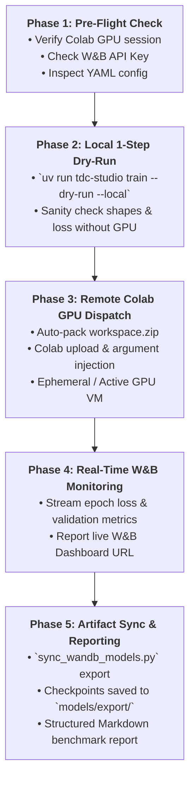

# TDC-Colab-WandB Training Skill: Standardized Cloud Training & Observability

This skill guides AI agents (Antigravity, Claude Code, Cursor, Devin) on how to execute model training, fine-tuning, and benchmarking within the `tdc-studio` ecosystem. It eliminates execution drift (e.g., agents mistakenly running heavy PyTorch/GNN training on local CPU/Windows) and guarantees 100% observability through Weights & Biases (W&B).

---

## ⛔ Absolute Guardrails & Anti-Patterns (엄격한 금지 사항)

All AI agents must strictly abide by the following constraints:

1. **NO Local Heavy Training (로컬 직접 훈련 전면 금지)**:
   - ❌ **NEVER** run `uv run python train.py`, `python scripts/benchmark_*.py`, or full epoch training locally on Windows. It causes OOM, package incompatibilities, and system freezing.
   - ⭕ Local execution is permitted **ONLY** for `--dry-run --local` (1-step forward pass sanity check).
2. **NO Arbitrary Pipeline Rewriting (학습 프로세스 임의 변조 금지)**:
   - ❌ **NEVER** write ad-hoc training scripts or invent new dataset loaders.
   - ⭕ Always use declarative configs under `configs/` and the standardized pipeline orchestrator [`scripts/run_training_pipeline.py`](file:///C:/Users/xps/orca/workspaces/tdc-studio/scripts/run_training_pipeline.py).
3. **NO Unmonitored Runs (W&B 모니터링 누락 금지)**:
   - ❌ **NEVER** trigger unmonitored training runs without active W&B logging.
   - ⭕ Always verify W&B authentication and provide the user with the direct W&B Run URL.
4. **NO Orphaned Remote Artifacts (체크포인트 방치 금지)**:
   - ❌ **NEVER** finish a training task without synchronizing model checkpoints back to the local repository.
   - ⭕ Always execute [`scripts/sync_wandb_models.py`](file:///C:/Users/xps/orca/workspaces/tdc-studio/scripts/sync_wandb_models.py) to download SOTA artifacts into `models/export/`.

---

## 🎯 When to Activate This Skill

Activate this skill whenever the user asks to:
1. Train, fine-tune, or benchmark any TDC ADMET, DTI, or Retrosynthesis model.
2. Execute training on Google Colab Cloud GPU.
3. Track or monitor training metrics in Weights & Biases (W&B).
4. Synchronize trained model weights and evaluation manifests from W&B to the local project.
5. Troubleshoot Colab GPU quota or session connectivity issues during training.

---

## 🚀 The Standardized 5-Phase Training Lifecycle



---

### Phase 1: Pre-Flight Environment & Session Verification

Before launching any job, inspect the cloud environment and active sessions:

```powershell
# 1. Check Colab CLI and active GPU sessions
uv run tdc-studio remote status

# 2. Verify W&B authentication
uv run python -c "import wandb; print('W&B Active:', bool(wandb.Api().api_key))"

# 3. Choose target YAML configuration in configs/
# e.g., configs/config_caco2_tuned.yaml, configs/config_clearance_mtl.yaml, configs/config_dti_phase_a.yaml
```

- If no active session is found, check saved accounts: `.\scripts\colab_switch.ps1 list`
- If session exists (e.g., `gpu-t4-s-kkb-...`), record the session ID for targeted execution.

---

### Phase 2: Local 1-Step Dry-Run Validation

Never dispatch unverified code to remote GPU to conserve compute units:

```bash
uv run tdc-studio train --config <CONFIG_PATH> --dry-run --local
```

- **Pass Condition**: Output shows `[bold green]Starting Training Pipeline[/bold green]` followed by 1 step of forward pass and zero runtime exceptions.
- **Fail Condition**: Missing keys in config, PyTorch tensor dimension mismatch, or import errors. Fix locally before proceeding to Phase 3.

---

### Phase 3 & 4: Remote Colab GPU Dispatch & Real-Time Monitoring

#### Preferred Path: One-Click Standardized Pipeline Runner
Use [`scripts/run_training_pipeline.py`](file:///C:/Users/xps/orca/workspaces/tdc-studio/scripts/run_training_pipeline.py) which automatically executes Phase 1 through Phase 5 atomically:

```bash
# Auto-detect active session, run dry-run, dispatch to Colab, monitor, and sync artifacts
uv run python scripts/run_training_pipeline.py --config configs/config_caco2_tuned.yaml
```

**Options**:
- `--session <SESSION_ID>`: Force dispatch to a specific Colab session.
- `--gpu <T4|L4|A100>`: GPU accelerator type (default: `T4`).
- `--epochs <INT>`: Override epoch count.
- `--skip-dry-run`: Skip local dry-run (use only if previously verified).
- `--no-sync`: Skip post-training artifact sync.

#### Alternative Manual Dispatch (Direct Script Injection)
If calling the low-level dispatchers directly:

```powershell
# On active persistent Colab session:
.\scripts\colab_exec.ps1 <SESSION_ID> deploy/colab_runner_job.py "tdc-studio train --config <CONFIG_PATH>"

# On ephemeral session (batch execution):
uv run tdc-studio remote run --gpu T4 --auto-switch --command "tdc-studio train --config <CONFIG_PATH>"
```

#### Monitoring Protocol
During Phase 4:
1. Locate the live W&B run link in stdout (e.g., `https://wandb.ai/tdc-studio/tdc-studio/runs/<RUN_ID>`).
2. Provide this URL immediately to the user so they can observe learning curves in real-time.
3. Allow the command to finish in the background or stream its logs until completion.

---

### Phase 5: Post-Training Artifact Sync & Structured Reporting

Once remote training concludes successfully:

```bash
# Download latest checkpoint weights and manifest
uv run python scripts/sync_wandb_models.py --project tdc-studio/tdc-learning --output-dir models/export
```

**Agent Output Deliverable Format**:
After completing the workflow, the agent MUST deliver a structured summary table to the user:

```markdown
### 📊 Training Run Completed Successfully

- **Dataset / Task**: `caco2_wang` (Regression / MAE)
- **Config**: `configs/config_caco2_tuned.yaml`
- **Execution Target**: Google Colab Cloud GPU (`gpu-t4-...`)
- **W&B Experiment Link**: [View W&B Run Dashboard](https://wandb.ai/tdc-studio/tdc-studio/runs/<RUN_ID>)
- **Best Validation Metric**: `MAE = 0.312` (Epoch 8)
- **Exported Artifact**: `models/export/cluster_1_absorption/best_checkpoint.pt`
```

---

## 🛠️ Troubleshooting & Quota Recovery Runbook

### Issue 1: `TooManyAssignmentsError` or Colab GPU Quota Exceeded
When Google Colab displays quota limits:
```powershell
# 1. Inspect registered accounts
.\scripts\colab_switch.ps1 list

# 2. Switch to backup account
.\scripts\colab_switch.ps1 use munhyoungdo@gmail.com

# 3. Or use --auto-switch flag with ColabRunner
uv run tdc-studio remote run --gpu T4 --auto-switch --command "tdc-studio train --config configs/config.yaml"
```

### Issue 2: Zombie / Stale Session Consuming Compute Units
If a previous session is stuck or running indefinitely:
```powershell
# List and terminate stale sessions
.\scripts\colab_cleanup.ps1 list
.\scripts\colab_cleanup.ps1 stop -Session <SESSION_ID>
```

### Issue 3: Missing Remote Dependencies on Colab Kernel
If the Colab kernel throws `ModuleNotFoundError`:
```bash
# scripts/colab_exec.ps1 automatically invokes scripts/install_deps.py.
# To trigger manual verification:
colab exec -s <SESSION_ID> -f scripts/install_deps.py
```
