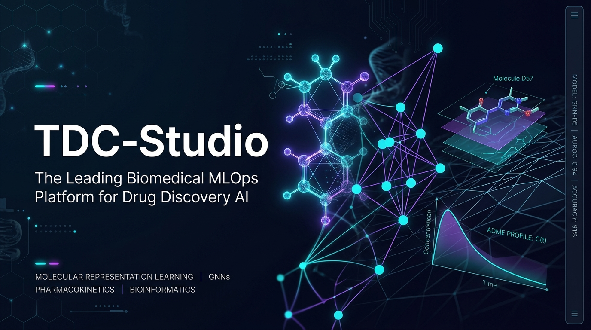

<div align="center">



# 🧬 TDC-Studio
### Modular MLOps Studio for Therapeutics Data Commons (TDC)

[](https://www.python.org/downloads/release/python-3110/)
[](https://github.com/astral-sh/uv)
[](https://github.com/astral-sh/ruff)
[](tests/)
[](tdc_studio/mcp/)
[](docs/COLAB_CLI_WINDOWS_GUIDE.md)
[](tdc_studio/serving/)
[](deploy/docker-compose.yml)
[](https://wandb.ai)
[](LICENSE)

**[📖 문서 허브](docs/) • [🤖 AI 에이전트 연동 (MCP)](#-ai-에이전트-원클릭-연동-가이드-agentic-mcp-integration) • [🚀 빠른 시작](#-빠른-시작-quickstart--workflow) • [📊 SOTA 벤치마크](docs/benchmarks/admet_cluster_sota_archive.md) • [🧪 웹 대시보드](#3-대화형-웹-대시보드-ui-구동) • [🤝 기여 가이드](CONTRIBUTING.md)**

</div>

---

## 🌟 핵심 기능 4대 축 (Core Capabilities)

| 🧪 ADMET 25-Head Multi-Task | 🧮 14-구획 ODE PBPK Engine |
| :--- | :--- |
| • 흡수(6), 체내분포(3), CYP450 대사(8), 배설(3), 안전성 독성(5)<br>• Bemis-Murcko Scaffold Test 기준 문헌 SOTA 신뢰구간 공식 진입<br>• D-MPNN 백본 + RDKit 물리화학 디스크립터 전이학습 | • $V_{dss}$, $t_{1/2}$, $f_u$, $CL_{\text{total}}$, $CL_H$, 간 추출비($E_H$) 실시간 연계<br>• 경구 투여 후 혈중 농도-시간 곡선($C_{\text{plasma}} - t$) 실시간 ODE 모사<br>• 타깃 결합력($K_d$) 및 hERG 연계 치료지수(TI) 임상 안전역 산출 |
| **🧬 DTI Foundation Pipeline** | **🔬 Retrosynthesis AI Engine** |
| • ChemBERTa(화합물) + ESM-2(단백질) 파운데이션 인코더 결합<br>• Bilinear Cross-Attention 융합으로 결합 친화도($pK_d$, $K_d$) 예측<br>• TDC BindingDB Cold-Drug 벤치마크: **CI = 0.7464 달성** | • 타깃 분자의 템플릿 기반 및 딥러닝 단일/다단계 합성 경로 역추적<br>• RDKit 화학 정규화(Canonicalization) 기반 반응 유효성 검증<br>• 상용 시약(Commercial Building Block) 라이브러리 가용성 분석 |

---

## 🏗️ 시스템 아키텍처 (System Architecture)

```mermaid
flowchart LR
    Agent["🤖 <b>AI Agent / LLM</b><br>• Claude / Antigravity<br>• Cursor / Copilot<br>• 자율 의사결정"]
    <-->|MCP Protocol (stdio/SSE)| MCP["🔌 <b>TDC MCP Server</b><br>• 8대 Agentic Tools<br>• 25-ADMET / PBPK<br>• Retro* / Dossier"]
    Local["💻 <b>Local Workstation</b><br>• Python 3.11 (uv)<br>• Ruff 린트 & 215 테스트<br>• CLI 1-Step 드라이런"]
    -->|google-colab-cli| Colab["☁️ <b>Cloud GPU Worker</b><br>• Ephemeral VM (T4 / A100)<br>• TDC Multi-Task & HPO<br>• W&B 실시간 실험 추적"]
    -->|Model Sync| Serving["🚀 <b>Production Serving</b><br>• Docker (Python 3.11-slim)<br>• FastAPI (/predict/pbpk, /dti)<br>• 원클릭 IND Dossier (HTML)"]
    MCP <--> Local
    Serving <--> MCP
```

---

## 📂 코드베이스 구조 (Repository Layout)

```text
tdc-studio/
├── assets/                      # 프로젝트 배너, UI 목업 및 시각 에셋
├── tdc_studio/                  # 핵심 바이오 MLOps 라이브러리 패키지
│   ├── cli/                     # CLI 엔트리포인트 (predict, ti, mcp, dossier, train 등)
│   ├── core/                    # 공통 레지스트리(@MODELS, @DATASETS), 기본 추상 클래스
│   ├── data/                    # TDC DataModule, RDKit Featurizer, Graph Batcher
│   ├── dossier/                 # ICH CTD 비임상 후보 평가 보고서 생성 엔진
│   ├── evaluation/              # CDI(치료지수), RetroMetrics, 평가 유틸리티
│   ├── explainability/          # Integrated Gradients 원자 히트맵 및 Bioisostere 추천
│   ├── generative/              # 자가교정 Lead Optimizer 및 Synthesizability Gate
│   ├── mcp/                     # AI Agent 연동용 Universal Model Context Protocol 서버
│   ├── models/                  # D-MPNN, GIN, ChemBERTa, ESM-2, Hybrid Stacker
│   ├── pbpk/                    # 14-구획 ODE 생체약동학 수식, 다회투여 & CYP DDI
│   ├── remote/                  # Google Colab CLI 원격 오케스트레이션 러너
│   ├── retrosynthesis/          # 템플릿 및 딥러닝 역합성 경로 탐색 엔진
│   ├── serving/                 # FastAPI 애플리케이션 및 추론 파이프라인
│   └── ui/                      # Streamlit / Web UI 대시보드 인터페이스
├── configs/                     # 선언적 YAML 설정 (ADMET 클러스터, DTI, 서빙, 트래킹)
├── deploy/                      # Colab 학습 스크립트, Dockerfile, docker-compose.yml
├── docs/                        # 시스템 상세 가이드, 아키텍처, 벤치마크 아카이브
├── models/                      # 학습된 체크포인트 (.pt), 스케일러 (.pkl), 모델 아티팩트
├── scripts/                     # W&B 모델 동기화, 배치 벤치마크 유틸리티 스크립트
└── tests/                       # 215+ 회귀 및 단위 테스트 (Zero-training 원칙)
```

---

## 🤖 AI 에이전트 원클릭 연동 가이드 (Agentic MCP Integration)

TDC-Studio는 **LLM(Claude Desktop, Cursor, Antigravity, Windsurf 등)이 직접 소형 특화 모델(SLMs)을 호출하여 자율적으로 신약을 설계하고 검증할 수 있는 표준 MCP(Model Context Protocol v2.3) 서버**를 기본 내장하고 있습니다.

### ⚡ 1. AI 에이전트에게 전달하는 원클릭 설치 및 연동 프롬프트 (Agent Prompt)
AI 코딩 에이전트(Antigravity, Cursor, Devin, Claude 등)의 대화창에 아래 프롬프트를 복사하여 붙여넣으면, **에이전트가 리포지토리를 직접 클론하고 환경을 구축하여 신약개발 도구를 즉시 사용**할 수 있습니다:

```text
https://github.com/brightonmoon/tdc-studio.git 리포지토리를 클론하고 `uv sync`를 실행해 개발 환경을 구축해줘.
그 후 TDC-Studio MCP 서버(`uv run tdc-studio mcp --transport stdio`)를 연동하여, 내가 질의하는 화합물에 대해 25대 ADMET 지표 예측(`predict_admet_profile`), 다회투여 PBPK 시뮬레이션(`simulate_pbpk_regimen`), 약물상호작용 검증(`evaluate_drug_interactions`), 역합성 경로 탐색(`plan_retrosynthesis_route`), 비임상 IND Dossier 보고서 컴파일(`compile_candidate_dossier`) 도구를 호출해 신약 개발 협업을 진행해줘.
```

### 🔌 2. MCP 클라이언트 설정 JSON (Claude Desktop / Cursor / Antigravity)

#### (1) Claude Desktop 연동 설정 (`claude_desktop_config.json`)
```json
{
  "mcpServers": {
    "tdc-studio": {
      "command": "uv",
      "args": [
        "--directory",
        "<tdc-studio 리포지토리 로컬 절대경로>",
        "run",
        "tdc-studio",
        "mcp",
        "--transport",
        "stdio"
      ]
    }
  }
}
```

#### (2) Cursor / VS Code MCP 연동 설정 (`.cursor/mcp.json`)
```json
{
  "mcpServers": {
    "tdc-studio": {
      "command": "uv",
      "args": ["run", "tdc-studio", "mcp", "--transport", "stdio"]
    }
  }
}
```

### 🛠️ 3. 에이전트가 호출 가능한 8대 도메인 특화 도구 (Agentic Tools)
| 도구명 (Tool Name) | 핵심 기능 | 반환 데이터 및 효과 |
| :--- | :--- | :--- |
| **`predict_admet_profile`** | 25대 전주기 ADMET 지표 및 결함 진단 | C1~C5 정량 수치, 신호등(Green/Amber/Red), 레이더 스코어 |
| **`explain_toxicity_hotspots`** | 독성 유발 작용단 국소화 및 동배체 추천 | Integrated Gradients 원자 기여도, Bioisostere 치환체 5종 |
| **`evaluate_target_affinity`** | 단백질 결합력 및 포켓 핵심 잔기 분석 | $pK_d, K_d, K_i, \text{IC}_{50}$ (nM), 핵심 접촉 아미노산, PyMOL 스크립트 |
| **`simulate_pbpk_regimen`** | 다회 투여(QD/BID) 정상상태 시뮬레이션 | $C_{ss,\max}, C_{ss,\min}$, 축적비($R_{ac}$), hERG 안전역($\ge 30\times$) 판정 |
| **`evaluate_drug_interactions`** | CYP 기반 약물상호작용(DDI) 평가 | Midazolam, Warfarin 등 5대 지표 기질 대상 AUC 증가 배수(Fold Change) |
| **`plan_retrosynthesis_route`** | 상용 시약 재고 연계 A* 역합성 탐색 | 단계별 반응 유형, 수율, 상용 시약 목록, Mermaid 플로우차트 |
| **`optimize_lead_molecule`** | 단점 자가교정 폐루프 분자 최적화 | 결함 극복 변이체 생성 및 실제 역합성 경로 존재성 검증 |
| **`compile_candidate_dossier`** | ICH CTD 비임상 후보 평가 보고서 생성 | 정량 데이터 + LLM 전문 고찰 결합 Standalone HTML & JSON 출력 |

### 💬 4. 에이전트와의 실전 신약개발 협업 질의 예시
* **[표적 결합 및 심장 안전성]**: *"HER2 표적($K_d < 20\text{nM}$)을 유지하면서 hERG 심장 독성을 낮춘 Imatinib 변이체를 설계하고, 1일 1회(QD) 100mg 투여 시의 정상상태 PBPK 혈중 농도를 계산해줘."*
* **[약물상호작용 리스크]**: *"이 신약 후보물질과 와파린(Warfarin)을 병용 투여할 때 CYP2C9 저해로 인한 출혈 위험(AUC Fold Change)을 평가하고, 임상 모니터링 가이드를 작성해줘."*
* **[원클릭 IND 보고서]**: *"후보물질에 대해 상용 시약 카탈로그(Enamine/Sigma)로부터 4단계 이내로 합성 가능한 역합성 경로를 찾고, 최종 비임상 IND Dossier 보고서를 생성해줘."*

---

## ⚙️ 환경 설정 및 무결성 검증 (Setup & Verification)

### (1) 환경 요구사항
- **Python**: `3.11` (TDC 데이터셋 라이브러리 및 PyTorch Geometric C++ 바이너리 호환 필수)
- **패키지 매니저**: [uv](https://github.com/astral-sh/uv) (가상환경 격리 및 초고속 의존성 동기화)

### (2) 로컬 개발 환경 동기화
```bash
git clone https://github.com/brightonmoon/tdc-studio.git
cd tdc-studio

# 개발 의존성을 포함하여 초고속 가상환경 동기화
uv sync --extra dev
```

### (3) 코드 무결성 검증 (린트 & 단위 테스트)
```bash
# 1. Ruff 정적 분석 검사
uv run ruff check tdc_studio tests

# 2. 단위 테스트 실행 (215개 전체 테스트 무결성 확인)
uv run pytest -v
```

---

## 🚀 빠른 시작 (Quickstart & Workflow)

### (1) AI 에이전트 연동 MCP 서버 구동 (stdio / SSE)
AI 에이전트(Claude Desktop, Cursor, Antigravity)와 실시간 표준 프로토콜로 통신합니다:
```bash
# 표준 입출력(stdio) 모드 (Claude Desktop, Cursor, CLI 연동)
uv run tdc-studio mcp --transport stdio

# 웹소켓/SSE 모드 (사내 웹 챗봇 및 원격 에이전트)
uv run tdc-studio mcp --transport sse --host 127.0.0.1 --port 8000
```

### (2) 원클릭 비임상 IND Candidate Dossier 생성 CLI
후보 분자의 25대 ADMET, 다회투여 PBPK, CYP DDI, 역합성 경로를 종합한 단독 실행형 HTML & JSON 보고서를 즉시 발행합니다:
```bash
uv run tdc-studio dossier "CC(=O)Oc1ccccc1C(=O)O" --target COX2 --dose 100.0
# 산출물: reports/dossier_COX2.html (브라우저 열람), reports/dossier_COX2.json
```

### (3) ADMET & PBPK 일괄 예측 CLI
SMILES 입력 시 25종 ADMET 지표와 14-구획 PBPK 파라미터를 일괄 산출합니다:
```bash
uv run tdc-studio predict "CC(=O)Oc1ccccc1C(=O)O"
```

### (4) 치료지수(TI) 및 안전역 평가 CLI
타깃 결합력($K_d$)과 hERG 심장 독성 예측값을 연계하여 치료 안전역을 판정합니다:
```bash
uv run tdc-studio ti "CC(=O)Oc1ccccc1C(=O)O" --kd 10.0
```

### (5) 대화형 웹 대시보드 UI 구동
분자 구조 렌더링, ADMET 레이더 차트, PBPK 혈중 농도 시뮬레이션 곡선을 웹 브라우저에서 직접 조작합니다:
```bash
uv run tdc-studio ui --port 8000
# 접속: http://localhost:8000/
```

### (6) 로컬 무결성 1-Step 점검 (Dry-run)
실제 대용량 학습 전 1-Batch 포워드/백워드 무결성을 즉시 검증합니다:
```bash
uv run tdc-studio train --config configs/config.yaml --dry-run
uv run tdc-studio tune --config configs/config.yaml --n-trials 2 --dry-run
```

### (7) Google Colab 클라우드 GPU 원격 학습 위임
로컬 리소스 소모 없이 Google Colab GPU 인스턴스(T4, A100 등)로 학습을 위임합니다:
```bash
# A100 GPU 할당 및 원격 실행
uv run tdc-studio remote run --gpu a100 --command "tdc-studio train --config configs/admet/caco2.yaml"

# 일회성 Colab Jupyter Notebook (.ipynb) 파일로 내보내기
uv run tdc-studio remote export-notebook --output tdc_colab_runner.ipynb
```

### (8) 프로덕션 REST API 서빙
```bash
# FastAPI 서버 시작
uv run tdc-studio serve --port 8000
```

<details>
<summary><b>🔍 cURL 호출 및 API 응답 JSON 예시 보기 (클릭)</b></summary>

#### PBPK 생체역학 파라미터 예측 쿼리
```bash
curl -X POST "http://localhost:8000/predict/pbpk" \
     -H "Content-Type: application/json" \
     -d '{"smiles": ["CC(=O)NC1=CC=C(O)C=C1"]}'
```
*응답 예시:*
```json
{
  "smiles": "CC(=O)NC1=CC=C(O)C=C1",
  "pbpk_parameters": {
    "vdss_L_kg": 0.952,
    "fu_percent": 78.4,
    "clearance_total_mL_min_kg": 5.12,
    "half_life_hours": 2.15,
    "extraction_ratio_hepatic": 0.247
  },
  "therapeutic_index": {
    "herg_safety_margin": "SAFE",
    "risk_level": "LOW"
  }
}
```

#### DTI 약물-표적 결합 친화도($pK_d$, $K_d$) 예측 쿼리
```bash
curl -X POST "http://localhost:8000/predict/dti" \
     -H "Content-Type: application/json" \
     -d '{
       "smiles": ["CC1=C(C(=O)N2CCCC2=N1)CCN3CCC(CC3)C4=NOC5=C4C=CC(=C5)F"],
       "target_sequences": ["MSHHWGYGKHNGPEHWHKDFPIAKGERQSPVDIDTHTAKYDPSLKPLSVSYDQATSLRILNNGHAFNVEFD"],
       "return_kd_nm": true
     }'
```
</details>

### (9) W&B Model Registry 자동 동기화 & Docker 실행
```bash
# 학습된 클라우드 체크포인트를 로컬 models/export/로 자동 인덱싱 및 동기화
uv run python scripts/sync_wandb_models.py

# 프로덕션 서빙 컨테이너 구동
docker compose -f deploy/docker-compose.yml up -d
```

---

## 🛡️ 에이전트 & 엔지니어링 개발 지침 (Agent Guidelines)

TDC-Studio 기여 및 코드 수정 시 반드시 준수해야 하는 5대 원칙입니다:

1. **Zero-Training 단위 테스트 원칙**:
   - 단위 테스트에서 실제 대용량 데이터셋 다운로드나 긴 에포크 학습을 수행하지 않습니다.
   - Mocking 및 `toy_batch`를 활용하여 15초 이내에 모든 회귀 테스트(`pytest`)가 통과되도록 유지합니다.
2. **안전한 모델 직렬화 (`weights_only=True`)**:
   - 모델 가중치 역직렬화 시 임의 코드 실행 취약점을 원천 방어하기 위해 `torch.load(..., weights_only=True)`를 강제합니다.
3. **화학적 동등성 및 정규화 (Canonicalization)**:
   - 분자 구조 비교 및 역합성 검증 시 RDKit `Chem.MolToSmiles(canonical=True)` 정규화를 필히 적용합니다.
4. **NaN 손실 방어 및 마스킹**:
   - 다중 작업(Multi-task) 학습 시 결측 레이블로 인한 기울기 왜곡을 방지하기 위해 `MaskedLoss`와 `zero_division=0` 가드를 유지합니다.
5. **Colab 세션 분리 거버넌스**:
   - GPU 리소스 경합 및 세션 충돌을 방지하기 위해 세션명을 분리합니다 (`tdc-studio-admet`, `tdc-studio-dti`, `tdc-studio-retro`).

---

## 📚 종합 문서 허브 (Documentation Index)

자세한 벤치마크 결과, 이론적 설계 배경 및 로드맵은 다음 문서들을 참조하십시오:

### 📊 벤치마크 및 실측 성과 아카이브
| 문서 | 설명 |
| :--- | :--- |
| **[🏆 ADMET 5대 클러스터 SOTA 벤치마크 아카이브](docs/benchmarks/admet_cluster_sota_archive.md)** | **Caco-2, PPBR/VDss/BBB, CYP450, Clearance, Safety 전 클러스터 실측 수치, W&B 런 및 체크포인트** |
| **[📊 Caco-2 SOTA 벤치마크 진화 리포트](docs/benchmarks/caco2_sota_progress_report.md)** | Baseline부터 SOTA 신뢰구간($R^2=0.7327$) 도달까지의 전 과정 실측 데이터 |
| **[📊 PPBR 체내분포 Tri-Hybrid 리포트](docs/benchmarks/ppbr_distribution_sota_progress_report.md)** | Tri-Hybrid Stacker($R^2=0.5412$) 및 ChEMBL HSA 전이학습 실측 데이터 |
| **[🎯 ADMETlab 3.0 대비 목표 성능 규격서](docs/benchmarks/admetlab3_tdc_target_performance.md)** | NAR 2024 부록 기준 22+ TDC 전 태스크별 목표 성능 수치 및 갭 분석 |
| **[🧬 DTI Phase B 벤치마크 결과 리포트](docs/dti/dti_phase_b_benchmark_report.md)** | BindingDB Kd Cold-Drug CI = 0.7464 달성 실측 성과 및 Phase B 구조 명세서 |

### 📐 설계 원리 및 도메인 가이드
| 문서 | 설명 |
| :--- | :--- |
| **[🧪 22+ ADMET 지표 선정 근거 및 PBPK 설계 철학](docs/guides/admet_selection_and_pbpk_rationale.md)** | **TDC 38종 중 22+(25)종 선별 이유, 비선정/통합 4대 사유 표, 14-구획 PBPK 메커니즘** |
| **[🏆 ADMET SOTA 엔지니어링 레시피 & 클러스터 맵](docs/guides/admet_sota_recipe.md)** | 5대 황금률, TDC 22+ 태스크 클러스터링 맵, 다중학습 및 앙상블 기법 가이드 |
| **[📐 ADMET 5대 클러스터 모델 설계 청사진](docs/guides/admet_cluster_architectures.md)** | 클러스터별 최적 백본 신경망 구조 및 피처 파이프라인 상세 설계안 |
| **[02. 알고리즘 선택 가이드](docs/02_algorithm_selection.md)** | ADMET/DTA 태스크별 의사결정 트리 및 추천 모델 백본 매트릭스 |

### 🛠️ 엔지니어링 및 운영 가이드
| 문서 | 설명 |
| :--- | :--- |
| **[01. 환경 설정 및 설치](docs/01_environment_setup.md)** | Python 3.11 고정 이유, UV 가상환경, Colab CLI 인증 가이드 |
| **[03. 학습 및 HPO 운영](docs/03_training_and_hpo.md)** | 로컬 1-Step 드라이런, Colab GPU 위임 및 W&B 실시간 추적 |
| **[04. 컴포넌트 확장 가이드](docs/04_extending_components.md)** | `@MODELS`, `@DATASETS` 데코레이터를 이용한 신규 모델/데이터 추가법 |
| **[05. 서빙 및 컨테이너 배포](docs/05_serving_deployment.md)** | FastAPI API 명세서 및 Docker Compose 프로덕션 배포 |
| **[설정(Configs) 명세](configs/README.md)** | YAML 선언적 설정 파일 구조 및 파라미터 규격 |
| **[기여 및 품질 관리 규칙](CONTRIBUTING.md)** | 커밋 전 필수 검증 및 Zero-training 테스트 작성 원칙 |

### 📋 프로젝트 로드맵 및 연구 계획
| 문서 | 설명 |
| :--- | :--- |
| **[📋 학습 파이프라인 실행 체크리스트 & TODOLIST](docs/roadmaps/training_pipeline_todolist.md)** | 클러스터별 1-Epoch Smoke Test 및 실측 학습 실행 로드맵 |
| **[🔬 역합성 마스터 작업 계획서](docs/retrosynthesis/retrosynthesis_master_work_plan.md)** | 템플릿 기반 및 딥러닝 역합성 모듈 구현 마스터 플랜 |
| **[🧬 DTI Phase C 고도화 계획서](docs/dti/dti_phase_c_advancement_plan.md)** | ESM-2 + ChemBERTa 결합 고도화 및 DTI 확장 계획 |
| **[🧭 차기 단계 종합 작업 계획서](docs/roadmaps/next_phase_work_plan.md)** | TDC-Studio 전 모듈 통합 및 프로덕션 릴리스 로드맵 |
