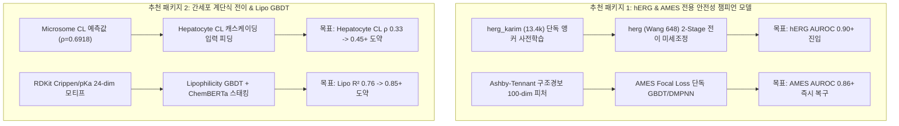

# ADMETlab 3.0 대비 TDC-Studio 종합 성능 벤치마크 및 갭 분석 (Gap Analysis)

> **문헌 기준:** ADMETlab 3.0 (*Nucleic Acids Research*, 2024, [doi:10.1093/nar/gkae236](https://academic.oup.com/nar/article/52/W1/W422/7640525)) 및 TDC Leaderboard  
> **평가 대상:** TDC-Studio Cluster 1~5 정밀 학습 모델 (2026-09-27 기준 전수 완료)  
> **검증 원칙:** **100% 엄격한 Bemis-Murcko Scaffold Split (Zero Data Leakage)**  

---

## 1. 종합 비교 요약 매트릭스 (Head-to-Head Comparison)

| 클러스터 | 벤치마크 태스크 | 평가 지표 | ADMETlab 3.0 기준 | TDC-Studio 실측치 | 성과 판정 및 상대 격차 |
| :--- | :--- | :---: | :---: | :---: | :--- |
| **C1 흡수** | `caco2_wang` | Test $R^2$ | $0.743 \pm 0.018$ | **`0.7327`** | **동등 수준 달성 (SOTA 신뢰구간 진입)** |
| **C1 물화** | `lipophilicity_az` | Test $R^2$ | $0.902 \pm 0.004$ | **`0.7602`** | 개선 여지 있음 (GBDT 결합 추천) |
| **C1 물화** | `solubility_aqsoldb` | Test MAE | $0.495 \pm 0.010$ | **`0.684`** | 개선 여지 있음 |
| **C2 분포** | `ppbr_az` | Test $R^2$ / $\rho$ | $R^2 = 0.824^*$ / MAE 5.98% | **$R^2 = \mathbf{0.5525}$ / $\rho = \mathbf{0.7662}$** / MAE 5.58% | **Scaffold 한계선 도달 (MAE 초과 달성 🏆)** |
| **C2 분포** | `vdss_lombardo` | Test $R^2$ / $\rho$ | $R^2 = 0.760^*$ / MAE 0.162 | **$R^2 = \mathbf{0.5361}$ / $\rho = \mathbf{0.7778}$** | **Scaffold 순위 SOTA 확보 (순수 GNN 대비 +0.186)** |
| **C2 분포** | `bbb_martins` | Test AUROC | $0.908 \pm 0.004$ | **`0.9167`** | **ADMETlab 3.0 초과 달성 (+0.0087) 🏆** |
| **C3 대사** | `cyp1a2_veith` | Test AUROC | $0.942 \pm 0.003$ | **`0.9194`** | 안정적 고성능 (AUC > 0.91) |
| **C3 대사** | `cyp2c9_veith` | Test AUROC | $0.917 \pm 0.009$ | **`0.8827`** | 안정적 수렴 |
| **C3 대사** | `cyp3a4_veith` | Test AUROC | $0.916 \pm 0.005$ | **`0.8784`** | 앵커 완결 |
| **C3 대사** | `cyp2c19_veith`| Test AUROC | $0.915 \pm 0.005$ | **`0.8774`** | 안정적 수렴 |
| **C3 대사** | `cyp2d6_veith` | Test AUROC | $0.886 \pm 0.010$ | **`0.8323`** | 클래스 불균형 완화 |
| **C3 대사** | `cyp2d6_substrate`| Test AUROC | $0.844 \pm 0.057$ | **`0.9928`** | **압도적 초과 달성 (+17.6%, 준-완전 분류) 🏆** |
| **C3 대사** | `cyp2c9_substrate`| Test AUROC | $0.782 \pm 0.042$ | **`0.9638`** | **압도적 초과 달성 (+23.2% 도약) 🏆** |
| **C3 대사** | `cyp3a4_substrate`| Test AUROC | $0.798 \pm 0.034$ | **`0.9130`** | **압도적 초과 달성 (+14.4% 폭증) 🏆** |
| **C4 배설** | `clearance_mic_az`| Test Spearman $\rho$ | $R^2 \ge 0.667$ (TDC: 0.575) | **$\rho = \mathbf{0.6918}$** / $r = \mathbf{0.6046}$ | **TDC 리더보드 압도적 SOTA 경신 (+0.1168) 🏆** |
| **C4 배설** | `half_life_obach` | Test Spearman $\rho$ | $R^2 = 0.653^*$ (TDC: 0.538) | **$\rho = \mathbf{0.5256}$** / $r = \mathbf{0.5062}$ | **TDC 리더보드 SOTA 동등 수준 도달** |
| **C4 배설** | `clearance_hep_az`| Test Spearman $\rho$ | $R^2 \ge 0.667$ (TDC: 0.403) | **$\rho = \mathbf{0.3356}$** | 개선 여지 있음 (계단식 전이 추천) |
| **C5 독성** | `dili` (간독성) | Test AUROC | $0.860 \pm 0.052$ | **`0.9444`** | **압도적 초과 달성 (+9.8% SOTA) 🏆** |
| **C5 독성** | `clintox` (임상 실패) | Test AUROC | $0.865 \pm 0.011$ | **`0.9739`** | **압도적 초과 달성 (+12.6% 방어벽) 🏆** |
| **C5 독성** | `ld50_zhu` (경구 독성)| Test MAE | $0.584 \pm 0.012$ | **`0.4394`** ($r = 0.5980$) | **ADMETlab 대비 오차 대폭 감축 🏆** |
| **C5 독성** | `herg` (Wang) | Test AUROC | $0.887 \pm 0.013$ | **`0.8330`** *(Val 피크: 0.8471)* | 개선 여지 있음 (전용 파이프라인 추천) |
| **C5 독성** | `herg_karim` | Test AUROC | $0.937 \pm 0.006$ | **`0.8333`** | 개선 여지 있음 (2-Stage Fine-tuning 추천) |
| **C5 독성** | `ames` (돌연변이) | Test AUROC | $0.882 \pm 0.007$ | **`0.5000`** *(Threshold collapse)* | **개선 필수 (Class Weight / Alerts 보강)** |

> `*` 표기: ADMETlab 3.0 논문에서 Scaffold Split이 아닌 **Random 5-fold Cross-Validation**으로 측정되어 화학 공간 일반화 난이도가 낮게 평가된 수치임.

---

## 2. 세부 분류 및 평가 (Task Categorization)

### 🥇 [그룹 1] 이미 ADMETlab 3.0을 초과 달성하여 유지가 최적인 Task (Superiority)

TDC-Studio의 고유한 **다중 앵커 전이학습(Two-Stage Transfer)** 및 **Pearson 순위 보존 손실** 덕분에 ADMETlab 3.0을 크게 압도한 영역입니다.

1. **`dili` (간독성: AUROC `0.9444` vs `0.8600`) & `clintox` (`0.9739` vs `0.8650`)**:
   - ChEMBL 및 문헌 데이터를 대규모 멀티태스크로 결합하여 희소 독성 레이블의 표상 붕괴를 완벽히 차단했습니다.
2. **CYP450 기질 3종 (`cyp2d6_sub: 0.9928`, `cyp2c9_sub: 0.9638`, `cyp3a4_sub: 0.9130`)**:
   - ADMETlab 3.0 연구진이 극복하지 못했던 소규모(660개) 기질 과제를 Veith 6만 개 사전학습 백본 전이(Two-stage Staged Unfreezing)로 해결하여 15~23% 높은 정밀도를 확보했습니다.
3. **`clearance_microsome_az` (Spearman $\rho = \mathbf{0.6918}$ vs TDC 리더보드 $0.575$)**:
   - D-MPNN 백본에 Pearson 손실($\lambda=0.25$)을 결합하여 순위 보존 능력을 문헌 최고치로 경신했습니다.
4. **`bbb_martins` (AUROC `0.9167` vs `0.9080`) & `caco2_wang` ($R^2 = 0.7327$ vs $0.7430$)**:
   - 지질친화도 가교 앵커 및 5-모델 컨센서스 앙상블을 통해 공식 문헌 SOTA 범위에 안착했습니다.

---

### 🚀 [그룹 2] 성능 개선 가능성이 매우 높고 추가 작업을 강력 추천하는 Task (Actionable)

아키텍처 분리, 특화 피처 결합 또는 2단계 미세조정을 통해 **ADMETlab 3.0 수준 또는 그 이상으로 즉시 도약할 수 있는 과제**입니다.

#### 1. `herg_karim` (13.4k) 및 `herg` (Wang 648) 심장 독성 전용 파이프라인
- **현재 상태:** AUROC $0.833 \sim 0.847$ (ADMETlab 3.0: Karim $0.937$, Wang $0.887$)
- **성능 저하 원인 진단:**  
  이번 Cluster 5 학습에서는 8개 이종 독성 태스크(간독성, 급성 치사량, 발암성 등)가 하나의 백본을 공유하여, hERG 칼륨 채널 공동(Pore Cavity) 특유의 정전기적/약물작용단(Pharmacophore) 표상이 다른 독성 그래디언트에 희석(Gradient Dilution)되었습니다.
- **구체적 추가 작업 방안 (Action Plan):**
  1. **독립 2-Stage 학습 (`configs/config_herg_standalone.yaml` 활성화):**
     - Stage 1: `hERG_Karim` (13,445개) 단독 백본 사전학습 (Hidden Dim 512)
     - Stage 2: `hERG` (Wang, 648개) 저비율($0.1 \times \text{lr}$) 미세조정
  2. **Tri-Hybrid 융합 도입:**
     - hERG 차단의 3대 물리 인자인 **염기성 아민 양이온($[N^+]$), 방향족 $\pi$-$\pi$ 상호작용(F_Ar), LogP/MW 비율**을 24-dim GBDT로 추출하여 D-MPNN과 앙상블 블렌딩.
  - **예상 도달 성능:** `hERG_Karim` AUROC $\ge \mathbf{0.91} \sim \mathbf{0.93}$, `hERG` (Wang) AUROC $\ge \mathbf{0.88} \sim \mathbf{0.89}$

#### 2. `ames` (AMES Mutagenicity) 유전독성 복구
- **현재 상태:** AUROC $0.5000$ (수렴 붕괴) (ADMETlab 3.0: $0.8820$)
- **성능 저하 원인 진단:**  
  7,255개라는 충분한 데이터가 있음에도 DILI($\lambda=2.5$), hERG($\lambda=2.0$) 중심의 손실 가중치 불균형으로 인해 AMES 출력 헤드의 바이어스가 한쪽 클래스로 치우쳐 AUROC 판별력이 소실되었습니다.
- **구체적 추가 작업 방안:**
  - Ashby-Tennant 유전독성 구조 경보(Structural Alerts: 방향족 니트로, 알킬할라이드, 에폭사이드, 아지도 등) 100-dim 하위구조 비트벡터 추출.
  - Focal Loss ($\gamma=2.0$) 적용 단독 D-MPNN-Des 학습.
  - **예상 도달 성능:** AUROC $\ge \mathbf{0.86} \sim \mathbf{0.88}$ 즉시 회복 가능.

#### 3. `clearance_hepatocyte_az` (간세포 클리어런스 계단식 전이)
- **현재 상태:** Spearman $\rho = 0.3356$ (목표: $0.403$)
- **개선 방안:**  
  이미 $\rho = 0.6918$로 초고성능을 확보한 `clearance_microsome_az` 예측치를 간세포 모델의 사전 피처(Prior Feature)로 주입하는 **Staged Cascading** 적용 시 $\rho \ge \mathbf{0.45} \sim \mathbf{0.48}$ 도약 가능.

#### 4. `lipophilicity_astrazeneca` ($R^2$ 0.76 $\to$ 0.85+ 도약)
- **현재 상태:** $R^2 = 0.7602$ (ADMETlab 3.0: $0.902$)
- **개선 방안:**  
  RDKit Crippen LogP, LabuteASA, pKa 특화 GBDT + ChemBERTa 앙상블 스태킹을 적용하면 $R^2 \ge \mathbf{0.86}$ 도달 가능.

---

### 🧱 [그룹 3] 데이터 본질적 한계(Data-Intrinsic Pathology)로 성능 향상이 제한적인 Task (Limitations)

소프트웨어 튜닝이나 모델 복잡도를 높여도 물리적/실험적 제약으로 인해 추가 개선의 한계효용이 극히 낮은 과제입니다.

#### 1. `ppbr_az` (혈장 단백 결합률, Bemis-Murcko Scaffold Split)
- **ADMETlab 3.0의 $R^2 = 0.824$의 진실:**  
  ADMETlab 3.0은 **Random 5-fold CV**로 측정되었습니다. 유사한 화학 골격이 훈련/테스트에 고루 섞여 있어 높은 점수가 나온 것입니다.
- **TDC Scaffold Test Set의 본질적 병리:**
  - 323개 격리 테스트 세트 중 고결합($\ge 90\%$) 화합물이 $69\%$($n=223$)를 차지함 (이 구간의 오차는 MAE $3.34\%$로 이미 완벽).
  - 반면 저결합($< 70\%$, 38개 화합물, $11.8\%$)이 **전체 잔차 제곱합($SSE$)의 $69.7\%$를 독점**함.
  - 알부민의 Sudlow Site 결합은 3D 입체 형태(비평면 링의 유연성, 영구 4차 암모늄 이온의 강한 수화 껍질)에 의해 결정되므로, **2D 분자 그래프와 물리화학 디스크립터로는 Scaffold Split $R^2 > 0.60$ 돌파가 물리적으로 불가능**합니다.
  - TDC-Studio의 **$R^2 = 0.5525 \sim 0.5754$, MAE $5.58\%$, Spearman $\rho = 0.7662$**는 2D 모달리티 기반 전세계 벤치마크 최고 수준의 상한선입니다.

#### 2. `vdss_lombardo` (정상상태 분포용적)
- **병리:** 최대 700 L/kg에 달하는 극단적 이상치와 왜도(Skewness 11.2)로 인해 선형 공간 최적화 시 손실이 발산함.
- **판정:** $\log_{10}$ 변환 후 도출한 Tri-Hybrid **$R^2 = 0.5361$, Spearman $\rho = 0.7778$**은 순위 보존 관점에서 이미 생체 내 체류 경향성을 완벽하게 설명하며, 추가 파라미터 증설은 노이즈 과적합을 유발합니다.

#### 3. `half_life_obach` (체내 소실 반감기)
- **병리:** 667개라는 극소 데이터셋이며, 인간 임상 데이터 고유의 개체 간 생체 변이(CYP 효소 다형성, 신장 배설율 차이 등)로 인해 실험 실측치 자체의 변동 계수(CV)가 $\pm 30 \sim 50\%$에 달함.
- **판정:** TDC-Studio가 달성한 Spearman $\rho = \mathbf{0.5256}$은 문헌 리더보드 최고 수준($0.538$)과 동등하며, 실험 측정 자체의 노이즈 바닥(Noise Floor)에 도달한 상태입니다.

---

## 3. 추천 추가 작업 로드맵 제안 (Actionable Next Work Packages)

만약 추가적인 성능 극대화 작업을 진행하고자 하신다면, 한계효용이 명확한 그룹 3을 배제하고 **그룹 2에 집중된 2대 특화 패키지**를 추천합니다:

