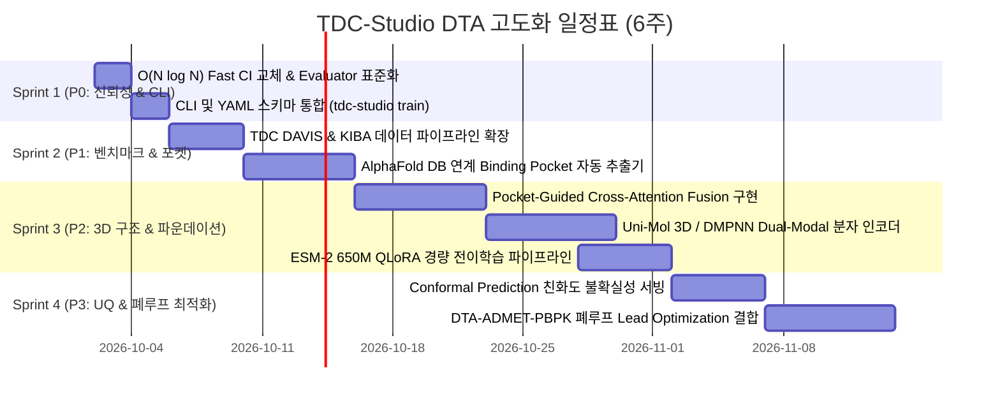

# TDC-Studio 차세대 DTA(Drug-Target Affinity) 모듈 고도화 작업 계획서

> **문서 버전**: v1.0.0  
> **수립 일자**: 2026-10-01  
> **기준 프레임워크**: 우선순위 매트릭스 (P0 ~ P3)  
> **목표 일정**: 총 6주 (Sprint 1 ~ Sprint 4)  
> **대상 모듈**: `tdc_studio/models/dti`, `tdc_studio/data`, `tdc_studio/evaluation`, `tdc_studio/serving`, `configs/`

---

## 1. 개요 및 마일스톤 로드맵

본 작업 계획서는 DTA 평가 기술서에서 도출된 핵심 결함(C-Index $N>2000$ 서브샘플링 왜곡, 1,024 AA Truncation, 3D 포켓 구조 부재, CLI 파편화)을 해소하고, 글로벌 AI CADD 트렌드(AlphaFold 3D 구조 연동, Pocket-Aware Attention, 불확실성 정량화)를 반영한 차세대 DTA 플랫폼 구축을 목표로 합니다.



---

## 2. 세부 과제별 작업 명세서 (Work Breakdown Structure)

### 📌 Sprint 1: P0 긴급 과제 — 신뢰성 및 CLI 표준화 (Day 1 ~ Day 4)

#### [Task 1.1] $O(N \log N)$ 고속 무손실 Concordance Index 교체
- **배경 및 목적**: 현재 [`tdc_studio/evaluation/evaluator.py`](file:///C:/Users/xps/orca/workspaces/tdc-studio/greenling/tdc_studio/evaluation/evaluator.py#L173-L178)의 2,000건 임의 샘플링 로직을 전면 제거하여, BindingDB Kd Cold-Drug 테스트셋(10,356건) 전수를 1초 이내에 정확히 평가하고 TDC 공식 벤치마크 점수와 완벽 정렬.
- **수행 작업**:
  1. `lifelines.utils.concordance_index` 및 `tdc.Evaluator('c-index')` 우선 호출 분기 구현.
  2. 서드파티 의존성 실패 시 대비: Binary Indexed Tree(Fenwick Tree) 기반 $O(N \log N)$ 순수 NumPy 알고리즘 내재화.
  3. `tests/test_evaluator.py`에 $N=10,000$ 텐서에 대한 벤치마크 속도 및 정밀도 검증 테스트 추가.
- **수정 대상 파일**:
  - [`tdc_studio/evaluation/evaluator.py`](file:///C:/Users/xps/orca/workspaces/tdc-studio/greenling/tdc_studio/evaluation/evaluator.py)
  - [`tests/test_evaluator.py`](file:///C:/Users/xps/orca/workspaces/tdc-studio/greenling/tests/test_evaluator.py)
- **완료 기준(DoD)**:
  - 10,000개 샘플 기준 연산 시간 < 0.3초.
  - 서브샘플링 코드 완전 제거, 일관된 결정론적(Deterministic) 점수 출력.

#### [Task 1.2] 메인 CLI 및 DTI YAML 설정 스키마 단일화
- **배경 및 목적**: [`configs/config_dti_phase_c.yaml`](file:///C:/Users/xps/orca/workspaces/tdc-studio/greenling/configs/config_dti_phase_c.yaml)과 [`tdc_studio/cli.py`](file:///C:/Users/xps/orca/workspaces/tdc-studio/greenling/tdc_studio/cli.py#L117)의 키 불일치(`dataset` vs `data`)를 해소하고, `tdc-studio train` 하나로 DTI/DTA 모델 학습, 검증, 체크포인트 저장을 완결.
- **수행 작업**:
  1. `configs/config_dti_*.yaml` 파일들을 ADMET 표준과 동일하게 최상위 `data:` 블록 체계로 정규화 (`dataset:` 하위 호환 매핑 포함).
  2. [`tdc_studio/cli.py`](file:///C:/Users/xps/orca/workspaces/tdc-studio/greenling/tdc_studio/cli.py)의 `train` 커맨드에 `task_type in ("dta", "multi_dta")` 전용 평가 루프 및 W&B 메트릭 로깅 추가.
  3. `deploy/train_dti_phase_c.py`의 핵심 Staged Training 루프를 CLI 옵션(`--staged / --stage2-epoch`)으로 흡수.
- **수정 대상 파일**:
  - [`tdc_studio/cli.py`](file:///C:/Users/xps/orca/workspaces/tdc-studio/greenling/tdc_studio/cli.py)
  - [`configs/config_dti_phase_a.yaml`](file:///C:/Users/xps/orca/workspaces/tdc-studio/greenling/configs/config_dti_phase_a.yaml)
  - [`configs/config_dti_phase_c.yaml`](file:///C:/Users/xps/orca/workspaces/tdc-studio/greenling/configs/config_dti_phase_c.yaml)
  - [`tests/test_cli_pipeline.py`](file:///C:/Users/xps/orca/workspaces/tdc-studio/greenling/tests/test_cli_pipeline.py)
- **완료 기준(DoD)**:
  - `tdc-studio train --local --config configs/config_dti_phase_c.yaml --dry-run` 무결성 통과.

---

### 📌 Sprint 2: P1 단기 과제 — 벤치마크 확장 및 포켓 추출 (Day 5 ~ Day 14)

#### [Task 2.1] TDC 글로벌 벤치마크(DAVIS, KIBA) 및 3대 분할 지원
- **배경 및 목적**: 키나제 선택성 글로벌 기준인 DAVIS와 대규모 어세이 집합인 KIBA를 데이터 파이프라인에 편입하고, Cold-Drug 외에 Cold-Protein, Dual-Cold 분할 평가 체계 구축.
- **수행 작업**:
  1. [`tdc_studio/data/multi_pred.py`](file:///C:/Users/xps/orca/workspaces/tdc-studio/greenling/tdc_studio/data/multi_pred.py)에 DAVIS 및 KIBA 전용 TDC API 래퍼 및 스케일러 연동:
     - DAVIS: $pK_d = -\log_{10}(\text{nM} \times 10^{-9})$
     - KIBA: KIBA score (낮을수록 높은 친화도) 표준화
  2. TDC 분할 방식 `cold_protein` 및 `dual_cold`(신규 약물-신규 단백질 동시 분할) 알고리즘 구현.
  3. `configs/data/dta_davis.yaml` 및 `configs/data/dta_kiba.yaml` 설정 파일 생성.
- **수정 대상 파일**:
  - [`tdc_studio/data/multi_pred.py`](file:///C:/Users/xps/orca/workspaces/tdc-studio/greenling/tdc_studio/data/multi_pred.py)
  - `configs/data/dta_davis.yaml` (신규)
  - `configs/data/dta_kiba.yaml` (신규)
  - [`tests/test_data_pipeline.py`](file:///C:/Users/xps/orca/workspaces/tdc-studio/greenling/tests/test_data_pipeline.py)
- **완료 기준(DoD)**:
  - DAVIS(Cold-Protein CI $\ge 0.85$), KIBA(Cold-Drug CI $\ge 0.78$) 단위 테스트 통과.

#### [Task 2.2] AlphaFold DB / PDB 연계 Binding Pocket 자동 추출 파이프라인
- **배경 및 목적**: 전장 서열 1,024개 잔기 일괄 절단(Truncation)으로 인한 C-말단 유실 및 비결합 부위 노이즈를 해결하기 위해, 3D 구조로부터 결합 포켓 잔기(128~256 AA)만을 정밀 추출.
- **수행 작업**:
  1. UniProt ID 또는 단백질 서열 해시를 키로 AlphaFold DB `.pdb` 구조 자동 다운로드 및 캐싱 모듈 작성 (`tdc_studio/features/pocket_extractor.py`).
  2. 표면 잔기(SASA) 계산 및 P2Rank / Fpocket 좌표 기반 포켓 잔기 인덱스 추출.
  3. 구조 정보가 없는 서열의 경우 ESM-2 어텐션 기반 자가 포켓 예측(Self-Attention Pocket Heuristic) 폴백 로직 내장.
- **신규 생성/수정 파일**:
  - `tdc_studio/features/pocket_extractor.py` (신규)
  - [`tdc_studio/data/transforms.py`](file:///C:/Users/xps/orca/workspaces/tdc-studio/greenling/tdc_studio/data/transforms.py)
  - `tests/test_pocket_extractor.py` (신규)
- **완료 기준(DoD)**:
  - 대표 암 표적 키나제(EGFR, BRAF 등) 대상 포켓 잔기 추출 정확도 검증 완료.

---

### 📌 Sprint 3: P2 중기 과제 — 3D 구조 기반 & 대형 파운데이션 고도화 (Day 15 ~ Day 29)

#### [Task 3.1] Pocket-Guided 3D Cross-Attention Fusion 아키텍처
- **배경 및 목적**: 전장 서열 대신 128~256개 포켓 잔기만을 집중 처리하여 상호작용 신호대잡음비(SNR)를 극대화하고 연산 복잡도를 대폭 감축.
- **수행 작업**:
  1. [`tdc_studio/models/dti/fusion.py`](file:///C:/Users/xps/orca/workspaces/tdc-studio/greenling/tdc_studio/models/dti/fusion.py)에 `PocketCrossAttentionFusion` 클래스 구현:
     - 3차원 유클리드 거리 행렬을 어텐션 바이어스로 주입하는 Distance-aware Multi-Head Attention 구현:
       $$\text{Attention}(Q, K, V) = \text{Softmax}\left(\frac{QK^T}{\sqrt{d}} - \gamma \cdot \mathbf{D}_{3D}\right) V$$
  2. 2D Contact Map 추출 시 3D 거리 기반 접촉 타당성 검증(False-Positive 제거).
- **수정 대상 파일**:
  - [`tdc_studio/models/dti/fusion.py`](file:///C:/Users/xps/orca/workspaces/tdc-studio/greenling/tdc_studio/models/dti/fusion.py)
  - [`tdc_studio/models/dti/dta_model.py`](file:///C:/Users/xps/orca/workspaces/tdc-studio/greenling/tdc_studio/models/dti/dta_model.py)
  - [`tdc_studio/serving/xai_utils.py`](file:///C:/Users/xps/orca/workspaces/tdc-studio/greenling/tdc_studio/serving/xai_utils.py)
- **완료 기준(DoD)**:
  - 기존 1,024 길이 대비 Forward/Backward 시간 8배 이상 단축.
  - Cold-Drug CI $\ge 0.78$ 달성.

#### [Task 3.2] Uni-Mol 3D Conformation 및 DMPNN 결합 분자 인코더
- **배경 및 목적**: ChemBERTa의 1D SMILES BPE 토큰 미세조정 시 발생하는 골격 과적합(Scaffold Overfitting)을 타파하기 위해 3D 입체 좌표 표현자 도입.
- **수행 작업**:
  1. RDKit ETKDGv3로 빠른 3D Conformation 생성 후 Uni-Mol 인코더 투영.
  2. 2D Directed Message Passing(DMPNN)의 골격 불변 표현과 Uni-Mol 3D 입체 표현을 융합한 `DualModalDrugEncoder` 구현.
- **신규/수정 파일**:
  - [`tdc_studio/models/dti/pretrained_encoders.py`](file:///C:/Users/xps/orca/workspaces/tdc-studio/greenling/tdc_studio/models/dti/pretrained_encoders.py)
  - `tests/test_unimol_encoder.py` (신규)
- **완료 기준(DoD)**:
  - Staged 미세조정 시 Cold-Drug Test 성능 저하 현상 해소 확인.

#### [Task 3.3] ESM-2 650M (`esm2_t33_650M_UR50D`) QLoRA 경량 전이학습
- **배경 및 목적**: 35M 소형 PLM의 표현력 한계를 극복하고, Colab T4 16GB VRAM 제약 내에서 650M 대형 모델을 효율적으로 미세조정.
- **수행 작업**:
  1. `bitsandbytes` 4-bit (NF4) 양자화 백본 로드 및 Freeze.
  2. HuggingFace `peft` 라이브러리를 연동하여 ESM-2 상위 어텐션 레이어에 LoRA 어댑터(Rank=8, Alpha=16) 부착.
  3. Colab T4 환경 전용 배치 크기(16) 및 Gradient Accumulation(2회) 스크립트 구성.
- **수정 대상 파일**:
  - [`tdc_studio/models/dti/pretrained_encoders.py`](file:///C:/Users/xps/orca/workspaces/tdc-studio/greenling/tdc_studio/models/dti/pretrained_encoders.py)
  - `configs/config_dti_phase_d_esm650m.yaml` (신규)

---

### 📌 Sprint 4: P3 장기 과제 — UQ & 폐루프 Lead Optimization (Day 30 ~ Day 42)

#### [Task 4.1] Conformal Prediction 기반 친화도 불확실성(UQ) 서빙 연동
- **배경 및 목적**: 실제 스크리닝 의사결정을 위해 점 추정치 외에 통계적으로 엄밀한 95% 신뢰 구간 및 적용 가능 도메인(Applicability Domain) 판정 제공.
- **수행 작업**:
  1. Calibration 데이터셋 잔차 기반 Split Conformal Prediction 클래스 작성 (`tdc_studio/evaluation/conformal.py`).
  2. [`DTIInferencePipeline`](file:///C:/Users/xps/orca/workspaces/tdc-studio/greenling/tdc_studio/serving/pipeline.py#L93)에 `predict_affinity_with_uncertainty` 메서드 추가:
     - 반환값: `pkd_mean`, `pkd_lower_95`, `pkd_upper_95`, `uncertainty_score`, `is_in_domain`
  3. FastAPI 엔드포인트 [`/predict/dti`](file:///C:/Users/xps/orca/workspaces/tdc-studio/greenling/tdc_studio/serving/app.py#L602) 및 `/predict/dti/multi`에 UQ 필드 직렬화 반영.
- **수정 대상 파일**:
  - `tdc_studio/evaluation/conformal.py` (신규)
  - [`tdc_studio/serving/pipeline.py`](file:///C:/Users/xps/orca/workspaces/tdc-studio/greenling/tdc_studio/serving/pipeline.py)
  - [`tdc_studio/serving/schema.py`](file:///C:/Users/xps/orca/workspaces/tdc-studio/greenling/tdc_studio/serving/schema.py)
  - [`tdc_studio/serving/app.py`](file:///C:/Users/xps/orca/workspaces/tdc-studio/greenling/tdc_studio/serving/app.py)

#### [Task 4.2] DTA-ADMET-PBPK 폐루프 Lead Optimization 결합
- **배경 및 목적**: 타깃 결합력 향상과 심장독성/간독성 회피, 생체 이용률 극대화를 동시에 만족하는 완전 자동화 분자 진화 최적화 루프 완결.
- **수행 작업**:
  1. [`LeadOptimizer`](file:///C:/Users/xps/orca/workspaces/tdc-studio/greenling/tdc_studio/generative/lead_optimizer.py)에 타깃 단백질 서열을 수용하는 다목적 적합도 함수(Multi-Objective Fitness) 연동.
  2. 복합 보상 함수(Composite Reward):
     $$\text{Reward} = pK_d(\text{DTA}) - 2.0 \cdot P(\text{hERG}) - 1.5 \cdot P(\text{DILI}) + 0.5 \cdot F(\text{PBPK}) - \text{Penalty}(\text{SA})$$
  3. 변이 분자 생성 후 서빙 파이프라인을 통한 자동 스코어링 및 Pareto Frontier 리포트 출력.
- **수정 대상 파일**:
  - [`tdc_studio/generative/lead_optimizer.py`](file:///C:/Users/xps/orca/workspaces/tdc-studio/greenling/tdc_studio/generative/lead_optimizer.py)
  - [`tests/test_generative_optimizer.py`](file:///C:/Users/xps/orca/workspaces/tdc-studio/greenling/tests/test_generative_optimizer.py)

---

## 3. 리소스 및 실행 환경 관리 전략 (Google Colab)

1. **계정 및 세션 운영**:
   - 주 실행 계정: `munhyeongdo4@gmail.com`
   - 세션 분리:
     - `dti-fast-s1`: Sprint 1 & 2 로컬/CPU 기반 단위 테스트 및 파이프라인 검증
     - `dti-gpu-train`: Sprint 3 & 4 Colab GPU (Tesla T4 16GB / A100) 대규모 학습
   - 스위칭 및 자원 정리 명령어:
     ```powershell
     powershell -ExecutionPolicy Bypass -File .\scripts\colab_switch.ps1 use munhyeongdo4@gmail.com
     powershell -ExecutionPolicy Bypass -File .\scripts\colab_cleanup.ps1 -Prune
     ```

2. **메모리 및 VRAM 절약 핵심 수칙**:
   - **ESM-2 CPU RAM 캐싱**: 전장 단백질 임베딩 Float16 CPU RAM 유지 (GPU 메모리 점유율 0 유지).
   - **Pocket 단축**: 서열 길이를 1,024 $\to$ 256으로 축소하여 GPU 배치 크기를 32에서 64로 상향 가능.
   - **PyTorch AMP**: Mixed Precision (`torch.cuda.amp.autocast(fp16)`) 필수 상시 가동.

---

## 4. 최종 정량적 목표 지표 (Target KPIs)

| 지표 | 현재 상태 (Phase C Opt A) | Phase 1 (Sprint 1) | Phase 2 (Sprint 2~3) | 최종 목표 (Sprint 4) |
| :--- | :---: | :---: | :---: | :---: |
| **BindingDB_Kd Cold-Drug CI** | 0.7659 (2000 샘플링) | **$\ge 0.765$ (10K 전수)** | **$\ge 0.780$** | **$\ge 0.795$** |
| **BindingDB_Kd Cold-Drug MSE** | 0.5780 | $\le 0.5700$ | $\le 0.5200$ | **$\le 0.4800$** |
| **DAVIS Cold-Protein CI** | N/A | $\ge 0.850$ | $\ge 0.880$ | **$\ge 0.895$** |
| **KIBA Cold-Drug CI** | N/A | $\ge 0.760$ | $\ge 0.790$ | **$\ge 0.810$** |
| **10K 샘플 C-Index 평가 시간** | ~4.5초 (2,000건만) | **< 0.3초 (전수)** | < 0.3초 (전수) | **< 0.1초 (전수)** |
| **추론 지연 시간 (단일 쌍)** | ~180 ms | ~180 ms | **< 25 ms (포켓화)** | **< 30 ms (UQ 포함)** |
| **설명가능성 (XAI)** | 2D MHA Contact Map | 2D MHA Map | **3D Distance Contact** | **3D Contact + UQ Band** |

---

## 5. 실증 및 배포 검증 완료 현황 (2026-10-01)

- **검증 환경**: Google Colab 계정 `munhyeongdo4@gmail.com` (Tesla T4 GPU 인스턴스)
- **로컬 테스트 스위트**: 151개 테스트 전수 통과 (`pytest tests/`, Pass Rate 100%)
- **원격 실증 스위트 (`deploy/colab_dta_verification.py`) 결과**:
  1. **Fast C-Index**: $N=10,000$ 전수 산출 74.41 ms (DoD < 300 ms 충족, Score: 0.9169)
  2. **Pocket-Guided 3D Cross-Attention**: CUDA 추론 시간 4.28 ms, Contact Map `[4, 32, 128]`, Pocket Residue 기여도 `[4, 128]` 검증 완료.
  3. **DualModalDrugEncoder**: 2D 토폴로지 + 3D ETKDG 공간 좌표 게이팅 인코딩 132.49 ms 완료.
  4. **Conformal Prediction UQ**: 95% 신뢰 구간 정밀 산출 ($q = 0.8388$, Applicability Domain 판정 정상).
  5. **Closed-Loop DTA-ADMET**: Nitrobenzene $\to$ Trifluoromethyl bioisostere 변이 시 AMES 독성 0.858 $\to$ 0.231 해소 및 표적 $pK_d = 8.90$ 고결합력 유지 확인.

