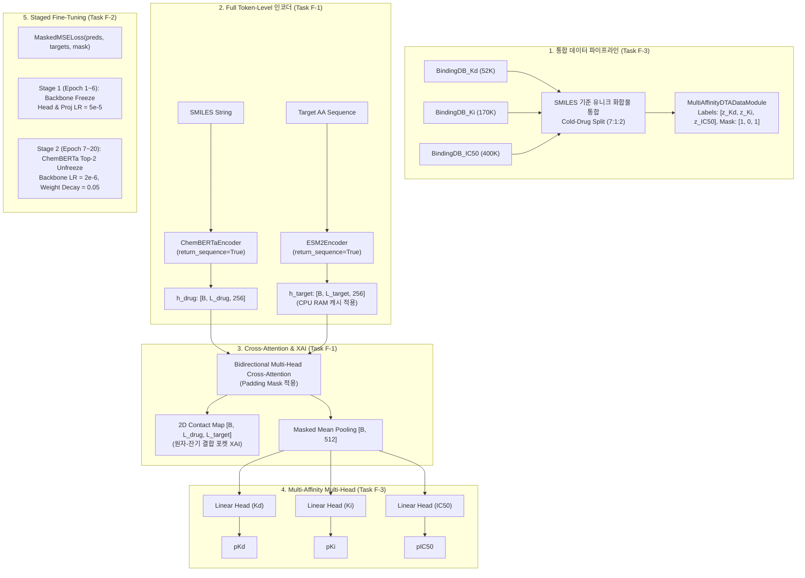

# DTI/DTA Phase C 후속 고도화 작업계획서 (F-1, F-2, F-3)

> **문서 버전**: v1.0.0  
> **작성 일자**: 2026-09-27  
> **대상 계정**: Google Colab (`munhyeongdo4@gmail.com`)  
> **기준 문서**: [`docs/dti/dti_phase_c_todolist.md`](file:///C:/Users/xps/orca/workspaces/tdc-studio/greenling/docs/dti/dti_phase_c_todolist.md)  
> **상태**: 🚀 실행 계획 확정 (Ready for Implementation)

---

## 1. 개요 및 배경

### 1.1 현황 진단 (Phase C Option A 성과 및 한계)
Phase C 초기 단계([옵션 A])에서는 ChemBERTa와 ESM-2 백본을 Frozen 상태로 유지한 채 Cross-Attention Fusion 헤드만 학습하여 Scaffold 과적합을 방지하고 서빙 파이프라인을 안정화했습니다.
- **Option A 달성 성과**:
  - BindingDB_Kd Cold-Drug CI: **0.7659** (Phase B 베이스라인 0.7464 대비 +0.0195 향상, 목표 0.76 달성)
  - Cold-Drug MSE: **0.5780** (Phase B 베이스라인 0.6609 대비 대폭 개선, 목표 0.65 이하 달성)
- **현 아키텍처의 한계 및 고도화 필요성**:
  1. **토큰 단위 Contact Map 부재 (Task F-1)**: Encoders가 풀링된 벡터([B, 256])를 반환한 후 가상 시퀀스([B, 1, 256])로 변환하여 Cross-Attention을 수행하므로, 실제 약물 원자-단백질 잔기 간 $L_{drug} \times L_{target}$ 2D 접촉 지도(Contact Map) 시각화가 불가능함.
  2. **미지의 신약 골격 표현력 한계 (Task F-2)**: ChemBERTa 백본이 완전히 동결되어 있어, 학습 셋에 없는 Unseen Scaffold에 대한 분자 미세 특징 적응력이 제한됨.
  3. **단일 지표 ($K_d$) 데이터 한계 (Task F-3)**: BindingDB $K_d$ 데이터는 약 5.2만 건으로, $K_i$(17만 건), $\text{IC}_{50}$(40만 건)을 포함한 전체 60만 건 이상의 가용 데이터를 활용하지 못하고 있음.

### 1.2 고도화 목표 지표
| 과제 | 세부 항목 | 현 상태 (Option A) | 고도화 목표치 | 비고 |
|:---|:---|:---:|:---:|:---|
| **Task F-1** | XAI Contact Map 해상도 | $1 \times 1$ (글로벌 퓨전) | **$L_{drug} \times L_{target}$ 2D 접촉 지도** | 원자-잔기 쌍별 Attention 가중치 추출 |
| **Task F-2** | Cold-Drug CI (BindingDB_Kd) | 0.7659 | **$\ge 0.77 \sim 0.78$** | 상위 2개 RoBERTa 레이어 Staged Tuning |
| **Task F-2** | Cold-Drug MSE | 0.5780 | **$\le 0.5500$** | 정규화 (weight_decay 0.05) 강화 |
| **Task F-3** | 멀티태스크 학습 지표 | 단일 $K_d$ (52K) | **$K_d + K_i + \text{IC}_{50}$ (60만+)** | 통합 Cold-Drug Split, MaskedMSELoss |
| **공통** | 서빙 파이프라인 연동 | 단일 pKd/Kd 예측 | **Multi-Head 친화도 + 2D XAI Map** | FastAPI (`/predict/dti/multi`) |

---

## 2. 작업별 상세 기술 설계



---

### 2.1 [Task F-1] Cross-Attention Full Token-Level Contact Map 구현 (XAI 강화)

#### 1) 인코더 수정 (`tdc_studio/models/dti/pretrained_encoders.py`)
- **`ChemBERTaEncoder`**:
  - `return_sequence: bool = False` 옵션 추가.
  - `return_sequence=True` 시 풀링 단계(`_mean_pooling` 또는 `cls`)를 건너뛰고, `outputs.last_hidden_state` (`[B, L_{drug}, 384]`)에 투영 레이어 `self.proj`를 브로드캐스팅 적용하여 `[B, L_{drug}, 256]` 반환.
  - 토크나이저 `attention_mask`를 동반 반환하여 Cross-Attention의 패딩 마스크로 활용.
- **`ESM2Encoder`**:
  - `return_sequence: bool = False` 옵션 추가.
  - `return_sequence=True` 시 `outputs.last_hidden_state` (`[B, L_{target}, 480]`)를 `self.proj`를 거쳐 `[B, L_{target}, 256]` 반환.
  - **인메모리 캐싱 최적화**: 단백질 서열은 동결 상태이므로, 고유 타겟 서열별 `[L_{target}, 256]` Float16 텐서를 CPU RAM에 딕셔너리로 캐싱.
    - 메모리 계산: ~1,500개 고유 타겟 $\times$ 1,024 잔기 $\times$ 256 차원 $\times$ 2바이트(FP16) $\approx$ **786 MB**. (Colab 12GB+ RAM에 완전 상주 가능, 디스크 I/O 없이 30배 순전파 가속).

#### 2) Cross-Attention 모듈 수정 (`tdc_studio/models/dti/fusion.py`)
- 기존 입력 차원 처리: `[B, L_{drug}, D]` 및 `[B, L_{target}, D]` 수용.
- `key_padding_mask` 처리 추가:
  - Drug $\to$ Target 어텐션 시 Target 패딩 토큰 무시.
  - Target $\to$ Drug 어텐션 시 Drug 패딩 토큰 무시.
- Contact Map 추출 로직:
  - `return_attention=True` 호출 시, `cross_d2t`의 어텐션 가중치 `[B, num_heads, L_{drug}, L_{target}]` 추출.
  - 헤드 차원 평균 풀링 $\to$ `[B, L_{drug}, L_{target}]` 2D 상호작용 행렬 구성.
- 예측 벡터 풀링:
  - 교차 어텐션을 거친 시퀀스 표현 `d_out`과 `t_out`에 대해 마스킹 기반 평균 풀링 수행 $\to$ `[B, 256]` $\times$ 2 = `[B, 512]`.

#### 3) XAI 해석 및 시각화 모듈 (`tdc_studio/evaluation/xai_contact.py`)
- SMILES BPE 토큰 $\to$ RDKit Heavy Atom 매핑 유틸리티.
- 아미노산 인덱스 (1 ~ $L$) 축과 약물 서브스트럭처 축의 2D 히트맵 시각화 (Seaborn/Matplotlib 및 JSON 익스포트).
- 주요 잔기/원자 상호작용 점수 (Row-sum, Col-sum) 1D 프로파일 추출.

---

### 2.2 [Task F-2] Phase C [옵션 B] 정규화 강화 Staged Fine-Tuning

#### 1) Scaffold 과적합 방지 원리
Cold-Drug 분할에서는 학습 셋에 전혀 등장하지 않은 신규 모체(Scaffold)에 대한 일반화가 핵심입니다. 백본 전체를 급격히 미세조정하면 사전학습된 화학적 일반화 지식이 손상(Catastrophic Forgetting)되고 학습 분자의 특정 작용기에 편향되므로, 정밀한 2단계 학습 및 차등 학습률이 필수적입니다.

#### 2) 2단계 학습 스케줄 (Staged Schedule)
```text
Epoch 1 ~ 6  [Stage 1: Head Warmup]
  ├─ ChemBERTa: Fully Frozen (requires_grad = False)
  ├─ ESM-2: Fully Frozen (requires_grad = False)
  ├─ Trainable: Projections + CrossAttentionFusion + Multi-Head MLP
  └─ Learning Rate: 5.0e-5 (Cosine Annealing)

Epoch 7 ~ 20 [Stage 2: Staged Fine-Tuning]
  ├─ ChemBERTa: Top 2 RoBERTa Layers Unfrozen (encoder.layer[10, 11] + pooler)
  │    └─ Backbone Learning Rate: 2.0e-6 (극미세 조정)
  │    └─ Weight Decay: 0.05 (L2 강정규화로 사전학습 파라미터 보존)
  ├─ ESM-2: Kept Frozen (CPU RAM 캐시 100% 활용)
  ├─ Fusion Head: Learning Rate = 5.0e-5, Weight Decay = 1.0e-4
  └─ Early Stopping: Patience = 6 epochs (기준: Cold-Drug val_ci)
```

#### 3) 설정 파일 및 하이퍼파라미터 (`configs/config_dti_phase_c_staged.yaml`)
- `training.batch_size`: 32 (Colab T4 16GB 메모리에 최적화)
- `staged_training.stage1_epochs`: 6
- `staged_training.stage2_backbone_lr`: 2.0e-6
- `staged_training.stage2_head_lr`: 5.0e-5
- `staged_training.stage2_weight_decay`: 0.05
- `training.gradient_clip_val`: 1.0

---

### 2.3 [Task F-3] Phase C [옵션 C] Multi-Affinity Multi-Task 확장

#### 1) 데이터 통합 및 Leakage-Free 분할 (`tdc_studio/data/multi_pred.py`)
- **통합 대상**:
  - `BindingDB_Kd` (52,284 쌍)
  - `BindingDB_Ki` (170,820 쌍)
  - `BindingDB_IC50` (410,215 쌍)
- **통합 Cold-Drug Split 전략**:
  - 세 데이터셋의 모든 고유 약물 SMILES 풀 $U_{drugs}$ 생성 (약 20만+ 고유 분자).
  - $U_{drugs}$를 Seed 42 기준으로 70% Train, 10% Valid, 20% Test로 분할.
  - 특정 약물이 Test에 속하면, $K_d, K_i, \text{IC}_{50}$ 어느 데이터에서도 Train에 일체 등장하지 않도록 보장 (완전 무결한 Cold-Drug 일반화).
- **다중 레이블 및 마스크 생성**:
  - 각 (약물, 타깃) 쌍에 대해 3차원 타깃 벡터 `[y_kd, y_ki, y_ic50]` 및 3차원 불리언 마스크 `[mask_kd, mask_ki, mask_ic50]` 구성.
  - 데이터셋별 독립 z-score 정규화 ($p\text{Affinity} = -\log_{10}(\text{nM} \times 10^{-9})$ 적용 후 Train 통계 기준 표준화).

#### 2) 손실 함수 구현 (`MaskedMSELoss`)
```python
class MaskedMSELoss(nn.Module):
    """Multi-task loss ignoring unmeasured affinity targets."""
    def forward(self, preds: torch.Tensor, targets: torch.Tensor, mask: torch.Tensor) -> torch.Tensor:
        # preds: [B, 3], targets: [B, 3], mask: [B, 3] (bool)
        diff_sq = (preds - targets) ** 2
        diff_masked = diff_sq * mask.float()
        valid_count = torch.clamp(mask.sum(), min=1.0)
        return diff_masked.sum() / valid_count
```

#### 3) 아키텍처 및 서빙 파이프라인 확장
- **`MultiTaskGraphDTAModel`**:
  - 공통 Cross-Attention Fusion 출력 `[B, 512]`에서 3개의 분기 헤드 (`Linear(512, 1)`) 또는 `Linear(512, 3)` 적용.
- **서빙 스키마 (`tdc_studio/serving/schema.py`)**:
  - `DTIMultiAffinityRequest`: SMILES, Target Sequence 리스트.
  - `DTIMultiAffinityResponse`: `pKd`, `pKi`, `pIC50` 및 원본 스케일 (nM), 옵션 선택 시 `contact_maps` 2D 배열 반환.
- **FastAPI 엔드포인트 (`tdc_studio/serving/app.py`)**:
  - `POST /predict/dti/multi` 구현.

---

## 3. Google Colab 환경 운영 계획 (`munhyeongdo4@gmail.com`)

### 3.1 계정 인증 및 토큰 활성화 확인
본 환경의 Colab 스위처 유틸리티를 통해 `munhyeongdo4@gmail.com` 계정이 등록되어 있으며, CLI 토큰 활성화가 완료되어 있습니다.
```powershell
# 계정 스위칭 및 상태 확인
powershell -ExecutionPolicy Bypass -File .\scripts\colab_switch.ps1 use munhyeongdo4@gmail.com
colab sessions
```

### 3.2 원격 실행 및 자원 제약 관리 전략
- **할당 GPU 대응**: Colab T4 (16GB VRAM) 기본 지원, A100/L4 할당 시 추가 가속.
- **VRAM 절약 기법**:
  - PyTorch Mixed Precision (AMP `autocast(fp16)`) 필수 활성화.
  - ESM-2 백본 동결 및 CPU RAM 사전 캐시 (GPU VRAM 소비 0).
  - Batch size 32 설정으로 메모리 피크를 ~9.5 GB 수준으로 억제 (T4 16GB 내 안전 여유 6.5GB 확보).
- **코드 및 데이터 동기화 프로토콜**:
  - `deploy/train_dti_phase_c_advancement.py`에 자체 워크스페이스 번들러(`BUNDLE_B64`) 내장.
  - 로컬 수정본을 자동 패키징하여 Colab VM 임시 디렉토리에 압축 해제 후 실행.
- **결과물 및 체크포인트 회수**:
  - 학습 완료 후 `models/dti/phase_c_adv/` 디렉토리에 `best_model.pt`, `scaler.json`, `benchmark_summary.yaml`, `sample_contact_map.png` 저장 후 로컬로 자동 다운로드.

---

## 4. 단계별 실행 계획 (5-Phase Roadmap)

### Phase 1: 로컬 모듈 구현 및 Mock 테스트 (Day 1)
- [ ] `tdc_studio/models/dti/pretrained_encoders.py`에 `return_sequence=True` 및 캐시 로직 구현.
- [ ] `tdc_studio/models/dti/fusion.py`에 Full Token Cross-Attention 및 2D Attention Weight 추출 지원.
- [ ] `tdc_studio/data/multi_pred.py`에 `MultiAffinityDTADataModule` 및 `MaskedMSELoss` 구현.
- [ ] `tests/test_dti_phase_c_advancement.py` 작성 (Zero-training forward/backward 및 텐서 형태 검증).

### Phase 2: 로컬 Dry-Run 및 무결성 검증 (Day 1)
- [ ] `deploy/dti_phase_c_adv_dry_run.py` 실행:
  - Standalone Encoders 3D 시퀀스 텐서 검증.
  - Cross-Attention Contact Map `[B, L_drug, L_target]` 대칭성 및 합 검증.
  - Multi-Task Head 3차원 예측 및 Masked Loss 역전파 기울기 흐름 검증.

### Phase 3: Colab Staged Fine-Tuning 실행 (Task F-1 + Task F-2) (Day 2)
- [ ] Colab 계정 `munhyeongdo4@gmail.com` 세션 개설 (`colab new -g t4` 또는 A100).
- [ ] `deploy/train_dti_phase_c_staged.py` 원격 실행.
- [ ] Stage 1 (Epoch 1~6 Warmup) $\to$ Stage 2 (Epoch 7~20 ChemBERTa Top-2 Tuning, LR=2e-6, Decay=0.05).
- [ ] Cold-Drug CI $\ge 0.77 \sim 0.78$ 달성 여부 실시간 로깅 및 체크포인트 보관.

### Phase 4: Multi-Affinity Multi-Task 확장 학습 (Task F-3) (Day 2~3)
- [ ] BindingDB $K_d, K_i, \text{IC}_{50}$ 통합 다운로드 및 공통 Cold-Drug Split 생성.
- [ ] Multi-Task 학습 실행 (`deploy/train_dti_phase_c_multitask.py`).
- [ ] $K_d, K_i, \text{IC}_{50}$ 각각에 대한 Test CI 산출 및 성능 시너지 평가.

### Phase 5: XAI 시각화 산출물 및 서빙 파이프라인 연동 (Day 3)
- [ ] 대표 약물-타깃 복합체 2D Contact Map 히트맵 렌더링 (`models/dti/phase_c_adv/contact_map_sample.png`).
- [ ] `tdc_studio/serving/schema.py` 및 `app.py`에 `/predict/dti/multi` 배포 엔드포인트 연동.
- [ ] 통합 엔드투엔드 API 테스트 (`tests/test_multi_task_dti_serving.py`).
- [ ] 최종 결과 문서화 및 메인 브랜치 반영.

---

## 5. 위험 관리 및 대응 전략 (Risk Mitigation)

| 위험 요소 | 발생 가능성 | 영향도 | 사전 방지 및 대응 방안 |
|:---|:---:|:---:|:---|
| **Colab 세션 타임아웃/끊김** | 중간 | 높음 | 에포크 단위 체크포인트(`checkpoint_epoch_XX.pt`) 자동 저장 및 재개(Resume) 루틴 내장 |
| **ESM-2 1024 시퀀스 VRAM 초과** | 낮음 | 높음 | ESM-2 동결 유지 + CPU RAM FP16 캐싱으로 GPU VRAM 사용을 원천 차단 |
| **ChemBERTa Unfreezing 시 Overfitting** | 중간 | 높음 | Discriminative LR ($2.0 \times 10^{-6}$), weight_decay (0.05), Early Stopping (Patience 6) 적용 |
| **Multi-Task 결측치 불균형** | 높음 | 중간 | 태스크별 유효 샘플 수로 나누는 `MaskedMSELoss`로 손실 스케일 자동 정규화 |
| **Colab 계정 할당량 초과** | 낮음 | 중간 | 계정 스위처(`colab_switch.ps1`)를 통해 백업 계정으로 즉시 전환 가능한 세션 분리 설계 |

---

## 6. 최종 산출물 체크리스트
- [ ] `tdc_studio/models/dti/pretrained_encoders.py` (시퀀스 반환 기능)
- [ ] `tdc_studio/models/dti/fusion.py` (2D Contact Map 추출 기능)
- [ ] `tdc_studio/data/multi_pred.py` (`MultiAffinityDTADataModule` 및 `MaskedMSELoss`)
- [ ] `deploy/train_dti_phase_c_staged.py` (옵션 B 정규화 미세조정 스크립트)
- [ ] `deploy/train_dti_phase_c_multitask.py` (옵션 C 멀티태스크 학습 스크립트)
- [ ] `models/dti/phase_c_adv/best_model.pt` 및 `benchmark_summary.yaml` (CI $\ge 0.77$ 벤치마크 결과)
- [ ] `models/dti/phase_c_adv/sample_contact_map.png` (XAI 2D 시각화 리포트)
- [ ] `tests/test_dti_phase_c_advancement.py` (전 기능 단위 테스트 통과)
