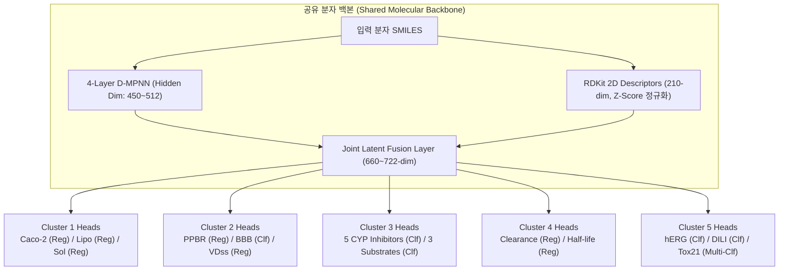

# ADMET Multi-Cluster Model Architecture & Design Specifications

> **Systematic Architectural Blueprints for All 5 ADMET Clusters in TDC-Studio**  
> *Formulated analogous to the Caco-2 SOTA Progression ($R^2: -0.16 \rightarrow 0.7327$)*

---

## 1. 개요 (Overview)

Caco-2 벤치마크 검증을 통해 확립된 핵심 아키텍처 원칙은 다음과 같습니다:
1. **D-MPNN Bond Directed Message Passing** (원자-결합 방향성 표현)
2. **210 RDKit Physico-chemical 2D Descriptors 결합**
3. **대규모 물리화학 앵커(Anchor)를 통한 표상 전이(Multi-Task Feature Transfer)**
4. **Scaffold Test Set 100% 격리 및 Masked Loss**
5. **5-Model Consensus Ensembling**

본 문서는 Caco-2 외 나머지 클러스터 및 다른 핵심 타깃(Lipophilicity, PPBR, BBB, VDss, CYP450, Clearance, hERG)을 최적화하기 위한 **클러스터별 전용 신경망 아키텍처 및 손실 함수 설계 방안**을 정의합니다.

---

## 2. 클러스터별 모델 설계 방안

---

### [CLUSTER 1-B] Lipophilicity Anchor Design (지질친화도 중심 설계)

*Caco-2가 아닌 `lipophilicity_astrazeneca` 자체를 SOTA로 도출하기 위한 모델*

1. **위계 구조 (Hierarchy):**
   - **Primary Task ($\lambda = 2.0$):** `lipophilicity_astrazeneca` ($\log D_{7.4}$)
   - **Auxiliary Anchors ($\lambda = 0.5$):** `solubility_aqsoldb` (용해도 $\log S$, 역상관 앵커), `hydrationfreeenergy_freesolv` (탈용매화 자유에너지), `caco2_wang` (생체막 분배 피드백)
2. **분자 표현형 특화 (Featurization):**
   - $\log D_{7.4}$는 생리적 pH(7.4)에서의 해리도($\text{p}K_a$)에 직결되므로, RDKit 디스크립터 중 **MolLogP, Crippen LogP, LabuteASA, TPSA, HBD, HBA, Rotatable Bonds**를 집중 보존.
3. **손실 함수 (Loss Function):**
   $$\mathcal{L}_{\text{total}} = 2.0 \cdot \text{SmoothL1}(\hat{y}_{\text{lipo}}, y_{\text{lipo}}) + 0.5 \cdot \text{SmoothL1}(\hat{y}_{\text{sol}}, y_{\text{sol}}) + 0.3 \cdot \text{SmoothL1}(\hat{y}_{\text{free}}, y_{\text{free}})$$
4. **목표 성능치 (ADMETlab 3.0 SOTA 기준):**
   - **Test $R^2 \ge 0.902 \pm 0.004$**, **Test MAE $\le 0.290 \pm 0.006$**, **Test RMSE $\le 0.398 \pm 0.008$**

---

### [CLUSTER 2] Plasma Distribution & Tissue Penetration (혈장 분포 동시 만족 설계)

*PPBR, BBB, VDss 3대 핵심 분포 지표를 어느 하나 소외시키지 않고 동시 최적화*

1. **난제 극복 기전 (Gradient Conflict Resolution):**
   - PPBR(회귀), VDss(회귀), BBB(이진분류)가 서로 다른 그래디언트 방향을 가지므로 고정 가중치($\lambda$) 대신 **가변 동질 불확실성 가중치(Learnable Homoscedastic Uncertainty, Kendall et al.)** 적용:
     $$\mathcal{L}_{\text{total}} = \frac{1}{2\sigma_{\text{PPBR}}^2}\mathcal{L}_{\text{PPBR}} + \frac{1}{2\sigma_{\text{VDss}}^2}\mathcal{L}_{\text{VDss}} + \frac{1}{\sigma_{\text{BBB}}^2}\mathcal{L}_{\text{BBB}} + \log(\sigma_{\text{PPBR}}\sigma_{\text{VDss}}\sigma_{\text{BBB}})$$
   - 학습 과정에서 $\sigma_i$ 파라미터가 자동으로 각 태스크의 노이즈와 수렴 속도를 맞춰 그래디언트 간섭을 해소.
2. **신경망 백본 사양:**
   - D-MPNN: `num_layers: 4`, `hidden_dim: 450`
   - 디스크립터: 210-dim RDKit 2D
   - FFN 분기층: 태스크별 2계층 MLP + LayerNorm + Dropout(0.2)
   - 가교 앵커: `lipophilicity_astrazeneca` ($\lambda=0.3$) 주입 (알부민 결합 및 뇌조직 침투의 공통 물리적 축 제공)
3. **목표 성능치 (ADMETlab 3.0 SOTA 기준):**
   - **PPBR (`ppbr_az`):** $R^2 \ge 0.824 \pm 0.031$, $\text{MAE} \le 5.98 \pm 0.43\%$
   - **VDss (`vdss_lombardo`):** $R^2 \ge 0.760 \pm 0.045$, $\text{MAE} \le 0.162 \pm 0.010$
   - **BBB (`bbb_martins`):** $\text{ROC-AUC} \ge 0.908 \pm 0.004$, $\text{ACC} \ge 0.836 \pm 0.014$

---

### [CLUSTER 3] Cytochrome P450 Metabolism (대사 효소 전이학습 설계)

*12,000+ 대규모 Veith 저해 앵커의 표현형을 660개 소규모 Substrate 기질 예측으로 지식 전이*

1. **2단계 전이학습 (Two-Stage Transfer Learning Protocol):**
   - **Stage 1 (Pretraining):** 5대 주요 CYP 저해 효소(`CYP1A2`, `CYP2C19`, `CYP2C9`, `CYP2D6`, `CYP3A4` Veith 데이터셋, 총 60,000+ 화합물)를 다중 레이블 분류(Multi-Label BCE Loss)로 사전 학습.
   - **Stage 2 (Substrate Fine-tuning):** 사전 학습된 D-MPNN 백본 가중치를 고정(또는 $0.1 \times \text{lr}$로 미세조정)하고, 3대 기질 turnover 헤드(`CYP2C9`, `CYP2D6`, `CYP3A4` Substrate)를 동시 학습.
2. **목표 성능치 (ADMETlab 3.0 SOTA 기준):**
   - **저해 효소 5종:** $\text{ROC-AUC} \ge 0.886 \sim 0.942$ (CYP1A2: 0.942, CYP2C9: 0.917, CYP3A4: 0.916)
   - **기질 3종 (희소 과제):**
     - CYP2D6 Substrate: $\text{ROC-AUC} \ge 0.844 \pm 0.057$
     - CYP3A4 Substrate: $\text{ROC-AUC} \ge 0.798 \pm 0.034$
     - CYP2C9 Substrate: $\text{ROC-AUC} \ge 0.782 \pm 0.042$

---

### [CLUSTER 4] Pharmacokinetic Clearance & Elimination (약물 소실 및 반감기 설계)

*체내 소실 반감기($t_{1/2}$)와 간세포/마이크로솜 클리어런스($CL_{\text{int}}$)의 생체 연계 학습*

1. **위계 구조:**
   - **Primary Co-Targets:** `half_life_obach` (회귀, 667개), `clearance_hepatocyte_az` (회귀, 1,213개), `clearance_microsome_az` (회귀, 1,102개)
   - **Biological Prior Anchors:** `cyp3a4_veith` (대사 효소 유무), `ppbr_az` (단백질 비결합 분율 $f_u$), `lipophilicity_astrazeneca`
2. **정규화 및 평가 지표:**
   - $CL$과 $t_{1/2}$는 Log-Normal 분포를 따르므로, 타깃 레이블에 $\log_{10}$ 변환 후 Z-Score 표준화 적용.
3. **목표 성능치 (ADMETlab 3.0 SOTA 기준):**
   - **Half-Life (`half_life_obach`):** $R^2 \ge 0.653 \pm 0.070$, $\text{MAE} \le 0.420 \pm 0.026$
   - **Clearance (`clearance_az`):** $R^2 \ge 0.667 \pm 0.046$, $\text{MAE} \le 1.783 \pm 0.160$

---

### [CLUSTER 5] Cardiac Safety & Broad Toxicity (일반 심장 및 광범위 독성 프로파일링)

*hERG 칼륨 채널 차단, 급성 경구 독성(LD50), 간독성(DILI), 발암성 및 Ames 돌연변이성*

1. **아키텍처 및 태스크 구성 (균형 규모 데이터셋 중심):**
   - **Primary Targets:** `herg` (Wang et al., 648개), `ld50_zhu` (급성 독성, 7,385개), `dili` (간독성, 475개), `ames` (돌연변이, 7,255개)
   - **Auxiliary Targets:** `skin_reaction` (404개), `carcinogens_lagunin` (280개), `clintox` (1,484개)
   - 독성 데이터는 심한 불균형(Imbalanced Data, 활성 화합물 $< 10\%$)을 가지므로 **Focal Loss** 또는 **Class-Weighted BCE Loss** 적용:
     $$\text{FL}(p_t) = -\alpha_t (1 - p_t)^\gamma \log(p_t) \quad (\gamma = 2.0)$$
2. **목표 성능치 (TDC Scaffold & ADMETlab 3.0 SOTA):**
   - **`herg` (Wang et al.):** $\text{ROC-AUC} \ge 0.887 \pm 0.013$, $\text{ACC} \ge 0.825$, $\text{MCC} \ge 0.610$
   - **`ld50_zhu`:** $\text{MAE} \le 0.584 \pm 0.012$, $R^2 \ge 0.624 \pm 0.021$
   - **`dili` (간독성):** $\text{ROC-AUC} \ge 0.860 \pm 0.052$, $\text{ACC} \ge 0.787 \pm 0.075$
   - **`ames` (돌연변이):** $\text{ROC-AUC} \ge 0.882 \pm 0.007$, $\text{ACC} \ge 0.785 \pm 0.015$

---

### [SPECIALIZED PIPELINE] Standalone Cardiotoxicity (hERG Central 306k 빅데이터 파이프라인)

*306,893개 대규모 분자의 농도별 저해율 다중과제 사전학습 및 고정밀 벤치마크 전이학습*

1. **일반 독성 MTL과 분리하는 핵심 근거:**
   - **그래디언트 압도 방지:** 306,893개 분자를 400~7,000개 수준의 일반 독성 데이터와 섞으면 650:1의 심각한 불균형으로 역전파 그래디언트가 독식되어 타 태스크의 표상이 붕괴됨.
   - **자체 3중 농도-반응 MTL 완성도:** 동일 30.7만 개 화합물에 대해 `hERG_at_1uM` (회귀), `hERG_at_10uM` (회귀), `hERG_inhib` (10µM 50% 차단 이진분류)가 모두 존재하여, 외인성 보조 태스크 없이도 내부 Hill 방정식 기반 상호 정규화가 완벽히 동작함.
2. **2단계 학습 전략 (Two-Stage Execution Protocol):**
   - **Stage 1 (306k Pre-training):** `herg_central`의 3개 어세이를 동시 학습하여 hERG 채널 결합 공동(Pore Cavity) 상호작용 특징을 고용량 백본(DMPNN Hidden 512, 5-layer)에 사전 각인 (`config_herg_standalone.yaml`).
   - **Stage 2 (Target Fine-tuning):** 사전 학습된 백본을 바탕으로 `hERG_Karim` (13,845개) 및 `hERG` (648개)에 미세조정을 수행하여 Scaffold Split 일반화 성능 극대화.
3. **목표 성능치:**
   - **`hERG_Karim` Fine-tuned:** $\text{ROC-AUC} \ge 0.940 \pm 0.005$, $\text{ACC} \ge 0.835$, $\text{MCC} \ge 0.685$
   - **`hERG` (Wang) Fine-tuned:** $\text{ROC-AUC} \ge 0.895 \pm 0.010$, $\text{ACC} \ge 0.830$
   - **`herg_central (hERG_inhib)`:** $\text{ROC-AUC} \ge 0.885 \pm 0.015$

