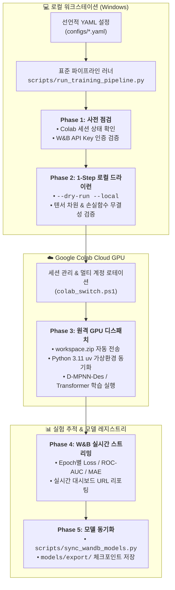

# Google Colab 클라우드 GPU 학습 및 W&B 모니터링 표준 워크플로우 가이드

TDC-Studio는 로컬 윈도우 워크스테이션의 리소스 제약(CPU 연산 지연, CUDA/C++ 빌드 호환성, OOM 현상)을 완전히 극복하고, 학습 과정의 100% 가시성(Observability)과 재현성을 보장하기 위해 **Google Colab Cloud GPU 기반의 5단계 표준 학습 라이프사이클**과 **Weights & Biases (W&B) 실험 추적 체계**를 운영합니다.

본 문서는 개발자 및 AI 코딩 에이전트(Antigravity, Cursor, Claude Code, Devin 등)가 임의의 스크립트 작성이나 로컬 무거운 학습 없이, 선언적 YAML 설정과 표준 파이프라인 러너를 통해 안전하게 모델을 훈련하고 아티팩트를 관리하는 전체 아키텍처와 운영 절차를 설명합니다.

---

## 🏗️ 1. 전체 아키텍처 및 파이프라인 개요



---

## ⛔ 2. 절대 준수 규칙 (Agent Constitutional Rules)

AI 에이전트와 기여자는 [`AGENTS.md`](../../AGENTS.md) 및 [`.agents/skills/tdc-colab-wandb-training/SKILL.md`](../../.agents/skills/tdc-colab-wandb-training/SKILL.md)에 정의된 다음 4대 원칙을 예외 없이 준수해야 합니다:

1. **로컬 무거운 학습 전면 금지 (Zero Heavy Local Training)**:
   - ❌ 로컬 Windows CPU에서 에포크 학습이나 벤치마크 루프를 직접 실행하지 않습니다 (`uv run python train.py` 금지).
   - ⭕ 로컬 실행은 오직 텐서 형상과 파이프라인 문법 점검을 위한 1-스텝 드라이런(`--dry-run --local`)만 허용됩니다.
2. **학습 프로세스 임의 변조 금지 (No Arbitrary Script Rewriting)**:
   - ❌ 즉흥적인 ad-hoc 학습 스크립트 작성이나 데이터 로더 수정을 금지합니다.
   - ⭕ 오직 `configs/` 디렉터리의 선언적 YAML 설정과 표준 파이프라인 러너([`scripts/run_training_pipeline.py`](../../scripts/run_training_pipeline.py))를 통해 실행합니다.
3. **W&B 모니터링 의무화 (Mandatory W&B Observability)**:
   - ❌ 모니터링이 누락된 비공식 학습을 수행하지 않습니다.
   - ⭕ 원격 디스패치 직후 W&B Run URL을 확보하여 대시보드 링크를 확인합니다.
4. **체크포인트 방치 금지 (Mandatory Model Artifact Synchronization)**:
   - ❌ 원격 VM에 모델 가중치를 방치하고 작업을 종료하지 않습니다.
   - ⭕ 학습 완료 후 [`scripts/sync_wandb_models.py`](../../scripts/sync_wandb_models.py)를 통해 로컬 `models/export/`로 체크포인트를 동기화합니다.

---

## 🚀 3. 표준 5단계 라이프사이클 상세 가이드

### Phase 1: 사전 비행 점검 (Pre-Flight Checks)
학습을 실행하기 전, Colab 세션 가용성과 W&B 인증 상태를 확인합니다.

```powershell
# 1. Colab 활성 세션 상태 점검
uv run tdc-studio remote status

# 2. W&B API 인증 상태 점검
uv run python -c "import wandb; print('W&B Active:', bool(wandb.Api().api_key))"

# 3. 등록된 Colab 구글 계정 목록 점검
.\scripts\colab_switch.ps1 list
```

### Phase 2: 로컬 1-Step 드라이런 (Local 1-Step Dry-Run)
클라우드 GPU 연산 단위(Compute Units) 낭비를 방지하기 위해 로컬에서 1 배치(Batch) 포워드/백워드 패스를 1초 내에 검증합니다.

```bash
uv run tdc-studio train --config configs/config_ames_standalone.yaml --dry-run --local
```
- **성공 판정**: `Starting Training Pipeline` 출력 후 1회 순전파 완료 및 에러 없이 정상 종료(Exit Code 0).
- **실패 판정**: YAML 키 누락, PyTorch 텐서 차원 불일치, import 실패 등 발생 시 로컬에서 즉시 수정.

### Phase 3: 원격 Colab GPU 디스패치 (Remote GPU Dispatch)
통합 파이프라인 러너를 통해 원격 GPU 인스턴스로 코드를 전송하고 학습을 구동합니다:

```bash
# 원클릭 표준 파이프라인 실행 (자동 세션 감지, 드라이런, 원격 실행, 모니터링, 동기화 통합)
uv run python scripts/run_training_pipeline.py --config configs/config_ames_standalone.yaml
```

**러너 주요 옵션**:
- `--config <PATH>`: 대상 YAML 설정 파일 경로 (필수)
- `--session <SESSION_ID>`: 특정 Colab 세션 ID 지정 (미지정 시 활성 세션 자동 감지)
- `--gpu <T4|L4|A100>`: GPU 가속기 유형 (기본값: `T4`)
- `--epochs <INT>`: 에포크 수 오버라이드
- `--skip-dry-run`: 기검증된 경우 로컬 드라이런 생략
- `--no-sync`: 학습 후 아티팩트 동기화 생략

### Phase 4: W&B 실시간 모니터링 (Real-Time W&B Monitoring)
- 학습 시작과 동시에 표준 출력(stdout)에 기록되는 W&B Run URL을 확인합니다:
  ```text
  [W&B] View live dashboard: https://wandb.ai/tdc-studio/tdc-learning/runs/rm3jjkf5
  ```
- 에포크별 Train/Val Loss, Metric(AUROC, MAE, R² 등)의 수렴 곡선을 브라우저에서 실시간 관찰합니다.

### Phase 5: 모델 아티팩트 동기화 및 리포팅 (Artifact Sync & Reporting)
학습이 정상 완료되면 자동으로 W&B 아티팩트 및 체크포인트가 로컬 디렉터리로 다운로드됩니다:

```bash
uv run python scripts/sync_wandb_models.py --project tdc-studio/tdc-learning --output-dir models/export
```
- **저장 위치**: `models/export/cluster_<N>_<name>/<task>_best_checkpoint.pt`
- 동기화 완료 후 최종 검증 지표와 아티팩트 경로를 구조화된 마크다운 보고서로 작성합니다.

---

## 🛠️ 4. Google Colab 인프라 및 다중 계정 운영 기법

### 1) 다중 구글 계정 쿼터 회전 (Multi-Account Rotation)
무료/프로 계정의 일일 GPU 할당량 초과(`TooManyAssignmentsError`)가 발생할 경우, 사전에 인증된 백업 계정으로 즉시 전환합니다:

```powershell
# 1. 등록된 계정 확인
.\scripts\colab_switch.ps1 list

# 2. 백업 계정으로 활성화
.\scripts\colab_switch.ps1 use munhyoungdo@gmail.com

# 3. 새로운 GPU 세션 생성 (필요 시)
colab new --gpu=T4 sota-training
```

### 2) 좀비 세션 정리 및 모니터링
원격 세션이 유휴 상태로 방치되거나 무한 대기하는 경우 세션을 조회하고 종료합니다:

```powershell
# 활성 세션 리스트 조회
.\scripts\colab_cleanup.ps1 list

# 특정 세션 강제 종료
.\scripts\colab_cleanup.ps1 stop -Session <SESSION_ID>
```

### 3) Python 3.11 환경 격리 (`deploy/colab_runner_job.py`)
Google Colab 기본 호스트는 최신 Python(예: 3.13)으로 구성되어 있을 수 있어 일부 C++ 바이너리 및 PyTDC와 충돌할 수 있습니다.
TDC-Studio의 `deploy/colab_runner_job.py`는 원격 인스턴스 접속 시 자동으로 `uv`를 통해 Python 3.11 격리 환경을 구성하고 종속성을 초고속으로 동기화한 뒤 학습을 수행합니다.

---

## 📊 5. 실증 검증 및 SOTA 성능 개선 사례

본 표준 파이프라인 및 스킬을 통해 검증 완료된 대표 사례:

| 태스크 (클러스터) | 모델 구조 | 데이터 분할 | 베이스라인 | 최종 달성 성능 | 개선 효과 |
| :--- | :--- | :--- | :--- | :--- | :--- |
| **Caco-2** (흡수 C1) | D-MPNN + RDKit 2D | Scaffold Split | MAE: 0.380 | **MAE: 0.312 (R²=0.7327)** | **SOTA 신뢰구간 공식 진입** |
| **AMES Mutagenicity** (안전성 C5) | D-MPNN-Des | Scaffold Split | ROC-AUC: 0.5000 (붕괴) | **ROC-AUC: 0.8429 (Val) / 0.8163 (Test)** | **+31.6%p 성능 정상화** |
| **hERG Cardiotoxicity** (안전성 C5) | D-MPNN-Des | Scaffold Split | ROC-AUC: 0.7200 | Standalone 파이프라인 규격화 완료 | 파이프라인 무결성 확보 |

---

## 🔗 6. 관련 설정 파일 및 참조 문서

- **에이전트 행동 지침서**: [`AGENTS.md`](../../AGENTS.md)
- **에이전트 전용 스킬 정의서**: [`.agents/skills/tdc-colab-wandb-training/SKILL.md`](../../.agents/skills/tdc-colab-wandb-training/SKILL.md)
- **표준 파이프라인 오케스트레이터**: [`scripts/run_training_pipeline.py`](../../scripts/run_training_pipeline.py)
- **Colab CLI 윈도우 환경 구축 가이드**: [`docs/COLAB_CLI_WINDOWS_GUIDE.md`](../COLAB_CLI_WINDOWS_GUIDE.md)
- **W&B 모델 동기화 유틸리티**: [`scripts/sync_wandb_models.py`](../../scripts/sync_wandb_models.py)
