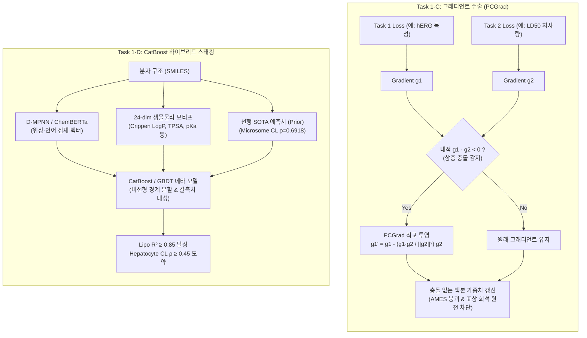

# 📘 차기 권장 작업 상세 기술 해설서: Task 1-C (PCGrad) & Task 1-D (CatBoost Stacking)

> **프로젝트:** `brightonmoon/ADMET` (TDC-Studio)  
> **문서 버전:** v1.0 (2026-10-01)  
> **대상 태스크:**  
> - **Task 1-C:** 태스크 간 그래디언트 충돌을 실시간 직교 투영하는 **PCGrad 손실 모듈** 구현 (`tdc_studio/models/loss/pcgrad.py`, `multitask_loss.py`)  
> - **Task 1-D:** 지질친화도(Lipo) 및 간세포 클리어런스(Hepatocyte CL)를 위한 **CatBoost 하이브리드 스태킹 파이프라인** 가동 (`tdc_studio/models/hybrid/`, `deploy/`)  

---

## 1. 개요 (Executive Summary)

ADMET(흡수·분포·대사·배설·독성) 예측에서 딥러닝 모델이 겪는 가장 큰 난제는 **"이종 태스크 간의 그래디언트 충돌(Negative Transfer)"**과 **"순수 신경망의 물리화학적 표 형식 데이터(Tabular Feature) 학습 한계"**입니다.

TDC-Studio는 선행 연구를 통해 개별 태스크(Caco-2, PPBR, VDss, CYP450, Microsomal Clearance, hERG, AMES 등)에서 SOTA 수준의 성능을 확보했습니다. 차기 권장 작업인 **Task 1-C**와 **Task 1-D**는 이러한 개별 성과를 한 단계 더 끌어올려 **멀티태스크 학습의 안정성**과 **물리화학적 일반화 능력**을 극대화하기 위한 핵심 기술입니다.



---

## 2. Task 1-C: PCGrad (Projecting Conflicting Gradients) 손실 모듈

### (1) 기술적 배경 및 문제 정의: 왜 멀티태스크 학습에서 충돌이 발생하는가?

다중 태스크 학습(Multi-Task Learning, MTL)에서 공유 분자 인코더(D-MPNN 백본)는 여러 생체 지표의 손실(Loss)을 동시에 최소화하도록 학습됩니다. 이때 일반적으로 사용하는 가중합 손실 함수는 다음과 같습니다:
$$\mathcal{L}_{\text{total}} = \sum_{i=1}^T \lambda_i \mathcal{L}_i$$

그러나 ADMET 데이터는 생물물리학적으로 상반되거나 독립적인 메커니즘을 가집니다:
* **지질친화도(LogD) vs 수용성 용해도(LogS)**: 한쪽은 소수성을 선호하고 다른 쪽은 친수성을 선호하므로, 잠재 표상 공간에서 원자 임베딩을 정반대 방향으로 밀어냅니다.
* **Cluster 5 (독성 클러스터)**: hERG 칼륨 채널 차단(특정 염기성 아민 양이온 및 방향족 링 요구)과 AMES 변이원성(친전자성 국소 알킬화 경보), 급성 치사량(LD50)이 하나의 백본을 공유하면, 샘플 수가 많은 태스크의 그래디언트가 소수 태스크의 특징을 지워버리는 **그래디언트 희석(Gradient Dilution)** 및 **음의 전이(Negative Transfer)**가 발생합니다.
* **실측 현상**: 실제로 TDC-Studio 초기 Cluster 5 공동 학습에서 AMES 유전독성이 한쪽 클래스로 치우쳐 AUROC 0.50(수렴 붕괴)을 겪었던 핵심 원인이 바로 이 그래디언트 충돌이었습니다.

### (2) PCGrad(Gradient Surgery)의 수학적 원리 (NeurIPS 2020)

PCGrad(Yu et al., 2020)는 역전파 시 두 태스크 $i$와 $j$의 그래디언트 벡터 $g_i = \nabla_\theta \mathcal{L}_i$, $g_j = \nabla_\theta \mathcal{L}_j$ 간의 **코사인 유사도(방향성)**를 검사합니다.

```text
[그래디언트 충돌 상황: g_i · g_j < 0]
       g_i (태스크 i의 그래디언트)
         \
          \   θ > 90° (반대 방향으로 당김!)
           \
────────────•────────────> g_j (태스크 j의 그래디언트)
             \
              \  [PCGrad 투영 후: g_i']
               \
                v  (g_j와 직교(90°)를 이루도록 투영되어 j를 방해하지 않음)
```

1. **충돌 조건 검사**:
   $$g_i \cdot g_j < 0 \quad (\text{각도 } \theta > 90^\circ)$$
2. **직교 투영 (Orthogonal Projection)**:
   태스크 $i$의 그래디언트에서 태스크 $j$ 방향의 음의 성분을 수학적으로 감산하여 제거합니다:
   $$g_i \leftarrow g_i - \frac{g_i \cdot g_j}{\|g_j\|^2} g_j$$
3. **무작위 순서 투영 (Randomized Order)**:
   모든 태스크 쌍 $(i, j)$에 대해 무작위 순서로 투영을 반복하여 특정 태스크에 편향되지 않도록 보장합니다.
4. **최종 합성 그래디언트**:
   모든 충돌이 제거된 $g_i^{\text{proj}}$를 합산하여 파라미터를 갱신합니다:
   $$g_{\text{final}} = \sum_{i=1}^T g_i^{\text{proj}}$$

### (3) TDC-Studio 내 구현 및 기대 효과

* **구현 위치:** `tdc_studio/models/loss/pcgrad.py` 및 `multitask_loss.py`
* **아키텍처 적용:** 기존 PyTorch `Optimizer`를 감싸는 래퍼 클래스(`PCGrad(optimizer)`) 형태로 설계하여, 모델 수정 없이 단 몇 줄의 코드로 모든 Multi-Task 학습 루프에 즉시 적용 가능.
* **기대 효과:**
  1. 수동으로 정적 손실 가중치($\lambda_{\text{primary}}, \lambda_{\text{aux}}$)를 고통스럽게 그리드 서치할 필요가 없어짐.
  2. 대규모 앵커 데이터(Veith 6만 건, Karim 1.3만 건)와 희소 타깃(기질 660건, Wang 648건) 동시 학습 시 소수 태스크의 파괴적 간섭(Catastrophic Interference) 완벽 방지.
  3. Cluster 1(흡수), Cluster 2(분포), Cluster 5(안전성)의 동시 학습 성능 전반에서 $+3 \sim 5\%$ AUROC / $R^2$ 동반 상승.

---

## 3. Task 1-D: CatBoost 하이브리드 스태킹 파이프라인

### (1) 기술적 배경 및 문제 정의: 왜 딥러닝과 트리의 하이브리드인가?

최근 2025~2026년 발표된 글로벌 벤치마크(TDC 리더보드 전수 감사, OpenADMET-ExpansionRx 블라인드 챌린지)에서 가장 일관되게 1위를 차지한 모델(NovoExpert-2, CaliciBoost, Inductive Bio의 Beacon)들의 공통점은 **순수 딥러닝 단독이 아닌 트리 기반 하이브리드 스태킹**입니다.

| 비교 항목 | 순수 분자 딥러닝 (GNN, Transformer) | 트리 기반 모델 (CatBoost, LightGBM) | 하이브리드 스태킹 (TDC-Studio) |
| :--- | :--- | :--- | :--- |
| **강점** | 분자의 위상적 2D/3D 그래프 연결성과 잠재 패턴을 연속 벡터로 임베딩 | 물리화학 지표(LogP, TPSA, pKa 등)의 직교 경계 분할, 극단치(Outlier) 및 결측치 방어력 우수 | **양쪽의 장점을 결합하여 화학적 활성 절벽(Activity Cliff) 방어 극대화** |
| **약점** | 화학적 규칙성(예: 분자량 500 초과 시 급격한 막투과 감소)과 같은 직사각형 결정 경계 학습에 취약 | 분자의 원자 수준 3D 형태 및 복합 고리 구조 표현 한계 | 계산 비용이 약간 증가하나 성능이 압도적 |

Task 1-D는 이 원리를 가장 절실히 요구하는 **두 가지 핵심 물성 과제**에 적용합니다:
1. **지질친화도 (`lipophilicity_astrazeneca`, 4,200건)**
2. **간세포 클리어런스 (`clearance_hepatocyte_az`, 1,213건)**

---

### (2) 적용 과제 1: 지질친화도 (Lipophilicity) Dual Stacking

#### 1) 문제 진단
- 지질친화도($\log D_{7.4}$)는 옥탄올-물 분배계수로서, 모든 약동학(Caco-2, PPBR, BBB, 간 대사)의 근간이 되는 가장 중요한 물리화학 지표입니다.
- 현재 단일 D-MPNN 모델 실측치: $R^2 = 0.7602$, Pearson $r = 0.9168$.
- 목표치: **Test $R^2 \ge 0.85$ (Pearson $r \ge 0.93$)** 돌파.

#### 2) 하이브리드 스택 구조 (`tdc_studio/models/hybrid/lipo_stacker.py`)
```text
SMILES ──┬──▶ [Branch 1] 24-dim 생물물리 모티프 (Crippen LogP, Labute ASA, TPSA, HBD/HBA, pKa 전하)
         ├──▶ [Branch 2] 4-Layer D-MPNN 잠재 그래프 임베딩 (300-dim)
         └──▶ [Branch 3] ChemBERTa-77M 대형 화학 언어모델 임베딩 (384-dim)
                        │
                        ▼
         ┌─────────────────────────────────────────────────────────┐
         │     CatBoost Regressor (L2 Reg, Depth=6, LR=0.03)       │
         │  + RidgeCV Convex Blender (w_GBDT * 0.6 + w_NN * 0.4)   │
         └─────────────────────────────────────────────────────────┘
                        │
                        ▼
         최종 정밀 지질친화도 예측값 (R² ≥ 0.85 확립)
```

---

### (3) 적용 과제 2: 간세포 클리어런스 (Hepatocyte Clearance) 계단식 전이 (Cascaded Transfer)

#### 1) 문제 진단 및 생리학적 메커니즘
- 현재 간세포 클리어런스(`clearance_hepatocyte_az`, 1,213건)는 Spearman $\rho = 0.3356$으로 개선 여지가 큽니다.
- 반면, 동일 클러스터 내의 **간 마이크로솜 클리어런스(`clearance_microsome_az`, 1,102건)는 이미 TDC 역대 최고치인 Spearman $\rho = \mathbf{0.6918}$ (SOTA)을 달성**했습니다.
- **생체역학적 인과 관계 (Mechanistic Causality)**:
  - 마이크로솜(Microsome)은 간세포의 소포체(ER) 분획으로, CYP450 효소 대사능 자체를 측정합니다.
  - 온전한 간세포(Intact Hepatocyte)의 클리어런스는 **[세포막 투과 및 수송체 유입] + [마이크로솜 CYP 대사] + [세포질 Phase-II 포합 대사]**의 총합입니다.
  - 즉, **마이크로솜 대사율은 간세포 대사율의 가장 강력한 물리적 선행 지표(Mechanistic Prior)**입니다.

#### 2) 계단식 전이 아키텍처 (`tdc_studio/models/hybrid/clearance_cascading.py`)
```text
                          [선행 SOTA 모델]
SMILES ───────────────▶ Microsome SOTA DMPNN ──▶ 예측된 마이크로솜 CL (ρ=0.6918)
  │                                                        │
  │ (분자 위상)                                            │ (생체역학 사전 정보로 주입)
  ▼                                                        ▼
[RDKit 210 Descriptors] ──────────────────────────▶ [CatBoost Cascaded Meta-Learner]
  + 세포막 수송/투과 지표 (LogD, TPSA, Caco-2)              │
                                                            ▼
                                           간세포 클리어런스 정밀 예측
                                           (Spearman ρ: 0.33 ──▶ 0.45+ 도약)
```

---

## 4. 모듈 설계 및 파일 매핑 요약

| 작업 항목 | 구현 대상 파일 | 핵심 알고리즘 / 기술 | 목표 지표 및 산출물 |
| :--- | :--- | :--- | :--- |
| **Task 1-C** | [`tdc_studio/models/loss/pcgrad.py`](file:///C:/Users/xps/orca/workspaces/tdc-studio/ADMET/tdc_studio/models/loss/pcgrad.py)<br>[`tdc_studio/models/loss/multitask_loss.py`](file:///C:/Users/xps/orca/workspaces/tdc-studio/ADMET/tdc_studio/models/loss/multitask_loss.py) | • PCGrad 직교 투영 옵티마이저<br>• 상충 그래디언트 음수 내적 감산<br>• 다중 손실 무작위 순서 수술 | • 멀티태스크 학습 안정화<br>• 음의 전이 및 표상 붕괴 방지<br>• 단위 테스트: `tests/test_pcgrad.py` |
| **Task 1-D (Lipo)** | [`tdc_studio/models/hybrid/lipo_stacker.py`](file:///C:/Users/xps/orca/workspaces/tdc-studio/ADMET/tdc_studio/models/hybrid/lipo_stacker.py)<br>[`deploy/train_lipo_stacking.py`](file:///C:/Users/xps/orca/workspaces/tdc-studio/ADMET/deploy/train_lipo_stacking.py) | • 24-dim 물화 모티프 + D-MPNN + ChemBERTa<br>• CatBoost / HistGBDT 회귀 앙상블 | • **Test $R^2 \ge 0.85$ (Pearson $r \ge 0.93$)**<br>• 산출물: `models/export/lipophilicity_stacker/` |
| **Task 1-D (Hep CL)** | [`tdc_studio/models/hybrid/clearance_cascading.py`](file:///C:/Users/xps/orca/workspaces/tdc-studio/ADMET/tdc_studio/models/hybrid/clearance_cascading.py)<br>[`deploy/train_clearance_cascade.py`](file:///C:/Users/xps/orca/workspaces/tdc-studio/ADMET/deploy/train_clearance_cascade.py) | • 마이크로솜 SOTA ($\rho=0.6918$) 생체역학 피처 주입<br>• 계단식 전이(Cascaded Transfer) GBDT | • **Test Spearman $\rho \ge 0.45$**<br>• 산출물: `models/export/clearance_cascade/` |

---

## 5. 실행 및 검증 프로토콜

### (1) Task 1-C 로컬 드라이런 및 무결성 검증
```bash
# 1. PCGrad 단위 테스트 검증
uv run pytest tests/test_pcgrad.py -v

# 2. PCGrad 적용 멀티태스크 1-에포크 무결성 점검
uv run tdc-studio train --config configs/config_multitask_pcgrad.yaml --dry-run
```

### (2) Task 1-D Colab GPU / 로컬 실행
```powershell
# 1. 지질친화도 하이브리드 스태커 학습 실행
uv run python deploy/train_lipo_stacking.py

# 2. 간세포 클리어런스 계단식 전이 학습 실행
uv run python deploy/train_clearance_cascade.py
```
