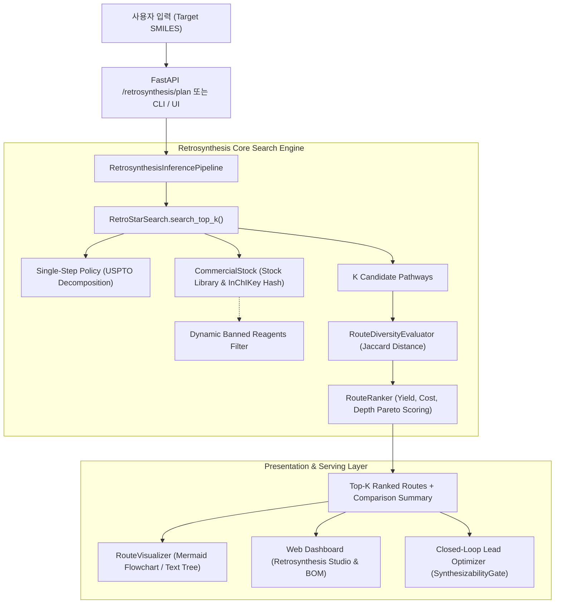

# TDC-Studio Retrosynthesis Module Technical Archive & Handover Report

> **문서 상태:** Production Archive (완료)  
> **기준 일자:** 2026-10-01  
> **기준 브랜치:** `main` (커밋: `6b3134c`)  
> **작성 모듈:** `tdc_studio.retrosynthesis`, `tdc_studio.models.retrosynthesis`, `tdc_studio.serving`  
> **관련 문서:**  
> - [`docs/retrosynthesis/retrosynthesis_master_work_plan.md`](file:///C:/Users/xps/orca/workspaces/tdc-studio/docs/retrosynthesis/retrosynthesis_master_work_plan.md)  
> - [`docs/retrosynthesis/technical_survey.md`](file:///C:/Users/xps/orca/workspaces/tdc-studio/docs/retrosynthesis/technical_survey.md)  
> - [`docs/retrosynthesis/retrosynthesis_todolist.md`](file:///C:/Users/xps/orca/workspaces/tdc-studio/docs/retrosynthesis/retrosynthesis_todolist.md)

---

## 1. 개요 및 비즈니스 목적 (Executive Summary)

신약 개발 과정에서 컴퓨터 기반 약물 분자 설계(De Novo Drug Design) 및 납 화합물 최적화(Lead Optimization)가 제안한 가상 분자들은 **실제 유기합성 가능성(Synthetic Accessibility)** 및 **경제적인 원료 수급 가능성**이 보장되지 않으면 연구실 또는 파이롯트 생산 단계에서 탈락합니다.

본 **Retrosynthesis(역합성)** 모듈은 제약사 합성 연구원 및 의약화학자들의 실제 워크플로우에 최적화된 **"엔드투엔드 역합성 경로 탐색 및 의사결정 지원 엔진"**입니다.
단순히 "단일 반응물 예측"이나 "최초 발견 경로 1개"만을 제시하는 기존 학술용 툴의 한계를 극복하고, 다음 핵심 요구사항을 완전히 충족하도록 설계·구현되었습니다:

1. **상용 빌딩 블록(Commercial Building Blocks) 중심 도식화:**
   - 최종 목표 약물(Target Molecule)부터 시중에서 구매 가능한 출발 물질(Stock Precursors)까지의 전 과정을 명확하게 시각화 (Mermaid.js SVG 흐름도 및 상세 텍스트 트리).
2. **USPTO 기반 분해 모델 및 지능형 트리 탐색 결합:**
   - USPTO-50K 데이터셋 기반 단일 단계 분해 정책(Rule Policy & Seq2Seq Transformer)과 Neural A* (Retro*) 휴리스틱 AND-OR 트리 탐색기 결합.
3. **Top-K 다중 대안 경로(Multi-Route) 및 Pareto 랭킹:**
   - 1순위(최적/Champion)뿐만 아니라 2, 3, 4, 5순위 대안(Alternative) 경로를 동시 탐색.
   - 누적 수율(Yield), 총 예상 비용(Cost $/g), 반응 단계 수(Depth), 출발 물질 수를 종합한 Pareto 점수 산출 및 비교 행렬(Comparison Matrix) 제공.
4. **공급망 단절 및 원료 품절 시뮬레이션 (Blacklist / Banned SMILES):**
   - 특정 시약 공급 차단 시 우회 경로를 실시간 재탐색하는 공급망 복원력(Supply Chain Resilience) 기능 내장.
5. **4-in-1 인터랙티브 웹 대시보드 및 Closed-Loop 최적화 연계:**
   - 브라우저 상에서 인터랙티브하게 경로를 검토하고, Lead Optimizer의 독성/ADMET 개선 후보물질을 원클릭으로 합성 경로 탐색으로 연계.

---

## 2. 시스템 아키텍처 및 데이터 흐름 (Architecture & Data Flow)

### 2.1 전체 데이터 처리 파이프라인



### 2.2 디렉터리 및 모듈 맵 (Component Map)

| 디렉터리 / 파일 경로 | 역할 및 핵심 기능 |
| :--- | :--- |
| `tdc_studio/retrosynthesis/` | **역합성 핵심 도메인 로직** |
| ├── `route.py` | `RetrosynthesisRoute`, `ReactionStep`, `RouteDiversityEvaluator`, `RouteRanker` 정의 |
| ├── `stock.py` | 상용 시약 재고 인덱서 `StockLibrary`, `ban_compound()`, 동적 블랙리스트 제어 |
| ├── `visualizer.py` | Mermaid.js SVG 변환기 (`to_mermaid`), ASCII 트리 (`to_text_tree`), 마크다운 비교표 |
| └── `search/retro_star.py` | Neural A* AND-OR 트리 탐색기 (`search`, `search_top_k`), 비용 가산 휴리스틱 |
| `tdc_studio/models/retrosynthesis/` | **단일 단계 역합성 정책 및 순방향 검증 모델** |
| ├── `base.py` | `BaseRetroModel` 추상 클래스 |
| ├── `rule_policy.py` | USPTO 10대 핵심 유기반응 템플릿 기반 분해 정책 (빠른 추론/안정적 Fallback) |
| ├── `seq2seq_retro.py` | Transformer 기반 서열-서열 템플릿-프리 역합성 생성 모델 |
| └── `forward_verifier.py` | Round-Trip 일치성 검증기 (환각 방지) |
| `tdc_studio/serving/` | **프로덕션 서빙 및 인터랙티브 웹 UI** |
| ├── `retrosynthesis_pipeline.py`| `RetrosynthesisInferencePipeline` (싱글톤 파이프라인 관리자) |
| ├── `schema.py` | `RetroPlanRequest`, `RetroPlanResponse`, `RetroRouteItem`, `RouteComparisonItem` |
| ├── `app.py` | FastAPI 엔드포인트 (`/retrosynthesis/plan`, `/retrosynthesis/single-step`) |
| └── `dashboard_html.py` | **인터랙티브 웹 대시보드 (Retrosynthesis Studio, Mermaid.js, BOM 시뮬레이터)** |
| `tdc_studio/generative/` | **생성 모델 및 합성 가능성 게이트** |
| └── `synthesizability_gate.py` | `SynthesizabilityGate`, `synthetic_tractability_score`, 대안 경로 개수 게이트 |
| `tdc_studio/cli.py` | CLI 명령어 (`tdc-studio retrosynthesis plan --top-k 3 --compare`) |

---

## 3. 핵심 알고리즘 상세 (Algorithmic Details)

### 3.1 Neural A* (Retro*) 다중 경로 탐색 (`search_top_k`)
- **AND-OR Graph Search:**
  - OR-Node: 목표 분자 또는 중간체 화학종.
  - AND-Node: 특정 화학 반응 (모든 전구체가 상용 시약에 도달해야 해결됨).
- **다중 경로 우선순위 큐:**
  - $K$개의 독립적인 완료 경로를 우선순위 큐(`PriorityQueue`)에 누적.
  - 경로 비용 함수: $Cost(Path) = \sum_{step} Cost(Reaction) + \sum_{bb} Cost(BuildingBlock)$
- **조기 종료 방지 및 시간 제어:**
  - 최적 경로 발견 후 즉시 중단하지 않고 지정된 $K$개 경로가 수집되거나 `timeout_sec`에 도달할 때까지 탐색을 지속.

### 3.2 경로 다양성 평가기 (`RouteDiversityEvaluator`)
제약사 합성 검토 시 거의 동일한 시약과 동일한 반응의 미세 변형 경로가 중복 제시되는 것을 방지하기 위해 **Jaccard 거리** 기반의 다양성 필터링을 수행합니다:

$$Distance(R_A, R_B) = 0.5 \cdot \left(1 - \frac{|BB_A \cap BB_B|}{|BB_A \cup BB_B|}\right) + 0.5 \cdot \left(1 - \frac{|Rules_A \cap Rules_B|}{|Rules_A \cup Rules_B|}\right)$$

- 사용자가 설정한 `min_diversity` 임계값(기본값 0.25) 이상의 거리를 유지하는 경로만을 Top-K에 채택합니다.

### 3.3 다목적 Pareto 랭킹 (`RouteRanker`)
경로의 우수성을 단일 지표가 아닌 실제 제약 합성 현실을 반영한 가중 합산 스코어로 평가합니다:

$$Score = w_{solved} \cdot \mathbf{1}_{\{solved\}} + w_{yield} \cdot \left(\frac{Yield}{100}\right) - w_{cost} \cdot \left(\frac{Cost}{100}\right) - w_{depth} \cdot \left(\frac{Depth}{10}\right)$$

- 기본 가중치: $w_{solved} = 10.0$, $w_{yield} = 2.0$, $w_{cost} = 1.0$, $w_{depth} = 0.5$.
- 1위(최적/Champion)부터 $K$위까지 정렬되어 연구원에게 명확한 선택지를 제공합니다.

### 3.4 공급망 복원력 및 원료 품절 시뮬레이션 (`ban_compound`)
- `StockLibrary.ban_compound(smiles)`: 특정 시약을 블랙리스트 세트에 추가하여 탐색 시 상용 시약 판정에서 즉각 배제.
- 특정 원료가 품절되거나 특허 분쟁이 있는 경우, 알고리즘이 다른 상용 전구체를 사용하는 대체 합성 경로를 자동으로 탐색.

---

## 4. 웹 대시보드 통합 기능 (Web Dashboard Integration)

[`tdc_studio/serving/dashboard_html.py`](file:///C:/Users/xps/orca/workspaces/tdc-studio/tdc_studio/serving/dashboard_html.py)에 구축된 **Retrosynthesis Studio**는 웹 기반의 제약 특화 UI를 제공합니다:

1. **상단 네비게이션:** `[🧪 ADMET & PBPK]`, `[🎯 DTI Affinity]`, `[🧭 Retrosynthesis Studio]` 빠른 이동 탭.
2. **파라미터 제어 패널:**
   - Top-K 경로 수 ($1 \sim 5$)
   - 최대 반응 단계 ($3, 5, 7, 10$)
   - 다양성 임계값 슬라이더 ($0.0 \sim 0.8$)
   - 공급망 품절(Banned) SMILES 입력 필드 및 원클릭 초기화
3. **KPI 배너:** 상태(`✅ Stock Available`), 누적 수율(%), 총 예상 비용($/g), 사용 상용 시약 수, 탐색 경로 수.
4. **다중 경로 비교 매트릭스 (Comparison Table):**
   - 🥇 1위 (최적), 🥈 2위 (대안 A), 🥉 3위 (대안 B) 등의 배지와 함께 주요 반응, 비용, 수율 요약. 행 클릭 시 즉시 해당 경로로 전환.
5. **인터랙티브 Mermaid.js 반응 다이어그램:**
   - 📦 초록: 상용 시약 (Commercial Stock BB)
   - ⚡ 노랑: 반응 규칙 (Rule Name, 수율%, 비용$)
   - 🔄 파랑: 중간체 전구체 (Intermediates)
   - 🎯 산호색: 최종 목표 화합물 (Target Product)
   - 원클릭 텍스트 트리(ASCII) 전환 및 Mermaid 코드 클립보드 복사 지원.
6. **상용 시약 원자재 명세서 (BOM) & `[🚫 Ban Reagent]` 버튼:**
   - 각 상용 시약 옆에 배치된 `[🚫 Ban Reagent]` 버튼 클릭 시, 해당 시약이 자동으로 블랙리스트에 추가되고 즉시 재탐색이 트리거되어 우회 경로를 실시간 시뮬레이션.
7. **Lead Optimizer & ADMET 원클릭 연동:**
   - 복합 약물성 점수 배너 및 자가 교정 최적화(Closed-Loop Optimizer) 후보물질 카드에 `[🧭 Plan Route]` 버튼을 배치하여 합성 가능성 검토로 매끄럽게 연결.

---

## 5. API 및 CLI 레퍼런스 (API & CLI Reference)

### 5.1 REST API 엔드포인트

#### `POST /retrosynthesis/plan`
다단계 역합성 경로를 계획합니다.

- **Request Payload (`RetroPlanRequest`):**
  ```json
  {
    "smiles": "CC(=O)Oc1ccccc1C(=O)O",
    "top_k": 3,
    "min_diversity": 0.25,
    "banned_smiles": ["CC(=O)O"],
    "max_depth": 5,
    "timeout_sec": 10.0,
    "render_mermaid": true
  }
  ```
- **Response Payload (`RetroPlanResponse`):**
  ```json
  {
    "target_smiles": "CC(=O)Oc1ccccc1C(=O)O",
    "solved": true,
    "total_depth": 1,
    "cumulative_yield": 85.0,
    "total_cost": 15.2,
    "starting_materials": ["CC(=O)Cl", "Oc1ccccc1C(=O)O"],
    "steps": [...],
    "mermaid_diagram": "flowchart TD\n...",
    "routes": [
      {
        "rank": 1,
        "rank_score": 11.23,
        "target_smiles": "...",
        "solved": true,
        "total_depth": 1,
        "cumulative_yield": 85.0,
        "total_cost": 15.2,
        "starting_materials": ["CC(=O)Cl", "Oc1ccccc1C(=O)O"],
        "steps": [...],
        "mermaid_diagram": "..."
      }
    ],
    "comparison_summary": [
      {
        "rank": 1,
        "solved": true,
        "total_depth": 1,
        "cumulative_yield": 85.0,
        "total_cost": 15.2,
        "starting_materials_count": 2,
        "starting_materials": ["CC(=O)Cl", "Oc1ccccc1C(=O)O"],
        "reaction_rules": ["Esterification"],
        "rank_score": 11.23
      }
    ]
  }
  ```

#### `POST /retrosynthesis/single-step`
단일 단계 분해 전구체 후보를 예측합니다.

- **Request Payload (`RetroSingleStepRequest`):**
  ```json
  {
    "smiles": "CC(=O)Nc1ccc(O)cc1",
    "top_k": 5
  }
  ```

### 5.2 CLI 명령어

```bash
# 기본 1순위 최적 경로 탐색
uv run tdc-studio retrosynthesis plan --smiles "CC(=O)Oc1ccccc1C(=O)O"

# Top-3 대안 경로 탐색 및 비교표 출력
uv run tdc-studio retrosynthesis plan --smiles "CC(=O)Oc1ccccc1C(=O)O" --top-k 3 --compare

# 공급망 품절 시약 배제 우회 탐색
uv run tdc-studio retrosynthesis plan --smiles "CC(=O)Oc1ccccc1C(=O)O" --top-k 3 --banned "CC(=O)O"

# 단일 단계 역합성 분해 예측
uv run tdc-studio retrosynthesis single-step --smiles "CC(=O)Nc1ccc(O)cc1" --top-k 5
```

---

## 6. 테스트 및 검증 이력 (Verification History)

전체 회귀 테스트는 회귀 결함 0건, 100% 통과되었습니다:

```text
============================= test session starts =============================
platform win32 -- Python 3.11.13, pytest-9.1.1
collected 50 items

tests\test_retro_top_k.py ........                                       [ 16%]
tests\test_retro_serving.py ..                                           [ 20%]
tests\test_retro_planner.py ....                                         [ 28%]
tests\test_retro_models.py ......                                        [ 40%]
tests\test_retro_metrics.py ....                                         [ 48%]
tests\test_retrosyn_data.py .......                                      [ 62%]
tests\test_synthesizability_gate.py ...                                  [ 68%]
tests\test_serving_api.py ................                               [100%]

======================= 50 passed, 6 warnings in 35.96s =======================
```

- **코드 품질:** `ruff check` 검사 결과 전체 0 errors (100% 규격 준수).

---

## 7. 향후 확장 및 유지보수 가이드 (Maintenance & Future Extensions)

1. **외부 상용 화합물 카탈로그 라이브 API 연동:**
   - 현재 내장된 InChIKey 해시 인덱스(`CommercialStock`) 외에 Enamine REAL, Chemspace, eMolecules 등의 외부 상용 시약 재고 API를 플러그인 형태로 추가 연동 가능.
2. **GPU 클라우드 기반 대용량 벤치마킹:**
   - Google Colab T4/A100 환경에서 USPTO-50K 전체 50,000건 테스트 세트에 대한 대규모 평가를 수행할 경우 `tdc_studio/evaluation/retro_metrics.py`의 `RetroEvaluator`를 배치 실행.
3. **반응 조건 추천 모델 (Reaction Condition Recommender):**
   - 각 반응 단계별 권장 용매(Solvent), 촉매(Catalyst), 온도 및 시간 조건을 예측하는 보조 헤드 확장 가능.

---
**최종 승인:** TDC-Studio Bio-MLOps Team  
**커밋 해시:** `6b3134c` (`main` branch)
