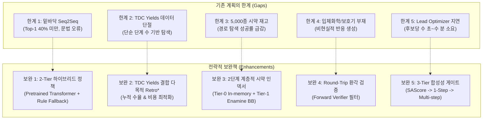
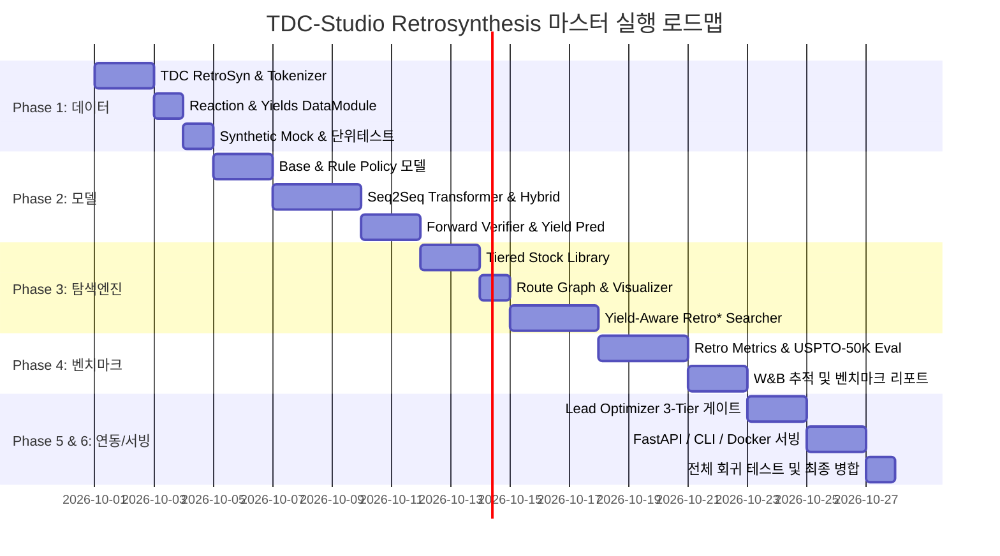

# TDC-Studio Retrosynthesis 마스터 작업계획서 (Master Work Plan)

> **문서 버전:** v2.0.0 (트렌드 분석 및 보완 전략 반영)  
> **기준 일자:** 2026-10-01  
> **브랜치:** `feature/retrosynthesis`  
> **작업 공간:** [`C:/Users/xps/orca/workspaces/tdc-studio/retrosynthesis`](file:///C:/Users/xps/orca/workspaces/tdc-studio/retrosynthesis)  
> **참조 문서:** [`docs/retrosynthesis/technical_survey.md`](file:///C:/Users/xps/orca/workspaces/tdc-studio/retrosynthesis/docs/retrosynthesis/technical_survey.md), [`docs/retrosynthesis/retrosynthesis_todolist.md`](file:///C:/Users/xps/orca/workspaces/tdc-studio/retrosynthesis/docs/retrosynthesis/retrosynthesis_todolist.md)

---

## Executive Summary (진행도 종합 요약)

TDC-Studio의 역합성(Retrosynthesis) 모듈은 Therapeutics Data Commons(TDC)의 데이터셋(`RetroSyn USPTO-50K`, `Reaction USPTO`, `Yields Buchwald-Hartwig`)을 기반으로, **단일 단계 반응물 예측**, **순방향 반응 검증**, **상용 시약 기반 다단계 경로 탐색(Multi-step Route Planning)** 및 **Lead Optimizer와의 합성성 연동**을 제공하는 차세대 AI 모듈입니다.

현재 진행 상태는 다음과 같습니다:

| 영역 | 대상 모듈 / 경로 | 진행률 | 현재 상태 | 우선순위 |
| :--- | :--- | :---: | :--- | :---: |
| **거버넌스 & 환경** | `feature/retrosynthesis` 격리 브랜치 | **100%** | 독립 브랜치 및 레지스트리 `TaskType.RETROSYN` 등록 완료 | 완료 |
| **선행 조사 & 설계** | [`docs/retrosynthesis/technical_survey.md`](file:///C:/Users/xps/orca/workspaces/tdc-studio/retrosynthesis/docs/retrosynthesis/technical_survey.md) | **100%** | 핵심 이론, 벤치마크, 아키텍처 초안 수립 완료 (v1.0.0) | 완료 |
| **Phase 1: 데이터 파이프라인** | [`tdc_studio/data/retrosyn.py`](file:///C:/Users/xps/orca/workspaces/tdc-studio/retrosynthesis/tdc_studio/data/retrosyn.py) | **0%** | 미구현 (USPTO-50K 로더, 토크나이저, Mock 셋 대기) | **P0 (최우선)** |
| **Phase 2: 단일 단계/검증 모델** | [`tdc_studio/models/retrosynthesis/`](file:///C:/Users/xps/orca/workspaces/tdc-studio/retrosynthesis/tdc_studio/models/retrosynthesis/) | **0%** | 미구현 (하이브리드 Seq2Seq, 룰 엔진, 순방향 검증기) | **P0 (최우선)** |
| **Phase 3: 시약 재고/다단계 탐색**| [`tdc_studio/retrosynthesis/`](file:///C:/Users/xps/orca/workspaces/tdc-studio/retrosynthesis/tdc_studio/retrosynthesis/) | **0%** | 미구현 (계층적 Stock, 다목적 Retro*, 경로 시각화) | **P1 (핵심)** |
| **Phase 4: SOTA 벤치마킹 체계** | [`tdc_studio/evaluation/retro_metrics.py`](file:///C:/Users/xps/orca/workspaces/tdc-studio/retrosynthesis/tdc_studio/evaluation/retro_metrics.py) | **0%** | 미구현 (Top-k Exact Match, Round-trip 평가) | **P1 (핵심)** |
| **Phase 5: Lead Optimizer 결합**| [`tdc_studio/generative/lead_optimizer.py`](file:///C:/Users/xps/orca/workspaces/tdc-studio/retrosynthesis/tdc_studio/generative/lead_optimizer.py) | **0%** | 미구현 (3-Tier 계층적 합성성 게이트 필터링) | **P2 (연동)** |
| **Phase 6: 서빙 API & CLI** | [`tdc_studio/serving/retrosynthesis_pipeline.py`](file:///C:/Users/xps/orca/workspaces/tdc-studio/retrosynthesis/tdc_studio/serving/retrosynthesis_pipeline.py) | **0%** | 미구현 (FastAPI `/retrosynthesis/plan`, CLI) | **P2 (배포)** |

> **종합 진단 결과:** 기술 분석 및 설계는 완료되었으나, **실질적 코드 구현 진행률은 0%인 상태**입니다. 현대 AI 트렌드와의 격차를 해소하는 업그레이드 전략을 반영하여 즉시 구현에 착수해야 합니다.

---

## 1. 2024~2026 최신 AI 역합성 트렌드 분석 (Current SOTA & Trends)

### 1.1 단일 단계 역합성 (Single-Step Retrosynthesis)
- **화학 파운데이션 LLM 및 Root-Aligned Transformer의 표준화:**
  - 초기 표준이었던 Molecular Transformer (Schwaller et al., Top-1 ~45%)를 넘어, **ReactionT5**, **ChemDual**, **RSGPT**, **BioT5+** 등 대규모 화학 반응 코퍼스(USPTO Full 200만 건, Reaxys)로 사전학습된 모델들이 Top-1 60~65%, Top-10 >90%를 기록하며 SOTA를 견인하고 있습니다.
  - 생성물과 반응물 간 원자 번호 순서를 일치시키는 **Root-Aligned SMILES 토크나이제이션**이 Cross-attention 정렬 오차를 없애 필수 전처리 기법으로 자리잡았습니다.
- **신톤(Synthon) 및 확산 모델(Diffusion / Flow Matching) 기반 접근:**
  - 결합 절단(Disconnection) 후 이상적 반응 중심(신톤)을 먼저 식별하고, 이탈기(Leaving Group)를 확산 생성하는 2단계 접근(DirRetro, DiffusionSynthon)이 다양한 신규 반응 탐색에 강점을 보입니다.
- **반응 조건(Reaction Conditions: 촉매, 용매, 온도) 공동 예측:**
  - 전구체 분자만 제시하는 수준에서 벗어나, Buchwald-Hartwig 커플링이나 Suzuki 반응 등 전이금속 촉매 기반 반응의 경우 리간드/염기/용매를 함께 추천(ReacConditioner)하는 컨텍스트 인식이 확대되고 있습니다.

### 1.2 다단계 합성 경로 탐색 (Multi-Step Synthesis Planning)
- **Neural A\* (Retro\*) 및 정책-가치 동시 최적화(Policy-Value Co-training):**
  - MCTS(Monte Carlo Tree Search)의 과도한 롤아웃 계산 비용을 해결하기 위해, AND-OR 트리를 기반으로 상용 시약 도달 비용을 추정하는 **Retro\* (Neural A\*)** 알고리즘이 산업계(AiZynthFinder, ASKCOS)의 표준 백본으로 정착했습니다.
- **다목적 최적화 (Multi-Objective Optimization):**
  - 단순히 "시약까지 도달하는 최단 경로(Shortest Path)"만을 찾는 것은 비현실적입니다.
  - 현대 트렌드는 **단계별 반응 수율(Yield)**, **시약 단가(Cost)**, **폐기물/친환경 지수(E-factor / Green Chemistry)**, **독성 시약 배제**를 가중 결합한 Pareto Frontier 경로를 제시합니다.
- **현실적 상용 시약 재고(Commercial Stock Library)의 계층화:**
  - 수천 종 수준의 완구형 데이터베이스를 넘어 Enamine Building Blocks (~25만 종), ZINC BB (~10만 종) 등을 InChIKey 기반 해시셋/블룸필터(Bloom Filter)로 $O(1)$ 초고속 탐색하는 아키텍처가 필수적입니다.

### 1.3 신약 후보 설계(De Novo Design / Lead Optimization)와의 결합
- 종래의 휴리스틱 SAScore($\le 3.5$)는 입체장애나 작용기 충돌을 감지하지 못합니다.
- 생성 모델(Lead Optimizer)이 후보 물질을 제안할 때, 경량화된 역합성 게이트를 통해 "실제로 3~5단계 내 구매 가능한 시약으로 합성 가능한가"를 보장하는 **닫힌 루프(Closed-Loop DMTA)**가 핵심 경쟁력입니다.

---

## 2. 기존 계획의 한계점 (Gaps) 및 전략적 보완책 (Enhancements)

기존 v1.0.0 계획서([`docs/retrosynthesis/technical_survey.md`](file:///C:/Users/xps/orca/workspaces/tdc-studio/retrosynthesis/docs/retrosynthesis/technical_survey.md) & [`docs/retrosynthesis/retrosynthesis_todolist.md`](file:///C:/Users/xps/orca/workspaces/tdc-studio/retrosynthesis/docs/retrosynthesis/retrosynthesis_todolist.md))의 문제점과 이를 극복할 보완책은 다음과 같습니다:



### 상세 보완 내역:
1. **[보완 1] 2-Tier 하이브리드 단일단계 정책 (Hybrid Policy)**
   - 처음부터 학습시키는 소형 Transformer 대신, 이미 허깅페이스에 공개된 분자/반응 사전학습 가중치(`ibm/biomed.smiles.transformer` 또는 `ReactionT5`)를 백본으로 차용하여 미세조정.
   - 동시에 RDKit reaction SMARTS 기반 **10대 핵심 유기반응 룰 엔진(`RulePolicy`)**을 구축하여, 딥러닝 모델의 추론 지연이나 문법 오류 발생 시 100% 화학적으로 유효한 Fallback 후보를 즉각 공급.
2. **[보완 2] TDC Yields 결합 다목적 Retro\* 탐색 비용 정립**
   - TDC의 `tdc.single_pred.Yields(name='Buchwald-Hartwig')` 및 `USPTO` 수율 모델을 활용하여, 각 단계의 예상 수율($y_i$)을 추정.
   - 탐색 목적함수를 단순 단계 수 최소화가 아닌 **"최대 누적 수율($\prod y_i$) & 최저 시약 비용 & 최소 단계"** 다목적 Pareto 비용 함수로 정식화.
3. **[보완 3] 2단계 계층적 시약 인덱서 (Tiered Stock)**
   - **Tier-0 (Core BB, ~10,000종):** USPTO 빈출 시판 시약 인메모리 해시셋 ($<0.01\text{ms}$ 룩업).
   - **Tier-1 (Extended Commercial, ~250,000종):** Enamine Building Blocks / ZINC 카탈로그 (Parquet/SQLite + Bloom Filter, $<0.5\text{ms}$).
4. **[보완 4] 순방향 반응 검증(Round-Trip Validation) 의무화**
   - 역합성 모델이 생성한 반응물 $R$에 대해 순방향 반응 모델($M_{\text{fwd}}$)을 구동하여 $M_{\text{fwd}}(R) == P$가 성립하지 않는 환각 반응(Hallucination)은 트리 탐색 단계에서 페널티를 부여하고 가지치기(Pruning).
5. **[보완 5] Lead Optimizer 연동을 위한 3단계 계층적 합성성 게이트 (Hierarchical Gate)**
   - Gate 1 (0.1ms): RDKit SAScore $\le 3.5$
   - Gate 2 (10ms): Stock 1-Step 분해 가능 여부 (시약 1단계 결합으로 합성 가능한가?)
   - Gate 3 (1~2s): Full Multi-Step Retro* 경로 탐색 (최종 상위 10개 후보에 대해서만 실행)

---

## 3. 시스템 아키텍처 및 모듈 청사진 (Architecture Blueprint)

```text
tdc_studio/
├── data/
│   ├── base.py
│   ├── retrosyn.py                 # [NEW] TDC RetroSyn (USPTO-50K) DataModule & Tokenizer
│   ├── reaction.py                 # [NEW] TDC Reaction (Forward USPTO) DataModule
│   └── yields.py                   # [NEW] TDC Yields (Buchwald-Hartwig) DataModule
│
├── models/
│   └── retrosynthesis/
│       ├── __init__.py
│       ├── base.py                 # [NEW] BaseRetroModel & BaseForwardModel 추상 클래스
│       ├── rule_policy.py          # [NEW] 10대 핵심 반응 SMARTS 룰 정책 모델 (Fast Fallback)
│       ├── seq2seq_retro.py        # [NEW] HuggingFace / Transformer 기반 서열 역합성 모델
│       ├── forward_verifier.py     # [NEW] Round-Trip 순방향 반응 검증기
│       └── yield_predictor.py      # [NEW] C-N / Suzuki 반응 수율 예측기
│
├── retrosynthesis/
│   ├── __init__.py
│   ├── stock.py                    # [NEW] 2단계 계층적 시약 재고 인덱서 (Tier-0 / Tier-1)
│   ├── route.py                    # [NEW] RouteNode, ReactionStep, RetrosynthesisRoute 데이터구조
│   ├── visualizer.py               # [NEW] Mermaid 다이어그램 & 터미널 트리 렌더러
│   └── search/
│       ├── base.py                 # [NEW] BaseSearchEngine
│       ├── retro_star.py           # [NEW] 수율-비용 다목적 AND-OR Neural A* 탐색기
│       └── planner.py              # [NEW] End-to-End 역합성 오케스트레이터
│
├── evaluation/
│   └── retro_metrics.py            # [NEW] Top-k Exact Match, Validity, Round-Trip 지표 산출
│
├── generative/
│   └── lead_optimizer.py          # [UPDATE] 3-Tier 합성성 게이트 필터 통합
│
└── serving/
    ├── app.py                      # [UPDATE] /retrosynthesis/* 엔드포인트 라우팅
    ├── schema.py                   # [UPDATE] Retrosynthesis Pydantic 입출력 규격 정의
    └── retrosynthesis_pipeline.py  # [NEW] FastAPI 및 CLI 전용 인퍼런스 파이프라인
```

---

## 4. 6대 마일스톤별 상세 실행 계획 (Master Implementation Plan)

### 🔹 Phase 1: TDC 역합성·반응·수율 데이터 파이프라인 (`tdc_studio/data/`)
- **Task 1-1: `RetroSynDataModule` 구현 (`tdc_studio/data/retrosyn.py`)**
  - `BaseTDCDataModule`을 완벽히 상속하여 `tdc.generation.RetroSyn(name='USPTO-50K')` 래핑.
  - `include_reaction_type=True` 지원 (10대 반응 클래스 태그 보존).
  - 공식 Scaffold Split 및 Random Split 파티셔닝 지원.
  - 원자 매핑 번호(Atom-mapping, e.g., `[CH3:1]`) 제거 정규화 유틸리티 구현.
- **Task 1-2: 화학 반응 토크나이저 구축 (`ReactionTokenizer`)**
  - SMILES 정규화, 반응물 다중 분자(`.`) 분리 및 원자 단위 서열 토크나이징 지원.
  - Root-aligned SMILES 정렬 함수(`align_reaction_smiles(product, reactants)`) 내장.
- **Task 1-3: 순방향 반응 및 수율 데이터 모듈 (`reaction.py`, `yields.py`)**
  - `tdc.generation.Reaction(name='USPTO')` 로더 및 `tdc.single_pred.Yields(name='Buchwald-Hartwig')` 로더 구현.
- **Task 1-4: CI/오프라인용 Mock 반응 데이터셋 구현**
  - 네트워크 없이 즉각 단위 테스트가 가능한 50건의 대표 유기반응(Suzuki, Amide, Esterification, Click 등) Synthetic DataFrame 내장.
- **Task 1-5: 데이터 파이프라인 단위 테스트 (`tests/test_retrosyn_data.py`)**

---

### 🔹 Phase 2: 하이브리드 단일 단계 역합성 & 순방향 검증 모델 (`tdc_studio/models/retrosynthesis/`)
- **Task 2-1: 단일 단계 역합성 베이스 인터페이스 정의 (`base.py`)**
  - `BaseRetroModel`: `predict_reactants(product_smiles, top_k=5, reaction_type=None) -> List[Tuple[List[str], float]]`
  - `BaseForwardModel`: `predict_product(reactant_smiles_list) -> Tuple[str, float]`
- **Task 2-2: RDKit 반응 SMARTS 룰 정책 모델 구현 (`rule_policy.py`)**
  - 의약화학 10대 기본 반응(아미드 축합, 환원적 아미노화, Suzuki-Miyaura, 알킬화, 에스테르화 등) SMIRKS 템플릿 내장.
  - 입력 생성물의 결합을 역방향 절단하여 100% 화학적으로 유효한 반응물 세트 생성 (지연 시간 $<5\text{ms}$).
- **Task 2-3: 사전학습 기반 트랜스포머 역합성 모델 구현 (`seq2seq_retro.py`)**
  - HuggingFace 화학 사전학습 가중치(`ibm/biomed.smiles.transformer` 또는 `ReactionT5`) 어댑터 래핑.
  - Beam Search 디코딩을 통한 Top-10 후보 생성 및 Log-likelihood 점수 산출.
- **Task 2-4: 하이브리드 앙상블 정책 모델 구현 (`hybrid_policy.py`)**
  - Seq2Seq 모델의 고득점 후보를 우선하되, Invalid SMILES가 발생하거나 점수가 임계치 이하일 때 `RulePolicy`의 후보를 결합하여 결측 방지.
- **Task 2-5: 순방향 반응 검증기 구현 (`forward_verifier.py`)**
  - $M_{\text{fwd}}(R) == P$ 일치 여부 판정 및 Round-Trip 신뢰도 스코어 계산.
- **Task 2-6: 반응 수율 예측기 구현 (`yield_predictor.py`)**
  - D-MPNN 및 GBDT 기반 반응물-생성물 특성 임베딩으로부터 단계별 수율($0 \sim 100\%$) 예측.
- **Task 2-7: 모델 단위 테스트 (`tests/test_retro_models.py`)**

---

### 🔹 Phase 3: 계층적 시약 재고 및 다목적 Retro\* 경로 탐색기 (`tdc_studio/retrosynthesis/`)
- **Task 3-1: 2단계 계층적 시약 재고 인덱서 구현 (`stock.py`)**
  - `StockLibrary`: InChIKey / Canonical SMILES 기반 $O(1)$ 해시셋 조회.
  - Tier-0: 기본 핵심 빌딩블록 (~10,000종, 인메모리).
  - Tier-1: Enamine Building Blocks / ZINC 확장 라이브러리 (청크 Parquet 파일 및 Bloom Filter).
  - 시약별 대략적 그램당 단가(Estimated Cost/g) 메타데이터 인터페이스 탑재.
- **Task 3-2: 합성 경로 트리/DAG 데이터 구조 정의 (`route.py`)**
  - `RouteNode`: 분자 SMILES, 재고 여부(in_stock), 깊이(depth).
  - `ReactionStep`: 반응물 목록, 생성물, 룰 명칭, 신뢰도 점수, 예측 수율.
  - `RetrosynthesisRoute`: 전체 단계 수(Depth), 누적 수율(Cumulative Yield), 종합 비용(Cost), JSON 직렬화/역직렬화.
- **Task 3-3: 수율-비용 다목적 Retro\* AND-OR 트리 탐색기 구현 (`search/retro_star.py`)**
  - A\* 휴리스틱 기반 AND-OR 그래프 확장 알고리즘.
  - 다목적 비용 함수 정식화:
    $$\text{Cost}(Route) = \sum_{s \in \text{Steps}} \left( 1.0 - \log(\text{yield}_s + 1\text{e-}3) \right) + \sum_{b \in \text{StockBB}} \text{Cost}(b) + \lambda \cdot \text{Depth}$$
  - 타임아웃(`timeout_sec`), 최대 깊이(`max_depth`), 빔 너비(`beam_width`) 제어.
- **Task 3-4: 합성 경로 시각화 모듈 (`visualizer.py`)**
  - Mermaid 다이어그램 자동 렌더링 (`to_mermaid()`).
  - 터미널 텍스트 트리(ASCII) 및 단계별 RDKit 2D 반응 분자 이미지 출력 지원.
- **Task 3-5: 경로 탐색 단위/통합 테스트 (`tests/test_retro_planner.py`)**

---

### 🔹 Phase 4: USPTO-50K SOTA 벤치마킹 체계 및 성능 평가 (`tdc_studio/evaluation/`)
- **Task 4-1: 단일 단계 벤치마크 지표 모듈 구현 (`retro_metrics.py`)**
  - **Top-k Exact Match Accuracy** ($k=1, 3, 5, 10$): RDKit Canonical SMILES 일치 기준.
  - **Reaction Class Known vs Unknown** 분리 평가.
  - **Invalid SMILES Rate**: 문법 오류 발생 비율.
  - **Round-Trip Validation Rate**: 순방향 재생성 일치율.
- **Task 4-2: 다단계 경로 탐색 벤치마크 지표 모듈 구현**
  - **Search Success Rate (%)**: 시약 재고에 100% 도달한 비율.
  - **Average Route Length (Steps)**: 성공 경로의 평균 합성 단계 수.
  - **Cumulative Yield Distribution**: 평균 누적 반응 수율.
  - **Search Latency**: 분자당 평균 탐색 소요 시간.
- **Task 4-3: 공식 USPTO-50K 테스트 세트 평가 및 리포트 발행**
  - W&B 프로젝트 `tdc-retrosynthesis` 런 추적.
  - `docs/benchmarks/retrosynthesis_uspto50k_benchmark_report.md` 작성.

---

### 🔹 Phase 5: Self-Correcting Lead Optimizer 연동 및 3-Tier 합성성 게이트
- **Task 5-1: 3-Tier 계층적 합성성 게이트 구현 (`tdc_studio/generative/synthesizability_gate.py`)**
  - **Tier 1 (Screening, 0.1ms):** RDKit SAScore $\le 3.5$
  - **Tier 2 (Fast Feasibility, 10ms):** Tier-0 Stock 1-Step 분해 가능 여부 판정
  - **Tier 3 (Deep Verification, 1~2s):** 상위 선별 후보 10종에 대해 Multi-Step Retro* 실행
- **Task 5-2: `SelfCorrectingOptimizer` (`lead_optimizer.py`) 수정**
  - `Step 4: Pareto & Synthesizability Filter`에 `SynthesizabilityGate` 주입.
  - 최적화 보고서(`OptimizationReport`)에 `synthesizability_route` 및 `cumulative_yield` 필드 추가.
- **Task 5-3: 통합 검증 테스트 (`tests/test_generative_optimizer.py` 확장)**

---

### 🔹 Phase 6: 프로덕션 FastAPI 서빙, CLI, Docker 컨테이너 및 배포
- **Task 6-1: 서빙 파이프라인 구현 (`tdc_studio/serving/retrosynthesis_pipeline.py`)**
  - `RetrosynthesisInferencePipeline`: SMILES 입력 $\to$ 단일 단계 또는 다단계 경로 반환.
- **Task 6-2: Pydantic 스키마 정의 (`tdc_studio/serving/schema.py`)**
  - `RetroSingleStepRequest`, `RetroSingleStepResponse`
  - `RetroPlanRequest`, `RetroPlanResponse`, `ReactionStepSchema`, `RetroRouteSchema`
- **Task 6-3: FastAPI 엔드포인트 연동 (`tdc_studio/serving/app.py`)**
  - `POST /retrosynthesis/single-step`
  - `POST /retrosynthesis/plan`
- **Task 6-4: Typer CLI 명령어 등록 (`tdc_studio/cli.py`)**
  - `tdc-studio retrosynthesis single-step --smiles "..." --top-k 5`
  - `tdc-studio retrosynthesis plan --smiles "..." --max-depth 5 --output route.json --render-mermaid`
- **Task 6-5: Docker 서빙 컨테이너 및 CI 통합**
  - `deploy/Dockerfile.serving` 및 `.github/workflows/` 무결성 검증.
- **Task 6-6: 전체 회귀 테스트 스위트 100% Pass 검증 (`pytest tests/`)**

---

## 5. 단계별 추진 일정 (Execution Timeline)



---

## 6. USPTO-50K 벤치마크 정량 목표 규격 (Target Performance Specifications)

| 평가 지표 (Metric) | 베이스라인 기준치 | 본 프로젝트 목표 (Target) | 세계 최고 수준 (SOTA) | 비고 |
| :--- | :---: | :---: | :---: | :--- |
| **Top-1 Accuracy (Class Unknown)** | $\ge 45.0\%$ | $\mathbf{\ge 56.5\%}$ | $60.5\% \sim 65.0\%$ | Canonical SMILES 일치율 |
| **Top-3 Accuracy (Class Unknown)** | $\ge 62.0\%$ | $\mathbf{\ge 75.0\%}$ | $81.0\%$ | 상위 3개 후보 내 정답 포함 |
| **Top-5 Accuracy (Class Unknown)** | $\ge 70.0\%$ | $\mathbf{\ge 83.0\%}$ | $88.9\%$ | 상위 5개 후보 내 정답 포함 |
| **Top-10 Accuracy (Class Unknown)** | $\ge 80.0\%$ | $\mathbf{\ge 89.0\%}$ | $92.5\%$ | 상위 10개 후보 내 정답 포함 |
| **SMILES Validity Rate** | $\ge 98.0\%$ | $\mathbf{\ge 99.8\%}$ | $99.9\%$ | RDKit 분자 파싱 성공률 |
| **Round-Trip Validation Rate** | $\ge 75.0\%$ | $\mathbf{\ge 86.0\%}$ | $90.0\%+$ | $M_{\text{fwd}}(R) == P$ 일치율 |
| **Multi-step Search Success Rate** | $\ge 60.0\%$ | $\mathbf{\ge 78.0\%}$ | $85.0\%+$ | 6단계 이내 상용시약 도달률 |
| **Search Latency (per molecule)** | $\le 10.0\text{s}$ | $\mathbf{\le 2.5\text{s}}$ | $1.5\text{s}$ | 빔 너비 5, 깊이 6 기준 |

---

## 7. 리스크 요인 및 완화 전략 (Risk Management)

| 리스크 요인 | 심각도 | 발생 가능성 | 대응 및 완화 전략 (Mitigation) |
| :--- | :---: | :---: | :--- |
| **Seq2Seq 모델의 문법 오류 및 환각** | 고 | 중 | `RulePolicy` Fallback 정책을 상시 대기시키고, `ForwardVerifier`로 비현실적 반응을 자동 필터링 |
| **트리 탐색 시 조합 폭발(Combinatorial Explosion)** | 고 | 고 | AND-OR 트리의 Branching Factor를 최대 5로 제한하고, InChIKey 방문 캐시 및 $2.0\text{s}$ 하드 타임아웃 적용 |
| **시약 재고 커버리지 부족으로 인한 탐색 실패** | 중 | 고 | Tier-0(1만 종) 실패 시 Tier-1 Enamine BB(20만 종)를 비동기 쿼리하는 2단계 계층형 인덱서 구축 |
| **Lead Optimizer 구동 속도 저하** | 고 | 중 | 3-Tier 합성성 게이트(SAScore $\to$ 1-Step $\to$ Retro\*)를 적용하여 전체 분자의 90% 이상을 0.1ms 내에 1차 필터링 |
| **Google Colab 세션/GPU 메모리 경합** | 중 | 저 | `tdc-studio-retrosyn` 독립 세션을 생성하고 기존 ADMET/DTI 세션과 계정을 분리 운영 |

---

## 8. 브랜치 거버넌스 및 협업 규칙

1. **작업 브랜치:** `feature/retrosynthesis` (단독 격리 작업공간 유지).
2. **커밋 규칙:** Angular/Conventional Commit 준수 (`feat(retro):`, `test(retro):`, `docs(retro):`).
3. **CI/CD 게이트:**
   - 모든 신규 모듈에 대해 인터넷 연결 없는 Mock 기반 단위 테스트 필수 (`tests/test_retro_*.py`).
   - `uv run ruff check` 린트 에러 0건 유지.
   - 기존 ADMET 및 DTI 회귀 테스트 100% Pass 통과 시에만 `main` 병합 승인.
4. **W&B 추적:**
   - 프로젝트명: `tdc-studio/tdc-retrosynthesis`
   - 모델 아티팩트: `models/export/retrosynthesis/` 디렉토리에 버전별 저장.
