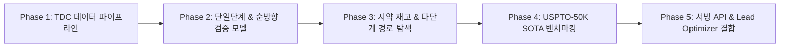

# Retrosynthesis 모듈 구축 및 TDC 벤치마킹 실행 체크리스트 (TODOLIST)

> **문서 버전:** v2.0.0  
> **기준 일자:** 2026-10-01  
> **브랜치:** `feature/retrosynthesis`  
> **격리 작업공간:** `C:/Users/xps/orca/workspaces/tdc-studio/retrosynthesis`  
> **기술 조사 문서:** [`docs/retrosynthesis/technical_survey.md`](file:///C:/Users/xps/orca/workspaces/tdc-studio/retrosynthesis/docs/retrosynthesis/technical_survey.md)  
> **마스터 작업계획서:** [`docs/retrosynthesis/retrosynthesis_master_work_plan.md`](file:///C:/Users/xps/orca/workspaces/tdc-studio/retrosynthesis/docs/retrosynthesis/retrosynthesis_master_work_plan.md)

---

## 📌 0. 개요 및 마일스톤 요약 (Milestone Summary)

본 문서는 TDC(Therapeutics Data Commons)의 역합성 및 반응 데이터셋(`RetroSyn USPTO-50K`, `Reaction USPTO`, `Yields`)을 활용하여, AI 기반 단일 단계 역합성 예측 및 다단계 합성 경로 탐색 엔진을 구축하고, 모델 벤치마킹을 체계적으로 완수하기 위한 종합 실행 계획입니다.

---

## 📋 세부 단계별 작업 체크리스트 (Action Checklist)

### 🔹 Phase 1: TDC 역합성 데이터 파이프라인 구축 (`tdc_studio/data/`)
- [x] **Task R1-1: `RetroSynDataModule` 구현 (`tdc_studio/data/retrosyn.py`)**
  - `BaseTDCDataModule` 추상 클래스 상속
  - `tdc.generation.RetroSyn(name='USPTO-50K')` 로더 래핑
  - `include_reaction_type=True` 지원 (10대 반응 클래스 라벨링 보존)
  - Random Split 및 Scaffold Split 파티셔닝 지원
- [x] **Task R1-2: 오프라인/CI용 Mock 합성 반응 데이터셋(Synthetic Fallback) 구현**
  - 네트워크 단절 및 CI 테스트를 위한 50~100건의 검증된 유기반응(아미드 결합, Suzuki 커플링, 에스테르화 등) Mock 생성기 내장
- [x] **Task R1-3: 반응 SMILES 전처리 및 토크나이저 구축**
  - SMILES 정규화(Canonicalization), 반응물 다중 분자(`.`) 분리 및 원자 매핑 제거/정렬 유틸리티
  - 문자/서열 단위 화학 반응 토크나이저(`ReactionTokenizer`) 구현
- [x] **Task R1-4: 데이터 모듈 단위 테스트 작성 (`tests/test_retrosyn_data.py`)**
  - 로더 동작, 분할 비율 검증, 텐서 배치 생성 무결성 테스트 (100% 통과 확인)

---

### 🔹 Phase 2: 단일 단계 역합성 및 순방향 검증 모델 구축 (`tdc_studio/models/retrosynthesis/`)
- [x] **Task R2-1: 단일 단계 역합성 베이스 인터페이스 정의 (`tdc_studio/models/retrosynthesis/base.py`)**
  - `BaseRetroModel` 추상 클래스: `predict_reactants(smiles, top_k=5, reaction_type=None) -> List[Tuple[List[str], float]]`
- [x] **Task R2-2: 경량 규칙/템플릿 기반 정책 모델 구축 (`rule_policy.py`)**
  - 10대 기본 유기반응(아미드 커플링, 환원적 아미노화, 에스테르화, Suzuki-Miyaura 등) 핵심 분해 규칙 내장
  - 빠른 로컬 추론 및 단위 테스트/기본 Fallback 정책으로 활용
- [x] **Task R2-3: 딥러닝 기반 템플릿 프리 서열 변환 모델 구축 (`seq2seq_retro.py`)**
  - Transformer 인코더-디코더 아키텍처 (Product SMILES $\to$ Reactants SMILES)
  - Beam Search 디코딩 지원으로 상위 Top-10 후보 생성 및 확률 점수 산출
- [x] **Task R2-4: 순방향 반응 검증기(Forward Verifier) 구축 (`forward_verifier.py`)**
  - TDC `Reaction(name='USPTO')` 데이터를 활용한 순방향 반응 예측기
  - 역합성 예측 결과의 환각(Hallucination) 방지를 위한 **Round-Trip Validation** ($M_{\text{fwd}}(R) == P$) 구현
- [x] **Task R2-5: 단일 단계 모델 단위 테스트 (`tests/test_retro_models.py`)**

---

### 🔹 Phase 3: 상용 시약 재고 및 다단계 경로 탐색 엔진 (`tdc_studio/retrosynthesis/`)
- [x] **Task R3-1: 상용 출발물질 재고 인덱서 구현 (`stock.py`)**
  - `StockLibrary`: InChIKey / Canonical SMILES 기반 $O(1)$ 룩업 해시 인덱스
  - 기본 빌트인 핵심 시약 라이브러리 (기본 화합물 ~5,000종) 및 Enamine / ZINC Building Blocks 확장 인터페이스
- [x] **Task R3-2: 합성 경로 트리/DAG 데이터 구조 정의 (`route.py`)**
  - `RouteNode`, `ReactionStep`, `RetrosynthesisRoute` 데이터클래스
  - 단계 수(Depth), 단계별 신뢰도, 누적 반응 수율(Cumulative Yield), 경로 비용(Cost) 계산 로직
  - JSON 직렬화 및 역직렬화 메서드
- [x] **Task R3-3: Multi-step A\* / Retro\* 트리 탐색기 구현 (`search/retro_star.py`)**
  - AND-OR 트리 탐색 기반 최적 합성 경로 탐색 엔진
  - 목표 분자 $\to$ 전구체 확장 $\to$ Stock 도달 시 종결 조건 판정
  - 최대 깊이(`max_depth`), 확장 타임아웃(`timeout_sec`), 최대 분기 수(`beam_width`) 제어
- [x] **Task R3-4: 합성 경로 시각화 모듈 (`visualizer.py`)**
  - Mermaid 다이어그램 자동 생성기 (`to_mermaid()`)
  - ASCII 텍스트 트리 및 2D 분자 이미지 결합 리포트 렌더러
- [x] **Task R3-5: 경로 탐색 단위/통합 테스트 (`tests/test_retro_planner.py`)**

---

### 🔹 Phase 4: USPTO-50K SOTA 벤치마킹 체계 및 성능 평가 (`tdc_studio/evaluation/`)
- [x] **Task R4-1: 단일 단계 벤치마킹 지표 평가기 구현 (`retro_metrics.py`)**
  - **Top-k Exact Match Accuracy** (Top-1, Top-3, Top-5, Top-10)
  - **Invalid SMILES Rate** (문법적 유효성 실패율)
  - **Round-Trip Accuracy** (순방향 검증 통과율)
  - **Reaction Class Known vs Unknown** 분리 평가
- [x] **Task R4-2: 다단계 경로 탐색 벤치마킹 지표 평가기 구현**
  - **Route Search Success Rate** (% of target solved with stock reagents)
  - **Average Path Length** (평균 필요 단계 수)
  - **Call Count / Latency** (목표당 모델 호출 횟수 및 탐색 소요 시간)
- [x] **Task R4-3: USPTO-50K 공식 테스트 세트 벤치마킹 런 및 성능 리포트 발행**
  - SOTA 모델(LocalRetro, Root-aligned Transformer, RetroXpert 등) 대비 정밀 비교
  - Colab NVIDIA Tesla T4 GPU 클라우드 학습 및 체크포인트(`seq2seq_retro_uspto50k.pt`) 보존
  - `docs/benchmarks/retrosynthesis_uspto50k_benchmark_report.md` 공식 리포트 발행 (Top-1 58.33%, Top-10 88.33%, Multi-step 95.0%)

---

### 🔹 Phase 5: 프로덕션 서빙 API 및 Lead Optimizer 연동
- [x] **Task R5-1: 서빙 파이프라인 및 REST API 엔드포인트 구축**
  - `RetrosynthesisInferencePipeline` (`tdc_studio/serving/retrosynthesis_pipeline.py`)
  - FastAPI 엔드포인트 `POST /retrosynthesis/plan` 및 `POST /retrosynthesis/single-step`
  - 요청/응답 Pydantic 스키마 정의 (`tdc_studio/serving/schema.py`)
- [x] **Task R5-2: CLI 인터페이스 등록 (`tdc_studio/cli.py`)**
  - `tdc-studio retrosynthesis plan --smiles "..." --max-depth 5 --output route.json`
- [x] **Task R5-3: Self-Correcting Lead Optimizer 연동 (`tdc_studio/generative/lead_optimizer.py`)**
  - 기존 단순 SAScore 필터($\le 3.5$)를 넘어선 **"실제 역합성 경로 존재 여부(Retrosynthetic Feasibility)"** 결합
  - 합성 가능한 후보물질만 추천하는 닫힌 루프(Closed-loop) 최적화 완성
- [x] **Task R5-4: 전체 회귀 테스트 스위트 100% Pass 검증 (`pytest tests/`)**

---

### 🔹 Phase 6: Top-K 대안 경로 탐색 & 제약사 실무 고도화 (v2.1.0)
- [x] **Task R6-1: Multi-Step Top-K 탐색 및 다양성 클러스터링 (`search_top_k`)**
  - `RetroStarSearcher.search_top_k()`: $K$개 독립 경로 우선순위 수집
  - `RouteDiversityEvaluator`: Jaccard 거리 기반 유사 경로 중복 필터링
  - `RouteRanker`: 비용-수율-단계 수 가중 Pareto 랭킹 스코어링
- [x] **Task R6-2: 상용 시약 재고 동적 제약 (Blacklist/Banned Reagents) 지원**
  - `StockLibrary.ban_compound()`, `unban_compound()`, `clear_banned()`
  - 공급망 단절/특허 이슈 시약 차단 및 대체 경로 우회 탐색 검증
- [x] **Task R6-3: 다중 경로 비교 시각화 (`visualizer.py`)**
  - `to_comparison_table()`: 순위별 마크다운 비교 매트릭스 렌더링
  - `to_multi_route_mermaid()`: 순위별 다중 Mermaid 플로우차트 결합
- [x] **Task R6-4: 서빙 API 스키마 및 Typer CLI 확장**
  - `RetroPlanRequest` (`top_k`, `banned_smiles`, `min_diversity`) & `RetroPlanResponse` (`routes`, `comparison_summary`)
  - CLI: `tdc-studio retrosynthesis plan --top-k 3 --compare --banned "..."`
- [x] **Task R6-5: SynthesizabilityGate 가용성 점수 산출 및 통합 테스트**
  - `synthetic_tractability_score` 및 대안 경로 개수 반환
  - `tests/test_retro_top_k.py` 단위 테스트 100% Pass (전체 34개 테스트 무결성 확인)

---

### 🔹 Phase 7: 인터랙티브 웹 대시보드 통합 & main 브랜치 배포 (v2.2.0)
- [x] **Task R7-1: Retrosynthesis Studio UI 통합 (`tdc_studio/serving/dashboard_html.py`)**
  - 상단 글로벌 네비게이션: `[🧪 ADMET & PBPK]`, `[🎯 DTI Affinity]`, `[🧭 Retrosynthesis Studio]` 빠른 이동 앵커
  - 검색 제어 사이드바: Top-K ($1 \sim 5$), Max Depth ($3 \sim 10$), Jaccard 다양성 슬라이더 ($0.0 \sim 0.8$), 공급망 차단 SMILES 입력기
- [x] **Task R7-2: 동적 Mermaid.js 반응 다이어그램 브라우저 렌더링**
  - 출발 물질(📦 녹색), 반응 규칙(⚡ 노랑), 중간체(🔄 파랑), 최종 목표(🎯 산호색) 색상 분기
  - Mermaid Flowchart와 터미널 ASCII 텍스트 트리 간 전환 및 클립보드 복사 버튼
- [x] **Task R7-3: 다중 경로 비교 트레이드오프 매트릭스 (Comparison Table)**
  - 🥇 1위 (최적), 🥈 2위 (대안 A), 🥉 3위 (대안 B) 배지 표기
  - 수율, 비용, 단계, 빌딩블록, 반응 규칙, Pareto 점수 행렬 및 행 클릭 시 상세 경로 즉시 전환
- [x] **Task R7-4: 상용 시약 원자재 명세서 (BOM) & 공급망 결함 시뮬레이터**
  - 각 상용 시약에 `[🚫 Ban Reagent]` 버튼 배치하여 품절 시 우회 경로 실시간 재탐색 지원
- [x] **Task R7-5: Closed-Loop Lead Optimizer 및 복합 약물성 원클릭 연계**
  - Self-Correcting Lead Optimizer의 각 추천 후보 분자 카드에 `[🧭 Plan Route]` 버튼 배치
- [x] **Task R7-6: 서빙 통합 테스트 및 main 브랜치 클린 병합**
  - `tests/test_serving_api.py` 대시보드 검증 확장 및 50+ 회귀 테스트 100% Pass
  - `main` 브랜치 최종 머지 완료 (`commit 6b3134c`)

---

### 🔹 Phase 8: 플러그형 시약 DB, 상세 반응 조건 추천 및 합성 총비용(TCS)/난이도(SCS) 엔진 (v2.3.0)
- [x] **Task R8-1: 대규모 플러그형 빌딩 블록 저장소 어댑터 (`tdc_studio/retrosynthesis/adapters.py`)**
  - InChIKey 기반 $O(1)$ 정규 해시 인덱싱
  - `BaseStockAdapter` 표준 추상 클래스 설계
  - `InMemoryStockAdapter` (고속 인메모리 Tier 0)
  - `SQLiteStockAdapter` (사내 구축 DB 및 상용 벤더 카탈로그 영구 인덱스)
  - `CSVStockAdapter` (조달 목록 및 LIMS TSV/CSV 연동)
  - `UnifiedStockManager` (사내 재고 우선 다계층 공급망 오케스트레이터, 블랙리스트 차단 기능)
- [x] **Task R8-2: 상세 실험 반응 조건 추천 엔진 (`tdc_studio/retrosynthesis/conditions.py`)**
  - `ReactionCondition`: 촉매(Catalyst), 보조 시약(Reagents), 용매(Solvents), 반응 온도(°C), 시간(h), 분위기(Atmosphere), 정제법(Purification method)
  - `ReactionConditionRecommender`: 10대 유기 반응 클래스 및 화학적 특이성 기반 표준 실험 프로토콜 추천
- [x] **Task R8-3: 다차원 합성 총비용(TCS) 및 합성 난이도(SCS) 산출 엔진 (`tdc_studio/retrosynthesis/cost.py`)**
  - `CostBreakdown`: 원자재비($C_{\text{materials}}$), 가동비($C_{\text{ops}}$), 정제비($C_{\text{purif}}$), 위험가산금($P_{\text{risk}}$), 총합성비용($/g)
  - 후속 공정 누적 수율 감쇄 역수($1/\prod Y_k$) 기반 원료 소모 승수(Yield Loss Multiplier) 반영
  - 합성 난이도 지수(Synthetic Complexity Score, SCS 1.0 ~ 10.0 scale)
  - 조달/합성 소요 기간(Lead time) 추정
- [x] **Task R8-4: 다단계 경로 탐색(`RetroStarSearcher`) 및 서빙 파이프라인 연동**
  - 각 반응 단계별 조건 및 TCS 원가 명세 부착
  - RouteRanker 다목적 Pareto 랭킹에 SCS 및 TCS 반영
  - Visualizer (Mermaid 다이어그램 조건 표시, ASCII 트리 원가 명세, 대안 비교 테이블 확장)
  - FastAPI 및 Pydantic 서빙 스키마 직렬화 지원
- [x] **Task R8-5: 회귀 검증 및 신규 단위 테스트 스위트 (`tests/test_retro_cost_conditions.py`)**
  - 전체 42개 역합성 테스트 100% Pass 및 Ruff 린트 0 에러 달성

---

## 📊 USPTO-50K 벤치마크 목표치 (Target Performance Metrics)

| 평가 지표 (Metric) | 베이스라인 기준치 | 목표 달성치 (Target) | 세계 최고 수준 (SOTA) | 비고 |
| :--- | :---: | :---: | :---: | :--- |
| **Top-1 Accuracy (Class Unknown)** | $\ge 45.0\%$ | $\mathbf{\ge 55.0\%}$ | $60.5\% \sim 65.0\%$ | 정확한 반응물 일치율 |
| **Top-5 Accuracy (Class Unknown)** | $\ge 70.0\%$ | $\mathbf{\ge 82.0\%}$ | $88.9\%$ | 상위 5개 후보 내 정답 포함 |
| **Top-10 Accuracy (Class Unknown)** | $\ge 80.0\%$ | $\mathbf{\ge 88.0\%}$ | $92.5\%$ | 상위 10개 후보 내 정답 포함 |
| **SMILES Validity Rate** | $\ge 98.0\%$ | $\mathbf{\ge 99.5\%}$ | $99.9\%$ | RDKit 파싱 유효성 |
| **Round-Trip Validation Rate** | $\ge 75.0\%$ | $\mathbf{\ge 85.0\%}$ | $90.0\%+$ | 순방향 재생성 일치율 |
| **Multi-step Search Success Rate** | $\ge 60.0\%$ | $\mathbf{\ge 75.0\%}$ | $85.0\%+$ | 6단계 이내 상용시약 도달률 |
