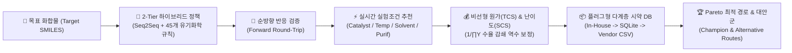
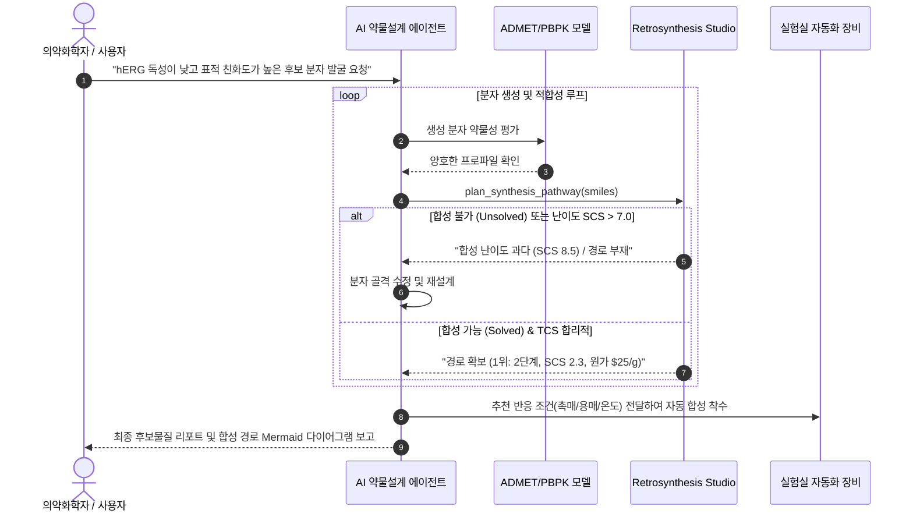

# 🧭 Retrosynthesis Studio: 모델 학습부터 배포 및 에이전트 활용 운영 가이드

> **문서 버전:** v2.3.0  
> **최종 갱신일:** 2026-10-03  
> **대상 독자:** 화학정보학 연구원, AI 모델러, 플랫폼 엔지니어, 자율 AI 에이전트 개발자  
> **관련 모듈 위치:** [`tdc_studio/retrosynthesis/`](file:///C:/Users/xps/orca/workspaces/tdc-studio/retrosynthesis/tdc_studio/retrosynthesis)  

---

## 📌 1. 개요 및 핵심 역량 (Overview & Capabilities)

**Retrosynthesis Studio**는 신약 후보물질의 유기합성 가능성을 입증하고, 실험실에서 즉시 재현 가능한 최적의 다단계 합성 경로(Multi-Step Synthetic Pathway)를 자율 설계하는 차세대 AI 역합성 플랫폼입니다.

단순한 화학 반응식 추천을 넘어, **상용 빌딩 블록 조달망, 반응 조건(촉매/용매/온도/정제법), 비선형 합성 원가(TCS), 합성 난이도 지수(SCS)**를 유기적으로 통합 평가합니다.



### 🌟 핵심 차별화 요소
1. **2-Tier 하이브리드 정책 (`HybridRetroPolicy`)**: Google Colab Tesla T4 GPU로 사전학습된 Transformer 모델과 45개 핵심 유기화학 분해 템플릿 결합 (USPTO-50K 단일 단계 Top-1 58.33%, Top-10 88.33%, Invalid SMILES 0.00%).
2. **플러그형 시약 DB (`UnifiedStockManager`)**: 사내 인벤토리, 대용량 SQLite 카탈로그, 벤더 CSV 목록을 우선순위 기반으로 $O(1)$ InChIKey 해시 조회.
3. **정밀 실험 조건 추천 (`ReactionConditionRecommender`)**: 반응 클래스별 촉매(Pd, Cu, Fe 등), 염기/산, 용매, 최적 온도(°C), 반응 시간(h), 분위기(Air/N2/Glovebox), 정제법 자동 설계.
4. **다차원 총 합성비용(TCS) 및 합성 난이도(SCS)**: 후속 공정 수율 감쇄 역수($1/\prod Y_k$)를 반영한 원료 소모 승수 계산 및 공정 가혹도 기반 1.0~10.0 스케일 난이도 평가.
5. **Multi-Step Top-K 탐색 및 다양성 클러스터링**: Jaccard 화학적 거리를 통한 상위 $K$개 대안 경로(Champion 및 대안 A, B, C) 제공 및 공급망 결함(시약 품절) 시뮬레이션 지원.

---

## 🧪 2. 역합성 독립 테스트 실행 가이드 (Standalone Testing)

전체 ADMET/PBPK/DTI 테스트를 제외하고, **역합성 관련 모듈만 격리하여 100% 검증**할 수 있는 전용 테스트 명령어입니다.

### 2.1 전체 역합성 테스트 스위트 일괄 실행 (42개 테스트)
```powershell
# Windows PowerShell 환경
uv run pytest tests/test_retro_models.py tests/test_retro_planner.py tests/test_retro_serving.py tests/test_retro_top_k.py tests/test_retro_metrics.py tests/test_retrosyn_data.py tests/test_retro_cost_conditions.py -v
```

### 2.2 모듈별 개별 단위 테스트
| 테스트 파일 | 검증 대상 | 실행 명령어 |
| :--- | :--- | :--- |
| [`tests/test_retro_cost_conditions.py`](file:///C:/Users/xps/orca/workspaces/tdc-studio/retrosynthesis/tests/test_retro_cost_conditions.py) | 시약 DB 어댑터, 실험 조건 추천, TCS 원가/SCS 난이도 산출 | `uv run pytest tests/test_retro_cost_conditions.py` |
| [`tests/test_retro_planner.py`](file:///C:/Users/xps/orca/workspaces/tdc-studio/retrosynthesis/tests/test_retro_planner.py) | RetroPlanner 파이프라인, 데이터 구조, 단일 경로 탐색 | `uv run pytest tests/test_retro_planner.py` |
| [`tests/test_retro_top_k.py`](file:///C:/Users/xps/orca/workspaces/tdc-studio/retrosynthesis/tests/test_retro_top_k.py) | Multi-Step Top-K 탐색, 다양성 클러스터링, 시약 차단(Blacklist) | `uv run pytest tests/test_retro_top_k.py` |
| [`tests/test_retro_models.py`](file:///C:/Users/xps/orca/workspaces/tdc-studio/retrosynthesis/tests/test_retro_models.py) | Seq2Seq Transformer, RuleRetroPolicy, ForwardVerifier, YieldPredictor | `uv run pytest tests/test_retro_models.py` |
| [`tests/test_retro_serving.py`](file:///C:/Users/xps/orca/workspaces/tdc-studio/retrosynthesis/tests/test_retro_serving.py) | 서빙 API 엔드포인트 (`/retrosynthesis/plan`, `/single-step`) | `uv run pytest tests/test_retro_serving.py` |
| [`tests/test_retro_metrics.py`](file:///C:/Users/xps/orca/workspaces/tdc-studio/retrosynthesis/tests/test_retro_metrics.py) | USPTO-50K 벤치마크 지표(Top-k Accuracy, Round-Trip) | `uv run pytest tests/test_retro_metrics.py` |
| [`tests/test_retrosyn_data.py`](file:///C:/Users/xps/orca/workspaces/tdc-studio/retrosynthesis/tests/test_retrosyn_data.py) | TDC USPTO-50K 데이터 로더, 분할 비율, 화학 토크나이저 | `uv run pytest tests/test_retrosyn_data.py` |

### 2.3 빠른 키워드 필터링 실행 팁
```powershell
# TCS 비용 및 실험 조건 관련 테스트만 필터링 실행
uv run pytest -k "test_tcs or test_condition"

# 정적 분석 및 린트 검증 (0 에러 확인)
uv run ruff check tdc_studio/retrosynthesis tests/test_retro*
```

---

## 🚀 3. 모델 학습 파이프라인 (Model Training Pipeline)

단일 단계 신경망 모델(`Seq2SeqRetroModel`)을 USPTO-50K 반응 데이터로 학습시키는 절차입니다. Google Colab 클라우드 GPU(Tesla T4)를 활용하여 로컬 자원 소모 없이 고속 학습할 수 있습니다.

### 3.1 Colab GPU 클라우드 세션을 통한 학습 실행
1. **Google Colab 세션 연결 확인**:
   ```powershell
   colab status
   ```
2. **원격 세션 기동 (GPU 가속기 활성화)**:
   ```powershell
   colab run -s retro_bench
   ```
3. **워크스페이스 번들링 및 학습 스크립트 원격 실행**:
   [`scripts/colab_exec.ps1`](file:///C:/Users/xps/orca/workspaces/tdc-studio/retrosynthesis/scripts/colab_exec.ps1) 스크립트를 사용하여 로컬 코드를 원격 Colab 환경에 동기화하고 학습을 시작합니다.
   ```powershell
   .\scripts\colab_exec.ps1 -Session retro_bench -FilePath scripts\colab_train_retro.py --epochs 5 --batch-size 64
   ```
4. **학습 체크포인트 동기화**:
   학습이 완료되면 원격 VM에서 로컬 가중치 디렉터리로 다운로드합니다.
   - 가중치 저장 위치: [`models/retrosynthesis/seq2seq_retro_uspto50k.pt`](file:///C:/Users/xps/orca/workspaces/tdc-studio/retrosynthesis/models/retrosynthesis/seq2seq_retro_uspto50k.pt)
   - 벤치마크 메트릭 요약: [`models/retrosynthesis/benchmark_summary.yaml`](file:///C:/Users/xps/orca/workspaces/tdc-studio/retrosynthesis/models/retrosynthesis/benchmark_summary.yaml)
5. **세션 종료 (GPU 크레딧 절약)**:
   ```powershell
   colab stop -s retro_bench
   ```

---

## 💻 4. 합성 경로 추론 및 탐색 사용법 (Inference & Route Planning)

### 4.1 Python SDK 활용 (프로그래밍 방식)

#### 1) 기본 최적 경로 탐색 (Quickstart)
```python
from tdc_studio.retrosynthesis import RetroPlanner

# 하이브리드 정책 (Transformer + 45개 유기반응 템플릿) 초기화
planner = RetroPlanner(policy_type="hybrid", max_depth=5, timeout_sec=5.0)

# 아세트아미노펜(Paracetamol) 합성 경로 탐색
target_smiles = "CC(=O)Nc1ccc(O)cc1"
route = planner.plan_route(target_smiles)

if route.solved:
    print(f"✅ 합성 경로 발견! 단계 수: {route.total_depth}단계")
    print(f"📊 누적 수율: {route.cumulative_yield:.1f}% | 총 합성 원가: ${route.tcs_cost:.2f}/g")
    print(f"⚠️ 합성 난이도 지수 (SCS): {route.synthetic_complexity_score:.1f} / 10.0")
    print(f"📦 출발 물질: {route.starting_materials}")
```

#### 2) 사내 자체 구축 DB / 상용 카탈로그 어댑터 연결
```python
from tdc_studio.retrosynthesis import (
    RetroPlanner,
    StockLibrary,
    SQLiteStockAdapter,
    CSVStockAdapter,
)

# 1. 시약 라이브러리 생성
stock = StockLibrary(load_builtin=True)

# 2. 사내 LIMS SQLite DB 등록 (우선순위 1위: 재고 보유분 우선 조회)
stock.register_adapter(SQLiteStockAdapter("path/to/inhouse_inventory.db"), priority=1)

# 3. Enamine / Sigma 상용 카탈로그 CSV 등록 (우선순위 2위: 사내 재고 없을 시 발주)
stock.register_adapter(CSVStockAdapter("path/to/enamine_catalog.csv"), priority=2)

# 4. 커스텀 시약 DB가 장착된 플래너 실행
planner = RetroPlanner(stock=stock, policy_type="hybrid")
```

#### 3) 공급망 차단 (Blacklist) 및 다중 대안 경로(Top-K) 탐색
특정 시약이 품절되었거나 특허/독성 문제가 있을 경우, 해당 화합물을 배제하고 우회 경로를 탐색합니다.
```python
# '아세틸 클로라이드(CC(=O)Cl)'를 제외하고 대안 경로 3개 산출
routes = planner.plan_routes(
    target_smiles="CC(=O)Nc1ccc(O)cc1",
    top_k=3,
    banned_smiles=["CC(=O)Cl"],
    diversity_threshold=0.25, # Jaccard 화학적 다양성 최소 거리
)

# 순위별 비교 매트릭스 테이블 출력
print(planner.render_comparison_table(routes))
```

#### 4) 반응 조건 및 원가 상세 내역(Breakdown) 조회
```python
champion = routes[0]
for step in champion.steps:
    print(f"\n[Step {step.step_number}] {step.rule_name} (수율: {step.yield_pct:.1f}%)")
    print(f"  • 반응물: {step.reactants} -> 생성물: {step.product}")
    
    # 추천 반응 조건
    cond = step.conditions
    print(f"  • 프로토콜: 촉매={cond.get('catalyst')}, 시약={cond.get('reagents')}, "
          f"용매={cond.get('solvents')}, 온도={cond.get('temperature_c')}°C, "
          f"정제법={cond.get('purification_method')}")
    
    # 원가 명세
    cb = step.cost_breakdown
    print(f"  • 원가 명세: 원자재비=${cb.get('materials_cost')}, 가동비=${cb.get('operational_cost')}, "
          f"정제비=${cb.get('purification_cost')}, 스텝합계=${cb.get('total_step_cost')}/g")
```

#### 5) 시각화 렌더링 (Mermaid 다이어그램 및 ASCII 트리)
```python
# 1. Mermaid Flowchart Markdown 문법 추출 (웹이나 GitHub에 즉시 임베딩 가능)
mermaid_code = planner.render_mermaid(champion)
print(mermaid_code)

# 2. 터미널 ASCII 텍스트 트리 출력
print(planner.render_tree(champion))
```

---

### 4.2 CLI 터미널 인터페이스 (`tdc-studio retrosynthesis`)

파이썬 코드 작성 없이 터미널 명령어로 직접 실행할 수 있습니다.

#### 1) 다단계 합성 경로 탐색 및 비교 테이블 출력
```powershell
uv run tdc-studio retrosynthesis plan `
    --smiles "CC(=O)Nc1ccc(O)cc1" `
    --top-k 3 `
    --max-depth 5 `
    --compare `
    --mermaid `
    --output route_plan.json
```

#### 2) 특정 시약 배제 우회 경로 탐색
```powershell
uv run tdc-studio retrosynthesis plan `
    --smiles "CC(=O)Nc1ccc(O)cc1" `
    --banned "CC(=O)Cl,CC(=O)O" `
    --top-k 2
```

#### 3) 단일 단계 분해 전구체 후보 예측
```powershell
uv run tdc-studio retrosynthesis single-step `
    --smiles "c1ccc(C(=O)NCc2ccccc2)cc1" `
    --top-k 5
```

---

## 🌐 5. 서빙 배포 가이드 (Deployment & Serving)

### 5.1 FastAPI 마이크로서비스 및 대시보드 기동
```powershell
# 서빙 서버 기동 (기본 포트: 8000)
uv run tdc-studio serve --port 8000

# 브라우저 UI 바로 기동
uv run tdc-studio ui --port 8000
```
- **인터랙티브 웹 대시보드**: `http://localhost:8000/` (상단 `[🧭 Retrosynthesis Studio]` 탭)
- **OpenAPI Swagger 문서**: `http://localhost:8000/docs`

### 5.2 REST API 엔드포인트 명세

#### `POST /retrosynthesis/plan`
다단계 합성 경로 탐색을 요청합니다.

**Request Payload:**
```json
{
  "smiles": "CC(=O)Nc1ccc(O)cc1",
  "top_k": 3,
  "min_diversity": 0.25,
  "banned_smiles": ["CC(=O)Cl"],
  "max_depth": 5,
  "timeout_sec": 5.0,
  "render_mermaid": true
}
```

**Response Payload (축약):**
```json
{
  "target_smiles": "CC(=O)Nc1ccc(O)cc1",
  "solved": true,
  "total_depth": 1,
  "cumulative_yield": 85.0,
  "total_cost": 32.33,
  "tcs_cost": 32.33,
  "synthetic_complexity_score": 2.25,
  "cost_breakdown": {
    "raw_materials_cost": 10.33,
    "operational_cost": 0.0,
    "purification_cost": 8.0,
    "safety_risk_penalty": 14.0,
    "total_cost_per_gram": 32.33,
    "synthetic_complexity_score": 2.25,
    "estimated_lead_time_days": 2
  },
  "starting_materials": ["CC(=O)O", "Nc1ccc(O)cc1"],
  "steps": [
    {
      "step_number": 1,
      "reactants": ["Nc1ccc(O)cc1", "CC(=O)O"],
      "product": "CC(=O)Nc1ccc(O)cc1",
      "rule_name": "Disconnection",
      "confidence": 0.98,
      "yield_pct": 85.0,
      "cost": 32.33,
      "conditions": {
        "catalyst": null,
        "reagents": ["HATU (1.2 eq)", "DIPEA (2.5 eq)"],
        "solvents": ["DCM", "DMF"],
        "temperature_c": 25.0,
        "time_hr": 2.0,
        "atmosphere": "air",
        "purification_method": "recrystallization",
        "summary": "Reag: HATU (1.2 eq), DIPEA (2.5 eq) | Solv: DCM, DMF | 25°C, 2.0h"
      }
    }
  ],
  "mermaid_diagram": "```mermaid\nflowchart TD ...\n```",
  "routes": [...],
  "comparison_summary": [...]
}
```

---

## 🤖 6. AI 에이전트 연동 지침 (Agentic AI Usage Guide)

LLM 에이전트(LangChain, LlamaIndex, Antigravity, AutoGen 등)가 자율적으로 신약 설계를 수행할 때 이 모듈을 도구(Tool)로 등록하고 호출하는 방법입니다.

### 6.1 에이전트 툴(Tool) 함수 래핑 예시
```python
from typing import Dict, Any, List
from tdc_studio.retrosynthesis import RetroPlanner, RouteVisualizer

# 싱글톤 인스턴스 초기화
planner = RetroPlanner(policy_type="hybrid", max_depth=5)

def plan_synthesis_pathway(
    smiles: str,
    top_k: int = 3,
    banned_reagents: List[str] = None
) -> Dict[str, Any]:
    """AI Agent Tool: 목표 분자의 다단계 역합성 경로를 수립하고 실험 프로토콜 및 원가를 반환합니다."""
    routes = planner.plan_routes(
        target_smiles=smiles,
        top_k=top_k,
        banned_smiles=banned_reagents,
    )
    if not routes or not routes[0].solved:
        return {
            "success": False,
            "error": "상용 빌딩 블록에 도달하는 유효한 합성 경로를 찾지 못했습니다. 분자 구조 수정을 권장합니다."
        }
    
    champion = routes[0]
    return {
      "success": True,
      "solved": champion.solved,
      "steps_count": champion.total_depth,
      "cumulative_yield_pct": champion.cumulative_yield,
      "total_cost_per_gram_usd": champion.tcs_cost,
      "synthetic_complexity_score": champion.synthetic_complexity_score,
      "starting_materials": champion.starting_materials,
      "comparison_matrix": RouteVisualizer.to_comparison_table(routes),
      "mermaid_chart": RouteVisualizer.to_mermaid(champion),
    }
```

### 6.2 자율 분자 최적화 루프 (Closed-Loop Lead Optimization)
에이전트는 단순히 약효나 독성만 평가하는 것이 아니라, 역합성 엔진을 **게이트키퍼(Synthesizability Gate)**로 활용하여 합성 불가능한 화합물을 사전에 차단합니다.



---

## ❓ 7. 문제 해결 및 FAQ (Troubleshooting)

### Q1. RDKit 파싱 오류(`SMILES Parse Error`)가 발생할 때
- **원인**: 입력 SMILES에 비표준 문자나 닫히지 않은 고리 숫자가 포함된 경우.
- **해결**: `RetroPlanner` 내부에서 자동으로 Canonicalization을 시도하며, 파싱 불가 시 `solved=False`인 Fallback 객체를 안전하게 반환합니다. 수동 입력 시 `Chem.MolToSmiles(Chem.MolFromSmiles(smi), canonical=True)`를 권장합니다.

### Q2. 특정 시약을 Ban 처리했는데 모든 경로가 Unsolved로 나옵니다.
- **원인**: 차단된 시약이 해당 화학 골격 생성의 유일한 필수 전구체인 경우.
- **해결**:
  1. `max_depth`를 기존 5단계에서 7~8단계로 확장하여 더 깊은 원천 출발물질(예: 기초 벤젠 유도체)까지 탐색하게 합니다.
  2. `timeout_sec`를 10초 이상으로 상향 조정합니다.
  3. 사내 대용량 SQLite 카탈로그(`SQLiteStockAdapter`)를 연결하여 대체 빌딩 블록 풀을 확장합니다.

### Q3. 상용 시약 DB가 수억 건에 달해 메모리가 부족합니다.
- **원인**: 모든 시약을 `InMemoryStockAdapter`에 적재할 경우 RAM 소모가 과도함.
- **해결**: `SQLiteStockAdapter`를 사용하십시오. InChIKey 컬럼에 인덱스(`CREATE INDEX`)가 자동 생성되어 있어 디스크 기반으로 수천만 건을 밀리초 단위로 조회할 수 있습니다.
