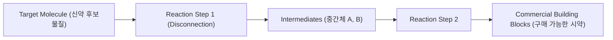
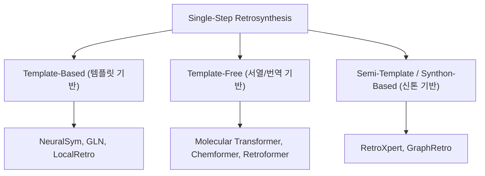
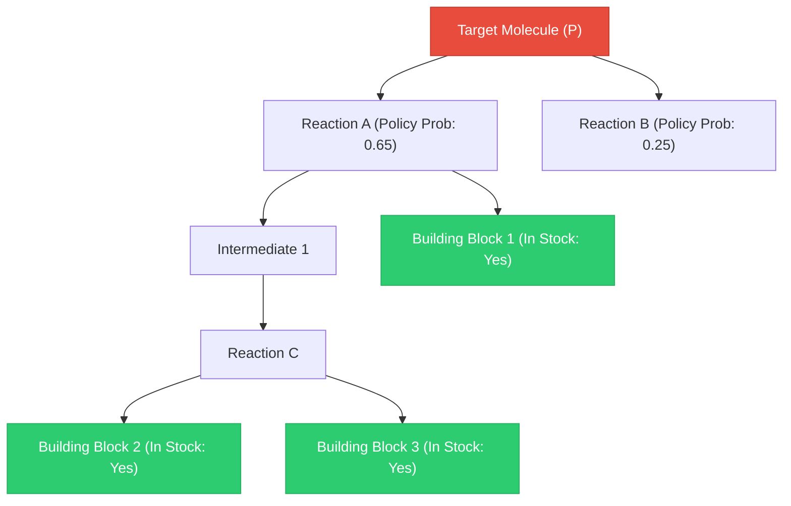
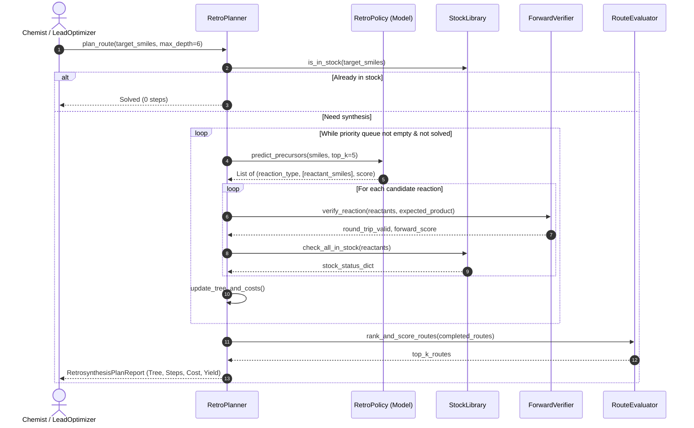

# TDC 기반 역합성(Retrosynthesis) 기술 조사 및 아키텍처 설계 보고서

**문서 버전:** v1.0.0  
**작성일자:** 2026-09-29  
**프로젝트:** `tdc-studio` / Retrosynthesis Module  
**목적:** TDC(Therapeutics Data Commons) 데이터셋을 활용한 AI 역합성 모듈 구축을 위한 핵심 이론, SOTA 알고리즘, TDC 데이터 명세 및 시스템 설계 방안 수립

---

## 1. 개요 및 연구 배경 (Overview & Background)

### 1.1 역합성 분석(Retrosynthesis Analysis)의 정의
역합성 분석(Retrosynthetic Analysis)은 1969년 E. J. Corey에 의해 체계화된 유기합성 계획 기법으로, 합성하고자 하는 목표 분자(Target Molecule / Product)로부터 출발하여 화학적으로 타당한 결합 절단(Disconnection)을 반복함으로써, 시판 중이거나 입수 가능한 단순 출발 물질(Commercial Starting Materials / Building Blocks)로 역방향 분해해 나가는 과정입니다.



### 1.2 신약 개발 및 `tdc-studio`에서의 가치
- **생성 모델(Generative Models)의 현실성 검증:** 분자 생성 모델(VAE, GAN, Diffusion, Lead Optimizer)이 제안한 분자가 약리학적 특성(ADMET)이 우수하더라도, 실제로 합성할 수 없다면 신약 후보물질로서 가치가 없습니다.
- **SAScore의 한계 극복:** 현재 `tdc-studio`의 `lead_optimizer.py` 등에서는 Ertl et al. 기반의 SAScore(휴리스틱 기반 분자 복잡도 지표)를 필터로 사용하고 있으나, Gao & Coley (2020)의 연구에 따르면 SAScore는 입체장애, 반응 작용기 호환성, 실제 시약 가용성을 반영하지 못하는 맹점(Blind spots)이 존재합니다.
- **실제 합성 경로 및 비용 추정:** 타깃 분자를 만들기 위한 구체적인 단계 수(Number of Steps), 예상 수율(Expected Yield), 시약 비용(Reagent Cost)을 산출하여 실험실 검증 우선순위를 정량화합니다.

---

## 2. 단일 단계 역합성(Single-Step Retrosynthesis) 핵심 알고리즘 분류

단일 단계 역합성(Single-step Retrosynthesis)은 주어진 단일 생성물(Product $P$)에 대해 직접적인 전구체 반응물 집합($R = \{r_1, r_2, \dots\}$)을 예측하는 작업입니다. 현대 AI 모델은 크게 3가지 패러다임으로 나뉩니다.



### 2.1 템플릿 기반 방식 (Template-Based)
- **원리:** 반응 데이터베이스에서 원자 매핑(Atom mapping)을 기반으로 추출한 반응 규칙(SMIRKS/SMARTS 템플릿, 예: RDChiral 추출)을 데이터베이스화하고, 타깃 분자의 특징(Fingerprint, Graph)으로부터 적용 가능한 템플릿을 분류(Multi-class Classification)한 후 생성물에 적용하여 반응물을 도출합니다.
- **주요 모델:**
  - **NeuralSym (2017):** Morgan Fingerprint + MLP 기반 상위 템플릿 분류.
  - **GLN (Graph Logic Network, 2019):** 계층적 논리 그래프 기반 모델.
  - **LocalRetro (2021):** GNN을 통해 분자 그래프의 반응 중심(Reaction Center: 결합 변경/원자 속성 변경)을 먼저 예측하고, 국소 템플릿을 조합하여 반응물을 유도.
- **장점:**
  - 100% 화학적으로 유효한 분자(Chemical Validity) 생성 보장.
  - 화학자의 유기반응 룰과 직관적으로 일치하여 해석력(Interpretability)이 뛰어남.
- **단점:**
  - 훈련 데이터에 없는 템플릿(Out-of-template) 반응은 절대 예측 불가.
  - 대규모 데이터셋(USPTO Full 등) 적용 시 템플릿 수가 수십만 개로 폭증하여 분류 차원 문제(Scalability issue) 발생.

### 2.2 템플릿 프리 방식 (Template-Free / Sequence-to-Sequence)
- **원리:** 화학 반응을 자연어 번역 문제(Machine Translation)로 모델링합니다. 입력으로 생성물 SMILES 문자열을 넣고, Seq2Seq / Transformer 디코더가 반응물 SMILES 문자열을 직접 생성(Autoregressive / Non-autoregressive)합니다.
- **주요 모델:**
  - **Molecular Transformer (Schwaller et al., 2019):** 표준 Transformer 인코더-디코더 기반 분자 변환 표준 수립.
  - **Chemformer (Irwin et al., 2022):** 대규모 분자 코퍼스로 사전학습(BART 기반)된 화학 파운데이션 모델을 역합성에 파인튜닝.
  - **Root-Aligned Transformer (Tiesman et al., 2023):** 생성물과 반응물 간 원자 순서 정렬(Root-alignment)을 통해 Attention 정렬도를 극대화하여 Top-1 정확도 대폭 향상.
- **장점:**
  - 복잡한 템플릿 추출 및 관리 파이프라인 불필요.
  - 전례 없는 신규 반응(Novel reaction / Out-of-template) 생성 가능.
- **단점:**
  - 유효하지 않은(Grammatically invalid) SMILES 문자열이 생성될 위험 존재.
  - 질량 보존(Atom count balance)이 깨진 반응물이 출력될 수 있음.

### 2.3 반템플릿 / 신톤 기반 방식 (Semi-Template / Synthon-Based)
- **원리:** 2단계 하이브리드 파이프라인.
  1. **Disconnection 단계:** 타깃 분자 그래프에서 반응 중심(Reaction Center) 결합을 절단하여 신톤(Synthon: 이상적인 반응 중심 단편) 생성.
  2. **Leaving Group Completion 단계:** 신톤에 적절한 이탈기(Leaving Group)를 부착하여 완전한 반응물(Reactants) 완성.
- **주요 모델:**
  - **RetroXpert (Liu et al., 2020):** GNN 기반 결합 단절 예측 + Transformer 기반 신톤 완성.
  - **GraphRetro (Somnath et al., 2021):** 완전 그래프 기반 신톤 결합 예측.
- **장점:**
  - 높은 해석력 + 템플릿 프리의 유연성을 동시에 확보.

### 2.4 USPTO-50K 벤치마크 성능 비교 (단일 단계 기준)

| 방식 구분 | 대표 모델 | Reaction Class Unk (Top-1) | Reaction Class Unk (Top-10) | 장점 및 특징 |
| :--- | :--- | :---: | :---: | :--- |
| **Template-based** | LocalRetro (2021) | 53.4% | 84.6% | 높은 연산 효율, 해석 가능, 국소 반응 규칙 |
| **Semi-template** | RetroXpert (2020) | 54.7% | 76.5% | 반응 중심 단절 후 신톤 기반 완성 |
| **Template-free** | Molecular Transformer | 45.7% | 71.9% | 초기 서열 기반 표준 벤치마크 |
| **Template-free** | Root-aligned Retro (2023) | 55.4% | 85.3% | 원자 정렬을 통한 Attention 왜곡 해소 |
| **Template-free / LLM** | ChemDual / RSGPT (2024~2025) | 60.5% ~ 65.0% | 90.0% ~ 92.5% | 분자 사전학습 LLM 및 Flow Matching 결합 |

---

## 3. 다단계 역합성 경로 계획 (Multi-Step Retrosynthesis Planning)

현실적인 유기합성은 한 단계로 끝나지 않으며, 3~10단계 이상의 복합적인 합성 경로를 거칩니다. 다단계 역합성은 트리/그래프 탐색(Tree/DAG Search) 문제로 정의됩니다.



### 3.1 핵심 컴포넌트
1. **Expansion Policy (단일 단계 역합성 엔진):**
   - 현재 노드의 분자를 반응물들로 확장하는 모델 (Top-k 후보 생성).
2. **Stock Database (시약 재고 카탈로그):**
   - 상용 구매 가능한 물질(Commercial Reagents)의 SMILES 또는 InChIKey 해시셋 (예: eMolecules, Enamine Building Blocks, Sigma-Aldrich 등).
   - 모든 가지(Leaf node)가 Stock에 존재할 때 탐색 성공(Solved) 판정.
3. **Search Engine (탐색 알고리즘):**
   - **MCTS (Monte Carlo Tree Search - Segler et al., Nature 2018):** 선택, 확장, 시뮬레이션(Rollout), 역전파를 통한 트리 탐색.
   - **Retro\* (Neural A\* Search - Chen et al., ICML 2020):** AND-OR 트리를 구성하고 합성 난이도 휴리스틱(Value function)을 이용해 최단/최저비용 경로를 우선 탐색.
   - **AiZynthFinder (AstraZeneca, 2020):** AND-OR 트리 탐색 기반 산업계 표준 오픈소스.
4. **Scoring & Verification (필터 및 검증기):**
   - **Round-Trip Validation:** 생성된 반응물 $R$에 대해 순방향 반응 예측 모델(Forward Reaction Model)을 구동하여 원래 타깃 $P$가 도출되는지 확인 ($M_{fwd}(R) == P$).
   - **Reaction Yield Predictor:** 단계별 수율 예측치를 곱하여 총 경로 수율(Cumulative Yield) 산출.

---

## 4. TDC (Therapeutics Data Commons) 데이터셋 및 기능 분석

TDC는 역합성 및 반응 예측 파이프라인 구축에 필요한 풍부한 데이터셋과 오라클을 제공하고 있습니다.

### 4.1 `tdc.generation.RetroSyn` (역합성 전용 데이터셋)
| 데이터셋 명 | 건수 (Reactions) | 데이터 특성 | 용도 및 모델링 전략 |
| :--- | :---: | :--- | :--- |
| **`USPTO-50K`** | 50,036 | 10대 화학 반응 클래스 라벨링, 원자 매핑(Atom-mapped) 완료 | 단일 단계 역합성 모델의 메인 학습/벤치마크, 반응 클래스 조건부/무조건부 학습 |
| **`USPTO` (Full)** | 1,939,253 | 미국 특허청 1976~2016년 전체 추출 반응 | 대규모 사전학습(Pretraining), 일반화 파운데이션 모델 구축 |

**TDC API 사용법:**
```python
from tdc.generation import RetroSyn

# 1. USPTO-50K 로드 (기본 무조건부)
data = RetroSyn(name='USPTO-50K')
split = data.get_split(method='random', seed=42)
# split['train'], split['valid'], split['test'] 반환 (DataFrame: input=Product, output=Reactants)

# 2. 반응 클래스(Reaction Type) 포함 로드 (0.3.5+ 지원)
split_with_type = data.get_split(include_reaction_type=True)
# DataFrame 컬럼: 'input', 'output', 'reaction_type'
```

### 4.2 `tdc.generation.Reaction` (순방향 반응 예측 데이터셋)
- **데이터셋:** `USPTO` (1,939,253건)
- **태스크:** 반응물 집합 $X \to$ 생성물 $Y$ 예측.
- **역합성 모듈에서의 필수 역할:**
  - **Round-Trip Validation:** 단일 단계 역합성 모델이 내놓은 예측 결과가 화학적으로 타당한지 검증하는 순방향 반응 검증기(Forward Model) 구축에 활용.

```python
from tdc.generation import Reaction
fwd_data = Reaction(name='USPTO')
fwd_split = fwd_data.get_split()
```

### 4.3 `tdc.single_pred.Yields` (반응 수율 예측 데이터셋)
- **데이터셋:**
  - **`Buchwald-Hartwig` (55,370건):** Pd 촉매 기반 C-N 결합 형성 반응의 고속 대량 스크리닝(HTE) 실험 수율.
  - **`USPTO` Yields:** 특허 문헌에 기재된 반응 수율.
- **역합성 모듈에서의 역할:**
  - 경로 탐색 중 반응 수율을 페널티/스코어로 적용하여 "수율이 극히 낮은 단계가 포함된 비실용적 경로"를 사전에 가지치기(Pruning).

```python
from tdc.single_pred import Yields
yield_data = Yields(name='Buchwald-Hartwig')
yield_split = yield_data.get_split()
```

### 4.4 `tdc.Oracle` (외부 역합성 평가 엔진 인터페이스)
TDC는 외부 구축 소프트웨어와의 연동 오라클을 제공합니다:
- **`ASKCOS`:** MIT의 엔드투엔드 역합성 트리 빌더. TDC API를 통해 `host_ip` 연결 후 분자의 plausibility 및 필요 단계 수(`num_step`) 획득 가능.
- **`IBM_RXN`:** IBM Molecular Transformer 클라우드 서비스 연동.
- **`Molecule One Synthesis`:** 상용 합성 경로 분석 API 연동.

---

## 5. `tdc-studio` 내 Retrosynthesis 모듈 아키텍처 설계

기존 `tdc-studio`의 데이터 로더(`BaseTDCDataModule`), 서빙 파이프라인(`UnifiedADMETPipeline`), 생성 모듈(`lead_optimizer.py`)의 디자인 패턴을 완벽히 계승하도록 설계합니다.

### 5.1 패키지 디렉터리 구성안

```
tdc_studio/
├── data/
│   ├── retrosyn.py             # TDC RetroSyn (USPTO-50K, USPTO) 데이터 로더 & 캐싱
│   └── reaction.py             # TDC Reaction (Forward) 데이터 로더
├── models/
│   └── retrosynthesis/
│       ├── __init__.py
│       ├── base.py             # BaseRetroModel (추상 클래스)
│       ├── seq2seq_retro.py    # Transformer 기반 단일 단계 역합성 모델
│       ├── local_retro.py      # GNN 기반 반응 중심 식별 경량 모델 (LocalRetro)
│       └── forward_verifier.py # Round-trip 검증용 순방향 반응 예측기
├── retrosynthesis/
│   ├── __init__.py
│   ├── stock.py                # 가용 시약 라이브러리 관리자 (StockReagentIndex)
│   ├── route.py                # 합성 경로 트리/DAG 데이터 구조 및 JSON 직렬화
│   ├── search/
│   │   ├── base.py             # BaseSearchTree
│   │   ├── retro_star.py       # Retro* (A* 휴리스틱 트리 탐색기)
│   │   └── mcts.py             # Monte Carlo Tree Search 탐색기
│   ├── evaluator.py            # Top-k 정확도, Round-trip 정확도, 경로 성공률 평가기
│   └── planner.py              # 엔드투엔드 역합성 계획 오케스트레이터
└── serving/
    ├── retrosynthesis_pipeline.py  # 추론 및 경로 탐색 서빙 파이프라인
    └── schema.py               # RetrosynthesisRequest/Response Pydantic 스키마
```

### 5.2 모듈 간 상호작용 및 파이프라인 흐름



### 5.3 `lead_optimizer.py`와의 시너지 (핵심 가치 제안)
현재 `lead_optimizer.py`의 후보 필터 단계(Step 4: Pareto & Synthesizability Filter)는 SAScore에만 의존하고 있습니다.
- **개선안:** 
  `is_synthetically_accessible(mol)`을 호출할 때 1차로 빠른 SAScore를 적용하고, 상위 후보들에 대해 `retrosynthesis.planner.is_route_found(mol, timeout_sec=2.0)`를 실행하여 **"실제로 구매 가능한 시약으로부터 합성이 검증된 후보"**만을 최종 추천하도록 업그레이드합니다.

---

## 6. 구현 단계별 로드맵 (Actionable Implementation Plan)

### Phase 1: 데이터 파이프라인 구축 (Data Pipeline & TDC Integration)
1. `tdc_studio/data/retrosyn.py` 구현
   - `RetroSynDataModule` 클래스 작성 (`BaseTDCDataModule` 상속)
   - `USPTO-50K` 데이터 다운로드 및 scaffold/random split 지원
   - 오프라인 환경/CI를 위한 합성(Synthetic) 반응 Mock 데이터셋 지원
   - 분자 전처리 및 SMILES 정규화(Canonicalization), Tokenizer 구현

### Phase 2: 단일 단계 역합성 및 순방향 검증 모델 (Single-Step & Forward Validator)
1. `tdc_studio/models/retrosynthesis/` 구축
   - SMILES Seq2Seq / Transformer 모델 구현 (또는 사전학습 모델 래퍼)
   - 순방향 반응 검증기(`ForwardVerifier`) 구현 (Round-trip 정확도 측정)
   - Top-1, Top-3, Top-5, Top-10 정확도 및 Invalid SMILES Rate 평가 지표 구현

### Phase 3: 시약 재고 관리 및 다단계 경로 탐색기 (Stock & Multi-Step Search)
1. `tdc_studio/retrosynthesis/stock.py`:
   - Enamine/ZINC 기반 기본 출발물질 인덱스(InChIKey / Canonical SMILES 기반 O(1) 룩업)
2. `tdc_studio/retrosynthesis/search/retro_star.py`:
   - A* 휴리스틱 및 AND-OR 트리 탐색 구현
3. 경로 평가기(`route.py`):
   - 전체 단계 수, 단계별 반응 신뢰도, 누적 수율 계산

### Phase 4: API 서빙 및 CLI, 리드 최적화기 연동
1. `tdc_studio/serving/retrosynthesis_pipeline.py` & FastAPI 엔드포인트 `/retrosynthesis/plan` 추가
2. `tdc-studio retrosynthesis plan --smiles "..."` CLI 명령어 등록
3. `lead_optimizer.py`에 역합성 검증 필터 옵션 연동
4. 단위 테스트(`tests/test_retrosyn_data.py`, `tests/test_retro_planner.py`) 작성

---

## 7. 결론 및 제언

TDC의 `RetroSyn (USPTO-50K)`과 `Reaction (USPTO)` 데이터셋은 현대 AI 기반 역합성 시스템을 구축하기에 최적화된 표준 벤치마크입니다.
- **데이터 측면:** `USPTO-50K`로 단일 단계 분해 모델을 훈련하고, `USPTO Reaction`으로 순방향 검증기를 훈련하여 **환각 반응(Hallucinated reactions)을 억제**할 수 있습니다.
- **시스템 측면:** `tdc-studio`는 이미 모듈화된 MLOps 아키텍처와 분자 최적화기(`lead_optimizer`)를 갖추고 있으므로, 역합성 모듈이 추가되면 **"신약 후보 발굴 $\to$ ADMET 평가 $\to$ 역합성 경로 검증"**으로 이어지는 완전한 엔드투엔드 인실리코(In-silico) 신약개발 스위트가 완성됩니다.
