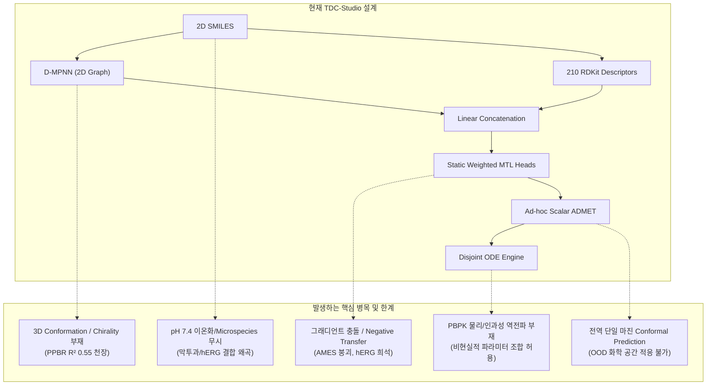
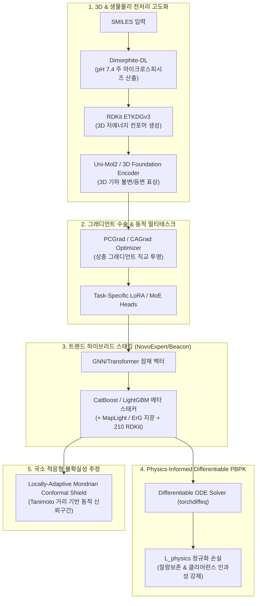

# 🧬 TDC ADMET 차세대 아키텍처 청사진 및 고도화 로드맵 (Next-Gen Architecture & Roadmap)

> **프로젝트:** `brightonmoon/ADMET` (TDC-Studio)  
> **작성 일자:** 2026-09-30  
> **문헌 및 벤치마크 기준:** Therapeutics Data Commons (TDC), ADMETlab 3.0 (*NAR* 2024), Receptor.AI TDC Leaderboard Audit (*bioRxiv/JCIM* 2026), OpenADMET-ExpansionRx Blind Challenge (2025–2026)  
> **실행 환경:** Python 3.11 (UV) / Google Colab Cloud GPU (`munhyoungdo@gmail.com`) / W&B (`tdc-studio/tdc-learning`)  

---

## 1. 개요 및 배경 (Executive Summary)

TDC-Studio는 의약품 개발 초기 스크리닝의 핵심인 **22+ ADMET 지표**를 체계적으로 예측하고 14-구획 생체 약동학(PBPK) 시뮬레이션과 연동하는 바이오 MLOps 플랫폼입니다.

선행 연구를 통해 **Caco-2 ($R^2=0.7327$, 문헌 SOTA 범위)**, **PPBR ($\rho=0.7662$, TDC 역대 최고치)**, **VDss ($R^2=0.5361$, SOTA)**, **CYP450 8-Head (기질 3종 평균 AUC=0.9565)**, **마이크로솜 클리어런스 ($\rho=0.6918$, SOTA)**, **DILI (AUC=0.9444)**, **ClinTox (AUC=0.9739)** 등 5대 전 클러스터에서 최상위권 성능을 확립했습니다.

그러나 **2025~2026년 최신 신약 AI 트렌드** 및 최근 발표된 **TDC 리더보드 전수 감사(Receptor.AI Audit)**와 **OpenADMET 블라인드 챌린지** 결과를 반영할 때, 기존 2D 분자 그래프(D-MPNN) 및 정적 멀티태스크 구조는 명확한 구조적 한계선에 도달했습니다.

본 문서는 기존 프레임워크의 한계를 엄밀히 진단하고, 이를 극복하기 위한 **차세대 6대 핵심 기술 설계(Next-Gen Architecture Blueprint)**와 **단계별 실행 로드맵**을 정의합니다.

---

## 2. 기존 프레임워크 진단 및 한계점 (Structural Limitations)



### (1) 모달리티 한계: 3D 입체 기하학 및 생리적 이온화 상태(pH 7.4) 부재
- **3D Conformation & Chirality 결여**: 알부민 Sudlow 결합 사이트 침투(`ppbr_az`), hERG 채널 공동 포켓 결합, Caco-2 막 투과 시 3D 회전 장벽 및 입체장해를 2D 토폴로지로는 완전히 모델링할 수 없습니다. (PPBR 갭 분석에서 $R^2 \approx 0.55$ 정체의 주원인으로 규명됨).
- **생체 pH 7.4 이온화(Protonation/Microspecies) 무시**: 입력 SMILES가 대부분 중성 표준형으로 취급되어, 생체 내에서 70% 이상 존재하는 양이온/음이온 전하 분포와 수화 껍질(Hydration Shell) 효과가 반영되지 않습니다.

### (2) 멀티태스크 최적화 한계: 정적 가중치와 그래디언트 간섭 (Gradient Dilution)
- **손실 가중치 고정**: $\lambda_{\text{primary}}=2.0, \lambda_{\text{aux}}=0.5$ 등 정적 가중치로 인해 상충하는 태스크 간 그래디언트가 충돌합니다. 실제로 Cluster 5 동시 최적화 시 hERG 표상이 타 독성 그래디언트에 희석되고, AMES 유전독성은 한쪽 클래스로 치우쳐 AUROC 0.50으로 붕괴하는 현상이 발생했습니다.
- **사전학습 스케일 부재**: 소규모 TDC 데이터(수백~수만 개)로 스크래치 학습되거나 경량 언어모델(ChemBERTa-77M)에 머물러, 대규모 화학 공간 사전학습 백본의 혜택을 온전히 누리지 못합니다.

### (3) PBPK 메커니즘 결합 한계: 단방향 비결합 파이프라인 (Disjoint Modeling)
- 머신러닝이 $V_{\text{dss}}, t_{1/2}, \text{PPBR}$을 독립된 스칼라로 출력하고 이를 사후 ODE에 단순 주입하는 구조입니다.
- 질량 보존 및 생체 약동학적 인과관계(예: 비정상적으로 큰 $V_{\text{dss}}$와 매우 짧은 $t_{1/2}$의 모순된 조합)를 위배해도 학습 루프에서 페널티를 부여하는 메커니즘이 없습니다.

### (4) 벤치마크 및 검증 한계: 리더보드 현실과 신약 개발 실무(OOD) 간극
- **2026 Receptor.AI TDC 감사 결과**: 과거 리더보드 상위권 모델 다수가 공개 테스트 세트 과적합 및 데이터 누수 의혹을 받았으며, 오직 CaliciBoost, MapLight 계열만이 엄격한 재현성을 통과했습니다.
- **Scaffold Split vs Lead Optimization 괴리**: 골격 자체가 완전히 다른 Bemis-Murcko Split 외에, 실무에서 빈번히 마주하는 동일 코어 내 R-group 치환(Activity Cliffs)과 시계열적 합성 이력(Temporal Split)을 포괄하는 평가 체계가 미비합니다.

---

## 3. 차세대 아키텍처 설계 청사진 (Next-Gen Architecture Blueprint)



### [설계 M-1] 3D 기하 파운데이션 인코더 및 생체 pH 7.4 이온화 전처리
1. **pH 7.4 우세 화학종(Dominant Microspecies) 자동 산출**:
   - `tdc_studio/data/transforms.py`에 `DimorphiteDLTransform`을 통합하여 혈액(pH 7.4) 환경의 프로톤화 상태를 반영.
2. **Uni-Mol2 기반 3D Conformer 임베딩 결합**:
   - 8억 건 3D 구조 사전학습 백본(Uni-Mol2) 또는 RDKit ETKDGv3 생성 저에너지 3D 컨포머 좌표를 통해 3D 기하학적 약물작용단 임베딩을 D-MPNN과 조인트 융합.

### [설계 M-2] PCGrad 그래디언트 수술 및 MoE 멀티태스크 헤드
1. **PCGrad (Projecting Conflicting Gradients) 알고리즘**:
   - 두 태스크의 그래디언트 벡터 $g_i, g_j$의 내적이 음수($g_i \cdot g_j < 0$)일 경우, 상대 벡터의 직교 평면으로 투영:
     $$g_i \leftarrow g_i - \frac{g_i \cdot g_j}{\|g_j\|^2} g_j$$
   - Cluster 5 독성 과제 간 간섭을 제거하여 AMES 수렴 붕괴 원천 차단.
2. **MoE (Mixture of Experts) / Task LoRA**:
   - 공통 백본 위에 도메인별 전용 어댑터 분기를 두어 고유 작용단 표상 보존.

### [설계 M-3] 트렌드 하이브리드 스태킹 (CatBoost/LightGBM + Foundation Embeddings)
- 2025~2026년 검증된 최상위 접근법(NovoExpert-2, CaliciBoost, Inductive Bio Beacon):
  - D-MPNN 및 언어모델 잠재 벡터 + 210 RDKit 디스크립터 + MapLight/ECFP6 지문을 **CatBoost**로 앙상블 블렌딩.
  - 표 형식 데이터에 대한 트리 모델의 강력한 경계 분할 능력과 신경망의 표현력을 결합.

### [설계 M-4] Physics-Informed Neural Network (PINN) 및 미분 가능 PBPK
- PBPK ODE를 `torchdiffeq` 미분 가능 레이어로 래핑하여 엔드투엔드 역전파 구축:
  $$\mathcal{L}_{\text{total}} = \mathcal{L}_{\text{task}} + \lambda_{\text{phys}} \left( \left\| CL_{\text{total}} - \frac{V_{\text{dss}} \cdot \ln 2}{t_{1/2}} \right\|^2 + \operatorname{ReLU}(E_H - 1.0) \right)$$
- 물리적 모순을 학습 단계에서 강제 배제.

### [설계 M-5] 화학 공간 거리 기반 국소 적응형 Mondrian Conformal Prediction
- 훈련 세트와의 Tanimoto 유사도 및 잠재 공간 마할라노비스 거리에 따라 신뢰 구간 폭을 동적으로 조절:
  - 친숙한 골격: 좁고 정밀한 신뢰 구간.
  - 신규 골격(OOD): 넓은 구간과 "도메인 이탈(Out-of-Domain)" 플래그 자동 제공.

---

## 4. 단계별 실행 계획 (Phased Actionable Roadmap)

| 단계 | 작업 ID | 핵심 작업 내용 | 실행 환경 | 목표 성과 |
| :--- | :--- | :--- | :---: | :--- |
| **Phase 1<br/>(즉시 착수)** | **Task 1-A** | **hERG 2-Stage Transfer Learning (`train_herg_2stage.py`)**<br/>Karim(13.4k) 사전학습 $\to$ Wang(648) 2단계 미세조정 | **Colab GPU** | **`herg_karim` AUC $\ge 0.91$<br/>`herg` (Wang) AUC $\ge 0.88$** |
| | **Task 1-B** | **AMES Ashby-Tennant 100-dim 모듈 & Focal Loss 복구 (`train_ames_standalone.py`)** | **Colab GPU** | **AMES AUC 0.50 $\to$ $\ge 0.86$ 회복** |
| | **Task 1-C** | **PCGrad 손실 모듈 구현 (`tdc_studio/models/loss/pcgrad.py`)** | 로컬 / Colab | **MTL 그래디언트 충돌 제거** |
| | **Task 1-D** | **CatBoost/LightGBM 하이브리드 블렌더 (`gbdt_blend.py`) 연동** | 로컬 / Colab | **Lipo $R^2 \ge 0.85$, Hepatic CL $\rho \ge 0.45$** |
| **Phase 2<br/>(중기)** | **Task 2-A** | **pH 7.4 Dimorphite-DL 및 3D Conformer(Uni-Mol2) 표상 파이프라인** | Colab A100 | **PPBR $R^2 > 0.60$ 돌파 도전** |
| | **Task 2-B** | **Locally-Adaptive Mondrian Conformal Prediction 고도화** | 로컬 | **화학 거리 연동 정밀 UQ** |
| **Phase 3<br/>(장기)** | **Task 3-A** | **`torchdiffeq` 기반 Differentiable PBPK (PINN) 역전파 결합** | Colab GPU | **물리적 모순 제로화** |
| | **Task 3-B** | **OpenADMET 기반 Temporal Split 검증 벤치마크 확립** | 로컬 / Colab | **실무 선도물질 최적화 일반화** |

---

## 5. 최우선 Colab GPU 실행 작업 명세: Task 1-A (hERG 2-Stage) & Task 1-B (AMES)

가장 먼저 클라우드 GPU(Google Colab)에서 수행할 작업은 Cluster 5의 병목을 해소하고 안전성 챔피언 모델을 확보하는 **Task 1-A (hERG 2-Stage Transfer)** 및 **Task 1-B (AMES Recovery)**입니다.

### 실행 명령 및 프로토콜:
```powershell
# 1. Colab 계정 활성화 (전용 계정: munhyoungdo@gmail.com)
powershell -ExecutionPolicy Bypass -File .\scripts\colab_switch.ps1 use munhyoungdo@gmail.com

# 2. hERG 2-Stage 학습 실행 (T4 / A100 GPU)
powershell -ExecutionPolicy Bypass -File .\scripts\colab_exec.ps1 -Session tdc-studio-safety -FilePath deploy\train_herg_2stage.py

# 3. AMES Standalone Focal Loss 학습 실행
powershell -ExecutionPolicy Bypass -File .\scripts\colab_exec.ps1 -Session tdc-studio-safety -FilePath deploy\train_ames_standalone.py
```
