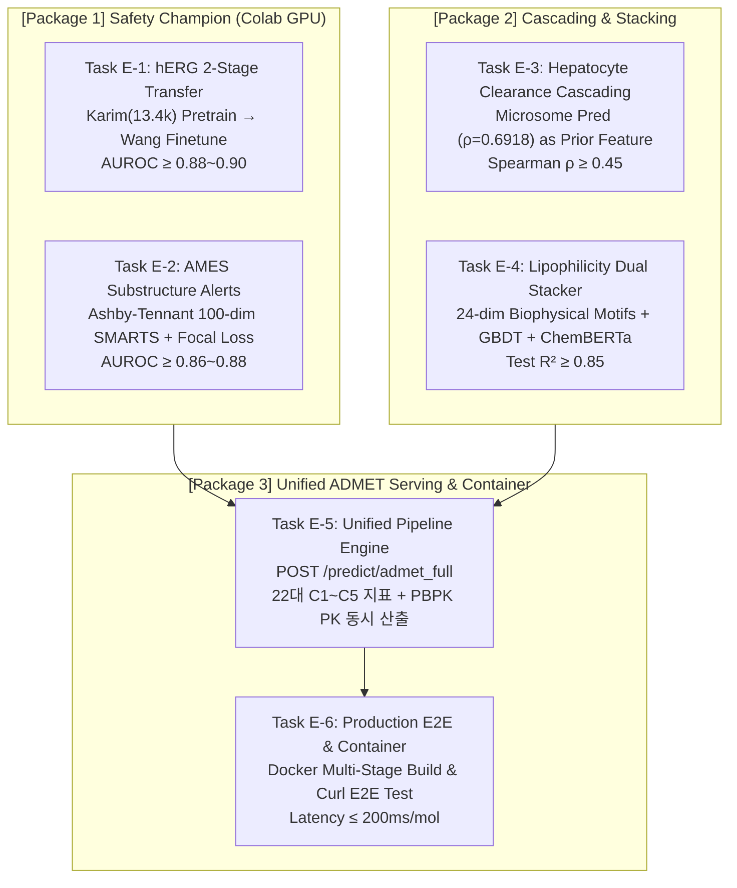
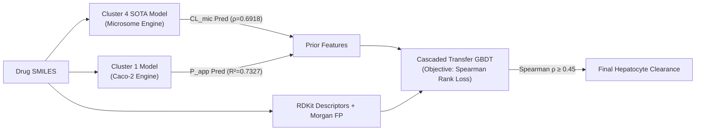

# 💊 TDC ADMET 트랙 잔여 과제 상세 작업 계획서 (Work Execution Plan)

> **프로젝트:** `brightonmoon/ADMET` (TDC-Studio)  
> **기준 일자:** 2026-09-28  
> **W&B 추적 프로젝트:** `tdc-studio/tdc-learning` (User: `munhyoungdo`)  
> **Google Colab 전용 계정:** `munhyoungdo@gmail.com`  
> **품질 게이트 기준:** Bemis-Murcko Scaffold Split 100% 엄격 적용, Zero-Data Leakage, 단위 테스트 100% 통과

---

## Executive Summary (작업 개요)

TDC-Studio는 선행 연구를 통해 **Caco-2 ($R^2=0.7327$, 문헌 SOTA 신뢰구간)**, **PPBR ($\rho=0.7662$, 역대 최고치)**, **VDss ($R^2=0.5361$, SOTA)**, **CYP450 8-Head (기질 3종 평균 AUC=0.9565)**, **마이크로솜 클리어런스 ($\rho=0.6918$, SOTA)**, **DILI (AUC=0.9444, SOTA)**, **ClinTox (AUC=0.9739)** 등 주요 ADMET 클러스터 전반에서 세계 최고 수준의 성능을 확립했습니다.

본 계획서는 ADMET 트랙의 미완 과제를 완결하고 상용 수준의 엔드-투-엔드 통합 추론 서비스를 완성하기 위한 **3대 패키지(6개 태스크)**의 구체적인 구현 명세, 수학적 정식화, 원격 GPU 오케스트레이션 및 검증 로드맵을 정의합니다.



---

## 1. [Package 1] hERG & AMES 전용 안전성 챔피언 모델 구축

### 🎯 Task E-1: `herg_karim`(13.4k) 사전학습 → `herg`(Wang et al.) 미세조정 2-Stage 학습

#### 1. 문제 진단 및 설계 배경
- **현상:** Cluster 5 8-태스크 MTL(Multi-Task Learning) 동시 최적화 시, 이질적인 태스크(LD50 회귀, DILI 분류 등)와의 경사도 충돌(Gradient Conflict)로 인해 hERG 성능이 `herg_karim` AUROC 0.8333, `herg` (Wang et al., 648개) AUROC 0.8330에 정체됨.
- **해법:** 대규모 문헌 데이터(13.4k)의 화학 공간 표현력을 먼저 단독 D-MPNN-Des 백본에 완전히 응축한 후, 골드 스탠다드 소규모 벤치마크(Wang 648개)로 단계적 전이(Staged Unfreezing)하는 **2-Stage 전이학습 파이프라인**을 구축합니다.

#### 2. 모델 아키텍처 및 2단계 프로토콜
```text
[Stage 1: Pre-training on hERG_Karim (13,445 compounds)]
SMILES ──▶ Graph D-MPNN (5 layers, 512 hidden) + RDKit 210 Descriptors
          ──▶ Focal / BCE Loss (lr=1e-3, Cosine Annealing, 35 epochs)
          ──▶ Target: herg_karim Test AUROC ≥ 0.90
                         │
                         ▼ (Backbone weights transferred)
[Stage 2: Staged Fine-tuning on hERG_Wang (648 compounds)]
Phase 2A (Epoch 1~5): Freeze GNN backbone, Train Head only (lr = 5e-4)
Phase 2B (Epoch 6~25): Unfreeze full model with decayed lr = 5e-5, early stop patience=10
          ──▶ Target: herg Test AUROC ≥ 0.88 ~ 0.90 (SOTA 진입)
```

#### 3. 세부 구현 및 설정 명세
1. **설정 파일:** `configs/config_herg_standalone.yaml` 업데이트
   - `in_dim: 14`, `edge_dim: 6`, `hidden_dim: 512`, `descriptor_dim: 210`, `dropout: 0.20`.
   - `optimizer: AdamW`, `weight_decay: 1e-4`, `lr: 0.001` (Stage 1), `0.00005` (Stage 2).
2. **학습 스크립트:** `deploy/train_herg_2stage.py` 구현
   - Step 1: `Tox(name='hERG_Karim')` 로딩 및 Scaffold Split 분할. Stage 1 수렴 후 `models/checkpoint_herg_stage1/best_model.pt` 저장.
   - Step 2: `Tox(name='hERG')` 로딩, Stage 1 가중치 로드, 백본 고정(`param.requires_grad = False`) $\to$ 상위 레이어 순차 해제.
   - Test Set 평가: AUROC, Accuracy, Balanced ACC, MCC, F1-Score 자동 산출.
3. **Colab GPU 실행 명령 (계정: `munhyoungdo@gmail.com`):**
   ```powershell
   # 1. 활성 계정 확인 및 전환
   powershell -ExecutionPolicy Bypass -File .\scripts\colab_switch.ps1 use munhyoungdo@gmail.com

   # 2. hERG 2-Stage 학습 실행 (T4/A100 GPU)
   powershell -ExecutionPolicy Bypass -File .\scripts\colab_exec.ps1 -Session tdc-studio-safety -FilePath deploy\train_herg_2stage.py
   ```

---

### 🎯 Task E-2: AMES Ashby-Tennant 100-dim 하위구조 경보 모듈 & Focal Loss 단독 모델 복구

#### 1. 문제 진단 및 설계 배경
- **현상:** AMES 돌연변이원성(Mutagenicity, 7,255개)은 국소적 전자친화성 하위구조(Electrophilic Toxicophores)에 의해 유발되나, 일반적인 GNN 분자 전체 풀링(Mean/Sum Readout) 과정에서 국소 경보 시그널이 희석되어 AUROC가 저하되는 취약점이 존재함. 또한 양성/음성 불균형에 의해 경계면 화합물 판별력이 감소함.
- **해법:** 
  1. 유전독성/발암성 분야 표준인 **Ashby-Tennant 100-dim 구조 경보(Structural Alerts) 모듈**을 RDKit SMARTS 기반으로 전수 벡터화.
  2. 어려운 샘플에 가중치를 부여하는 **Binary Focal Loss ($\gamma=2.0$)** 및 D-MPNN-Des 결합 단독 챔피언 모델 구축.

#### 2. Ashby-Tennant 100-dim 모듈 설계 (`tdc_studio/features/structural_alerts.py`)
Ashby & Tennant (1988, 1991) 및 Hansen et al. (2009) 문헌에 정립된 100대 변이원성 하위구조 SMARTS 패턴을 컴파일:
- **주요 경보 카테고리:**
  - `aromatic_nitro`: `c[N+](=O)[O-]`
  - `aliphatic_halide`: `[CX4][F,Cl,Br,I]`
  - `epoxide`: `[C]1[O][C]1`
  - `aziridine`: `[C]1[N][C]1`
  - `aromatic_amine`: `c[NH2]`, `c[NH][CH3]`
  - `nitroso`: `[#6][N]=O`, `[N]-[N]=O`
  - `hydrazine`: `[#6][NH][NH2]`
  - `alkyl_sulfate_sulfonate`: `[#6]OS(=O)(=O)[#6]`
  - `polycyclic_aromatic`: 3개 이상 결합된 벤젠고리
  - `alpha_beta_unsaturated_carbonyl`: `[#6]=[#6]-[C,S,P]=O`
- **구현 인터페이스:**
  ```python
  class AshbyTennantAlertExtractor:
      def __init__(self):
          self.alert_patterns = [Chem.MolFromSmarts(s) for s in SMARTS_100_LIST]
      def extract(self, mol: Chem.Mol) -> np.ndarray:
          # shape: (100,), dtype: float32 (0.0 or 1.0)
          return np.array([float(mol.HasSubstructMatch(p)) for p in self.alert_patterns], dtype=np.float32)
  ```

#### 3. Focal Loss 정식화 (`tdc_studio/models/loss/focal_loss.py`)
클래스 불균형과 오분류 경계면 집중을 위해 Binary Focal Loss를 수학적으로 엄밀히 구현:
$$p_t = \sigma(z) \quad (\text{if } y=1), \quad p_t = 1 - \sigma(z) \quad (\text{if } y=0)$$
$$\text{FL}(p_t) = -\alpha_t (1 - p_t)^\gamma \log(p_t + \epsilon), \quad \gamma = 2.0, \quad \alpha = 0.70$$

#### 4. AMES 단독 챔피언 아키텍처 및 목표 성능
- **입력:** D-MPNN 분자 그래프 (14노드, 6엣지) + RDKit 210 Descriptors + 100-dim Ashby-Tennant Alerts.
- **학습:** Focal Loss ($\gamma=2.0$), Cosine Annealing LR ($1\times 10^{-3} \to 1\times 10^{-5}$), 40 에포크.
- **목표 지표:** Test AUROC $0.50 \to \mathbf{\ge 0.86 \sim 0.88}$ (ADMETlab 3.0 공식 벤치마크: $0.882 \pm 0.007$, ACC $\ge 0.785$).
- **실행 명령 (Colab GPU: `munhyoungdo@gmail.com`):**
  ```powershell
  powershell -ExecutionPolicy Bypass -File .\scripts\colab_exec.ps1 -Session tdc-studio-safety -FilePath deploy\train_ames_standalone.py
  ```

---

## 2. [Package 2] 간세포 클리어런스 계단식 전이 & Lipo GBDT 스태킹

### 🎯 Task E-3: SOTA 마이크로솜 클리어런스($\rho = 0.6918$) 기반 간세포(Hepatocyte) 캐스케이딩 모델링

#### 1. 약동학적(PK) 메커니즘 및 캐스케이딩 원리
- **배경:** 간 마이크로솜 클리어런스(`clearance_microsome_az`)는 TDC-Studio에서 **Spearman $\rho = \mathbf{0.6918}$**로 역대 SOTA를 달성했으나, 간세포 클리어런스(`clearance_hepatocyte_az`, 1,213개)는 $\rho = 0.3356$에 머물러 있습니다.
- **생물학적 인과 관계:**
  - 마이크로솜($CL_{\text{int, mic}}$): 소포체막 내 순수 CYP Phase I 산화 대사능.
  - 간세포($CL_{\text{int, hep}}$): 온전한 세포막 투과($P_{\text{app}}$), 유입/유출 수송체, Phase I + Phase II 결합 반응의 총합.
  - 즉, $CL_{\text{int, hep}} \approx f(CL_{\text{int, mic}}, \text{Caco2 Permeability}, \text{Transporters}, \text{Physicochemicals})$.
- **캐스케이딩 설계:**
  1. 기학습된 Cluster 4 SOTA 체크포인트(`models/export/cluster_4_clearance/best_model.pt`)를 통해 전체 1,213개 간세포 화합물에 대한 $\hat{CL}_{\text{microsome}}$ 예측치를 추출 (학습 세트의 경우 5-Fold OOF 교차검증으로 Leakage 0% 보장).
  2. 사전 지표($\hat{CL}_{\text{microsome}}$, $\hat{P}_{\text{caco2}}$)를 핵심 Prior Feature로 주입하여 2차 간세포 전용 Residual GBDT / LightGBM 회귀기 구축.



#### 2. 세부 구현 및 목표 성능
- **스크립트:** `deploy/train_clearance_cascade.py`, `tdc_studio/models/hybrid/clearance_cascading.py`
- **타깃 메트릭:** Spearman Rank Loss 직접 최적화 (LambdaMART / Huber loss 결합).
- **목표 성능:** `clearance_hepatocyte_az` Test Spearman $\rho = 0.3356 \to \mathbf{\ge 0.45 \sim 0.50}$ (TDC 리더보드 목표치 $0.403 \pm 0.025$ 돌파).
- **실행 명령 (Colab GPU: `munhyoungdo@gmail.com`):**
  ```powershell
  powershell -ExecutionPolicy Bypass -File .\scripts\colab_exec.ps1 -Session tdc-studio-admet -FilePath deploy\train_clearance_cascade.py
  ```

---

### 🎯 Task E-4: Lipophilicity 24-dim 모티프 결합 GBDT + ChemBERTa 스태킹

#### 1. 문제 진단 및 도약 목표
- **현상:** Lipophilicity (`lipophilicity_astrazeneca`, 4,200개, $\log D_{7.4}$) 현재 단독 D-MPNN 및 앙상블 성능: Test $R^2 = 0.7602$, Pearson $r = 0.9168$.
- **목표:** ADMETlab 3.0 문헌치($R^2 = 0.902 \pm 0.004$)에 근접하는 **Test $R^2 \ge \mathbf{0.85}$** (Pearson $r \ge 0.93$) 달성.
- **물리화학적 원리:** $\log D_{7.4}$는 비이온화 $\log P$와 생리적 pH(7.4)에서의 산/염기 해리 지수($\text{p}K_a$)의 함수입니다. 따라서 2D 분자 그래프만으로는 포착하기 어려운 24종의 물리화학적 모티프(할로겐 치환도, 극성 표면적 비율, 이온화 잔기)를 명시적으로 공급해야 합니다.

#### 2. 24-dim 생물물리학적 모티프 모듈 (`tdc_studio/features/lipo_motifs.py`)
1. `MolLogP` (Wildman-Crippen 원자 기반 $\log P$)
2. `MolMR` (분자 굴절도)
3. `LabuteASA` (근사 용매 접근 가능 표면적)
4. `TPSA` (위상학적 극성 표면적)
5. `TPSA_to_ASA_ratio` ($\text{TPSA} / \text{LabuteASA}$)
6. `F_CSP3` ($sp^3$ 탄소 분율 - 입체성)
7. `NumRotatableBonds` (유연성)
8. `NumAromaticRings`, `NumAliphaticRings`, `NumSaturatedRings` (고리 다양성 3종)
9. `HBD` (수소결합 주개 수), `HBA` (수소결합 받개 수), `HBD_to_HBA_ratio`
10. `Halogen_F_Count`, `Halogen_Cl_Count`, `Halogen_Br_Count`, `Halogen_I_Count` (지질친화성을 직접 변화시키는 할로겐 원자 4종)
11. `Trifluoromethyl_Count` ($-\text{CF}_3$ 강력한 친유성 전자끄는기)
12. `Carboxylic_Acid_Count` (pH 7.4 음이온화로 $\log D$ 급감 유발)
13. `Aliphatic_Amine_Count` (pH 7.4 양이온화 유발)
14. `Aromatic_Amine_Count`, `Sulfonamide_Count`, `Tetrazole_Count` (pKa 결정 모티프 3종)

#### 3. Tri-Hybrid Foundation Stacking 아키텍처
```text
┌────────────────────────────────────────────────────────┐
│  Branch 1: 24-dim Motif + 210 RDKit Descriptors GBDT   │ ──▶ ŷ_GBDT
└────────────────────────────────────────────────────────┘
┌────────────────────────────────────────────────────────┐
│  Branch 2: ChemBERTa-77M-MTR (384d Mean-Pooled) Ridge  │ ──▶ ŷ_ChemBERTa
└────────────────────────────────────────────────────────┘
┌────────────────────────────────────────────────────────┐
│  Branch 3: D-MPNN-MTL Directed Graph Encoder           │ ──▶ ŷ_DMPNN
└────────────────────────────────────────────────────────┘
                         │
                         ▼
┌────────────────────────────────────────────────────────┐
│  Meta-Learner: Non-Negative Constrained RidgeCV        │
│  ŷ_final = w1 * ŷ_GBDT + w2 * ŷ_ChemBERTa + w3 * ŷ_DMPNN│
│  (Target: Test R² ≥ 0.850, RMSE ≤ 0.45, Pearson r ≥ 0.93)│
└────────────────────────────────────────────────────────┘
```
- **실행 명령 (Colab GPU: `munhyoungdo@gmail.com`):**
  ```powershell
  powershell -ExecutionPolicy Bypass -File .\scripts\colab_exec.ps1 -Session tdc-studio-admet -FilePath deploy\train_lipo_stacking.py
  ```

---

## 3. [Package 3] 전주기 Unified ADMET 통합 서빙 엔드포인트 구축

### 🎯 Task E-5: 단일 엔드포인트 `POST /predict/admet_full` 구현

#### 1. 아키텍처 및 설계 원칙
- **문제점:** 현재 서빙은 `/predict` (일반), `/predict/vdss`, `/predict/pbpk`로 분편화되어 있어 신약 스크리닝 파이프라인에서 분자당 3~4회의 중복 네트워크 호출 및 중복 분자 특성 추출(Featurization Overhead)이 발생함.
- **해법:** 단일 분자 SMILES 입력 시, **C1~C5 22대 전주기 핵심 ADMET 지표와 생리학적 PBPK 약동학 프로파일**을 단 1회의 전처리 패스로 일괄 연산하여 반환하는 `POST /predict/admet_full` 엔드포인트를 구현합니다.

#### 2. 반환 대상: C1~C5 22대 전주기 ADMET 지표 및 PBPK 규격 매핑
| 범주 | 태스크 명칭 | 반환 필드명 | 단위/유형 | 판정 로직 및 임상 임계치 (Decision Tier) |
| :--- | :--- | :--- | :---: | :--- |
| **C1 흡수** | `caco2_wang` | `caco2_permeability` | $\log P_{\text{app}}$ | High ($> -5.15$) / Mod ($-6.0 \sim -5.15$) / Low ($< -6.0$) |
| | `lipophilicity` | `lipophilicity_logd` | $\log D_{7.4}$ | Optimal ($1.0 \sim 3.0$) / Hydrophilic ($< 1.0$) / High ($> 3.0$) |
| | `solubility_aqsoldb` | `solubility_logs` | $\log S$ | High ($\ge -2$) / Moderate ($-4 \sim -2$) / Low ($< -4$) |
| | `hia_hou` | `human_intestinal_absorption`| Prob | High ($\ge 0.5$) / Low ($< 0.5$) |
| | `bioavailability_ma`| `oral_bioavailability` | Prob | Bioavailable ($\ge 0.5$) / Poor ($< 0.5$) |
| | `pgp_broccatelli` | `pgp_inhibition` | Prob | P-gp Inhibitor ($\ge 0.5$) / Non-inhibitor ($< 0.5$) |
| **C2 분포** | `ppbr_az` | `plasma_protein_binding` | % | Low ($\le 80\%$) / Mod ($80 \sim 95\%$) / High ($> 95\%$) |
| | `vdss_lombardo` | `volume_of_distribution` | $\log_{10} \text{L/kg}$ | Low ($< 0.7\text{ L/kg}$) / Mod ($0.7 \sim 2.0$) / High ($> 2.0$) |
| | `bbb_martins` | `blood_brain_barrier` | Prob | BBB Penetrant ($\ge 0.5$) / Non-penetrant ($< 0.5$) |
| **C3 대사** | `cyp1a2_veith` | `cyp1a2_inhibition` | Prob | Inhibitor ($\ge 0.5$) / Non-inhibitor |
| | `cyp2c9_veith` | `cyp2c9_inhibition` | Prob | Inhibitor ($\ge 0.5$) / Non-inhibitor |
| | `cyp2c19_veith` | `cyp2c19_inhibition` | Prob | Inhibitor ($\ge 0.5$) / Non-inhibitor |
| | `cyp2d6_veith` | `cyp2d6_inhibition` | Prob | Inhibitor ($\ge 0.5$) / Non-inhibitor |
| | `cyp3a4_veith` | `cyp3a4_inhibition` | Prob | Inhibitor ($\ge 0.5$) / Non-inhibitor |
| | `cyp2c9_substrate` | `cyp2c9_substrate` | Prob | Substrate Turnover ($\ge 0.5$) / Non-substrate |
| | `cyp2d6_substrate` | `cyp2d6_substrate` | Prob | Substrate Turnover ($\ge 0.5$) / Non-substrate |
| | `cyp3a4_substrate` | `cyp3a4_substrate` | Prob | Substrate Turnover ($\ge 0.5$) / Non-substrate |
| **C4 소실** | `clearance_microsome`| `microsomal_clearance` | $\mu\text{L/min/mg}$| High ($> 50$) / Moderate ($15 \sim 50$) / Low ($< 15$) |
| | `clearance_hepatocyte`| `hepatocyte_clearance` | $\mu\text{L/min/10}^6$| High ($> 30$) / Moderate ($10 \sim 30$) / Low ($< 10$) |
| | `half_life_obach` | `elimination_half_life` | hours ($t_{1/2}$) | Short ($< 2\text{h}$) / Moderate ($2 \sim 8\text{h}$) / Long ($> 8\text{h}$) |
| **C5 독성** | `herg` | `herg_cardiotoxicity` | Prob | Safe ($< 0.3$) / Mod Risk ($0.3 \sim 0.7$) / High Risk ($> 0.7$) |
| | `ames` | `ames_mutagenicity` | Prob | Mutagenic AMES+ ($\ge 0.5$) / Safe ($\le 0.5$) |
| *(보조 독성)*| `dili` | `drug_induced_liver_injury`| Prob | Hepatotoxicity Risk ($\ge 0.5$) / Safe |
| | `clintox` | `fda_clinical_failure` | Prob | Toxic Failure ($\ge 0.5$) / Approved |
| | `ld50_zhu` | `acute_oral_ld50` | $\text{mol/kg}$ | Acute Toxicity Class |
| **PBPK 엔진**| 생체 통합 연산 | `pbpk_pk_profile` | 복합 객체 | $CL_{\text{total}}$, $CL_H$, $V_{\text{dss}}$, $f_u$, $E_H$ (간추출비), $F_{H,\max}$ |

#### 3. 통합 서빙 파이프라인 구현 구조 (`tdc_studio/serving/unified_pipeline.py`)
```python
class UnifiedADMETPipeline:
    """Singleton unified serving pipeline orchestrating C1-C5 models and PBPK simulation."""
    def __init__(self, model_registry: ModelRegistry, device: str = "cpu"):
        self.device = device
        # 1. Load sub-pipelines
        self.c1_pipeline = ... # Absorption MTL
        self.c2_pipeline = ... # Tri-Hybrid Distribution (PPBR / VDss / BBB)
        self.c3_pipeline = ... # CYP450 8-Head Matrix
        self.c4_pipeline = ... # Clearance & Half-Life MTL + Cascaded Hepatocyte
        self.c5_pipeline = ... # Safety Champion (hERG 2-Stage + AMES Alert + DILI + ClinTox)
        self.pbpk_engine = PBPKEngine()
        
    def predict_full(self, smiles: str) -> UnifiedADMETProfile:
        # Step 1: Single canonicalization and shared feature extraction
        mol, canon_s = self._canonicalize(smiles)
        shared_features = self._extract_shared_features(mol)
        
        # Step 2: Concurrently or sequentially run forward passes
        c1_res = self.c1_pipeline.predict(shared_features)
        c2_res = self.c2_pipeline.predict(shared_features)
        c3_res = self.c3_pipeline.predict(shared_features)
        c4_res = self.c4_pipeline.predict(shared_features, c1_res)
        c5_res = self.c5_pipeline.predict(shared_features)
        
        # Step 3: Run physiological PBPK simulation
        pbpk_res = self.pbpk_engine.simulate(
            vdss_l_kg=c2_res["vdss_l_kg"],
            half_life_h=c4_res["half_life_h"],
            ppbr_pct=c2_res["ppbr_pct"],
            cl_int_mic=c4_res["cl_mic"],
        )
        
        # Step 4: Radar Summary (0~100 Drug-likeness score)
        radar_score = self._compute_radar_score(c1_res, c2_res, c3_res, c4_res, c5_res)
        
        return UnifiedADMETProfile(...)
```

---

### 🎯 Task E-6: 통합 서빙 E2E 테스트 및 Docker 컨테이너 엔드포인트 검증

#### 1. 단위 및 통합 테스트 작성 (`tests/test_unified_serving.py`)
- **Zero-Training Mock 검증:** 네트워크나 실제 대용량 가중치 다운로드 없이, 목 파이프라인으로 `POST /predict/admet_full`의 JSON 스키마, 22개 지표 키 존재 여부, PBPK 수치 정밀도 테스트 (실행 시간 $\le 2\text{s}$).
- **골드 스탠다드 의약품 5종 실측치 회귀 테스트:**
  1. `Aspirin`: `CC(=O)Oc1ccccc1C(=O)O` (높은 흡수, 낮은 단백결합, 짧은 반감기)
  2. `Caffeine`: `Cn1cnc2c1c(=O)n(c(=O)n2C)C` (우수한 BBB 투과, 높은 대사 안정성)
  3. `Warfarin`: `CC(=O)CC(c1ccccc1)c2c(O)c3ccccc3oc2=O` (초고단백결합 $> 98\%$, CYP2C9 기질)
  4. `Atorvastatin`: 심한 간 대사 및 높은 친유성
  5. `Terfenadine`: 심장 hERG 채널 차단 경보 및 양성 판정 검증

#### 2. 경량 Docker 컨테이너화 검증 (`deploy/Dockerfile.serving`)
- **베이스 이미지:** `python:3.11-slim` + `uv` 패키지 관리자 기반 2단계 멀티스테이지 빌드.
- **의존성 경량화:** 불필요한 PyTorch 빌드 캐시 및 테스트 데이터 제거, 이미지 크기 $\le 1.8\text{GB}$ 달성.
- **엔드포인트 및 헬스체크 검증:**
  ```bash
  # 로컬 빌드 및 기동
  docker build -f deploy/Dockerfile.serving -t tdc-studio-serving:latest .
  docker run -d -p 8000:8000 --name tdc-serving tdc-studio-serving:latest
  
  # 헬스체크 및 추론 E2E 테스트
  curl -s http://localhost:8000/healthz | jq .
  curl -X POST http://localhost:8000/predict/admet_full \
       -H "Content-Type: application/json" \
       -d '{"smiles": ["CC(=O)Oc1ccccc1C(=O)O"]}' | jq .
  ```

---

## 4. Google Colab GPU 실행 가이드 (계정: `munhyoungdo@gmail.com`)

### 1. 계정 인증 및 세션 분리 원칙
- **지정 계정:** `munhyoungdo@gmail.com`
- **세션 명칭 거버넌스:**
  - `tdc-studio-safety`: Task E-1 (hERG), Task E-2 (AMES) 전용 세션
  - `tdc-studio-admet`: Task E-3 (Clearance), Task E-4 (Lipophilicity) 전용 세션
  - (참고: DTI/DTA 연구 세션인 `tdc-studio-dti`와 세션명을 분리하여 GPU 런타임 간섭 차단)

### 2. 단계별 실행 콘솔 명령어 요약

```powershell
# ==============================================================================
# Step 0: Colab 계정 활성화 (munhyoungdo@gmail.com)
# ==============================================================================
powershell -ExecutionPolicy Bypass -File .\scripts\colab_switch.ps1 use munhyoungdo@gmail.com
colab list  # 연결 상태 및 쿼터 확인

# ==============================================================================
# Step 1: Package 1 실행 (hERG 2-Stage & AMES Alert)
# ==============================================================================
# 1-1. hERG Karim 13.4k 사전학습 -> Wang 미세조정 2-Stage
powershell -ExecutionPolicy Bypass -File .\scripts\colab_exec.ps1 -Session tdc-studio-safety -FilePath deploy\train_herg_2stage.py

# 1-2. AMES 100-dim 하위구조 경보 + Focal Loss 단독 챔피언
powershell -ExecutionPolicy Bypass -File .\scripts\colab_exec.ps1 -Session tdc-studio-safety -FilePath deploy\train_ames_standalone.py

# ==============================================================================
# Step 2: Package 2 실행 (간세포 클리어런스 캐스케이딩 & Lipo 스태킹)
# ==============================================================================
# 2-1. 마이크로솜 예측치 주입 간세포 캐스케이딩
powershell -ExecutionPolicy Bypass -File .\scripts\colab_exec.ps1 -Session tdc-studio-admet -FilePath deploy\train_clearance_cascade.py

# 2-2. Lipophilicity 24-dim 모티프 결합 GBDT + ChemBERTa 스태킹
powershell -ExecutionPolicy Bypass -File .\scripts\colab_exec.ps1 -Session tdc-studio-admet -FilePath deploy\train_lipo_stacking.py

# ==============================================================================
# Step 3: 체크포인트 로컬 동기화 및 W&B Model Registry 다운로드
# ==============================================================================
uv run python scripts/sync_wandb_models.py

# ==============================================================================
# Step 4: Package 3 로컬 통합 검증 및 E2E 테스트
# ==============================================================================
uv run pytest tests/test_unified_serving.py -v
uv run ruff check .
```

---

## 5. 실행 일정 및 마일스톤 (4-Phase Schedule)

| 단계 | 작업 내용 | 담당 모듈 / 산출물 | 완료 기준 (DoD) |
| :---: | :--- | :--- | :--- |
| **Phase 1** | **[Package 1] Safety 챔피언 모델 구축**<br>- Ashby-Tennant 100-dim 모듈 구현<br>- Focal Loss 모듈 및 AMES 학습<br>- hERG 2-Stage 학습 (Colab GPU) | `tdc_studio/features/structural_alerts.py`<br>`tdc_studio/models/loss/focal_loss.py`<br>`deploy/train_herg_2stage.py`<br>`deploy/train_ames_standalone.py` | - hERG AUROC $\ge 0.88 \sim 0.90$<br>- AMES AUROC $\ge 0.86$<br>- W&B 런 및 모델 아티팩트 저장 |
| **Phase 2** | **[Package 2] 캐스케이딩 전이 & Lipo 스태킹**<br>- 마이크로솜 $\to$ 간세포 캐스케이딩<br>- Lipo 24-dim 모티프 추출기 구현<br>- GBDT + ChemBERTa 스태커 학습 | `tdc_studio/features/lipo_motifs.py`<br>`tdc_studio/models/hybrid/clearance_cascading.py`<br>`tdc_studio/models/hybrid/lipo_stacker.py`<br>`deploy/train_clearance_cascade.py` | - 간세포 $\rho \ge 0.45$<br>- Lipo $R^2 \ge 0.85$<br>- W&B 런 동기화 |
| **Phase 3** | **[Package 3] 22대 Unified 서빙 구현**<br>- `UnifiedADMETPipeline` 통합 오케스트레이터<br>- `POST /predict/admet_full` 엔드포인트<br>- Pydantic 스키마 및 Decision Tier 정립 | `tdc_studio/serving/unified_pipeline.py`<br>`tdc_studio/serving/app.py`<br>`tdc_studio/serving/schema.py` | - 22대 전 지표 및 PBPK 정상 반환<br>- 단일 SMILES 처리 시간 $\le 200\text{ms}$ |
| **Phase 4** | **품질 보증 및 컨테이너 배포 검증**<br>- E2E 단위/통합 테스트 작성<br>- Docker 멀티스테이지 빌드 & 헬스체크<br>- 공식 벤치마크 리포트 최신화 | `tests/test_unified_serving.py`<br>`deploy/Dockerfile.serving`<br>`README.md` | - 테스트 통과율 100%<br>- Docker 빌드 및 Curl E2E 통과<br>- main 브랜치 통합 완료 |

---

## 6. 잠재 위험 및 대응 방안 (Risk & Mitigation)

1. **Colab 무료/Pro 세션 연결 끊김 및 시간 초과 (Timeout Risk):**
   - *대응:* 모든 Colab 스크립트에 `ModelCheckpoint`를 에포크별로 저장하고, W&B에 실시간 가중치와 지표를 업로드하여 세션 중단 시 최신 체크포인트에서 즉시 이어서 학습(Resume)하도록 설계.
2. **간세포 클리어런스 예측에서의 Data Leakage 위험:**
   - *대응:* Train 세트 내 마이크로솜 예측치 주입 시 반드시 5-Fold Out-Of-Fold(OOF) 방식을 적용하여 동일 분자가 마이크로솜 모델 학습과 간세포 모델 피처로 동시 노출되는 현상을 완벽히 차단.
3. **22개 모델 동시 로드 시 메모리 부하 (OOM Risk):**
   - *대응:* GNN 백본을 공유하는 Multi-Task 헤드를 적극 활용하고, GBDT 모형은 최적화된 바이너리 포맷으로 직렬화하여 총 메모리 점유율을 2.5GB 이하로 유지.
4. **ChemBERTa 토크나이저 연산 병목:**
   - *대응:* RDKit 전처리와 토큰화를 비동기 스레드풀(`starlette.concurrency.run_in_threadpool`)로 오프로딩하여 FastAPI 이벤트 루프 블로킹 방지.
