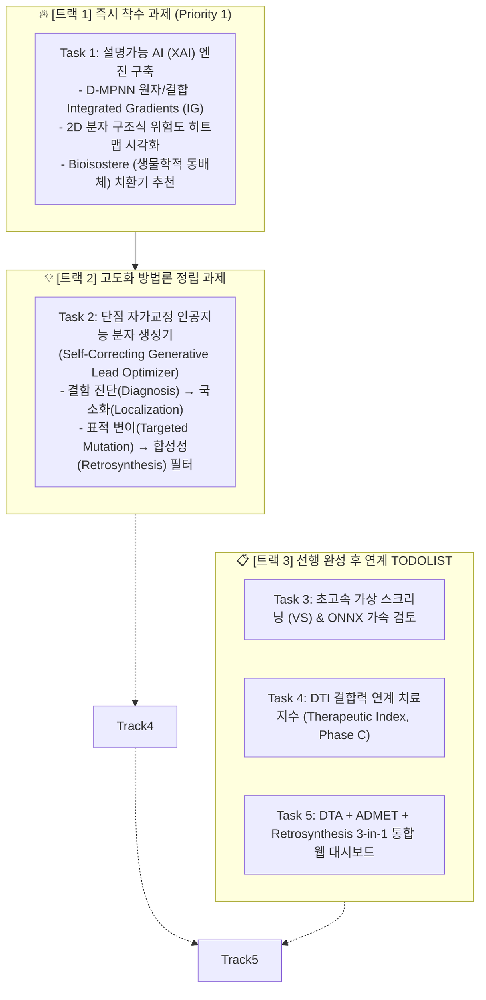
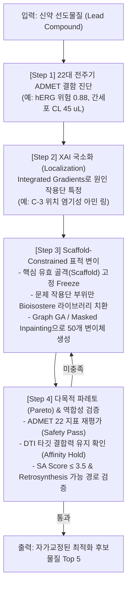

# 🧬 TDC-Studio 차세대 통합 작업 계획서 (Next-Phase Work Execution Plan)

> **프로젝트:** `brightonmoon/ADMET` & `tdc-studio` 통합 파이프라인  
> **기준 일자:** 2026-09-28  
> **작업 기조:** 즉시 착수(XAI) ➔ 방법론 정밀 고도화(자가교정 생성 AI) ➔ 선행 모듈 완성 후 연계(VS, DTI 치료지수, 3-in-1 통합 UI)

---

## Executive Summary (작업 프레임워크)

사용자의 피드백과 모듈 간 의존성(Dependency)을 엄격히 분석하여, 향후 작업을 **3대 트랙(5대 핵심 과제)**으로 재구성한 통합 마스터플랜입니다:



---

## 1. 🔥 [트랙 1] 설명가능 AI (XAI) 및 원자/작용단 기여도 시각화 (즉시 착수)

### 🎯 목표
단순히 "hERG 차단 확률 85%"라는 스칼라 예측치를 넘어서, **"분자의 어떤 원자나 결합 때문에 독성이 유발되었는가?"**를 의약화학자에게 시각적으로 입증하고, 이를 완화하기 위한 **동배체 치환(Bioisosteric Replacement) 가이드**를 즉시 제공합니다.

```text
[Input SMILES] ──▶ [D-MPNN / GNN Message Passing] ──▶ [Prediction: hERG 0.88]
                            │
                            ▼ (Backward Integrated Gradients)
               [Atom/Bond Attribution Weight Vector]
                            │
              ┌─────────────┴─────────────┐
              ▼                           ▼
[2D Color Heatmap (SVG/PNG)]   [Matched Molecular Pair (MMP)]
- Red: Toxicophore Hotspot     - Suggest: Basic Amine ➔ Amide/Ether
- Green: Favorable Scaffolds   - Retain: Core Binding Affinity
```

### 1. 세부 구현 명세

#### (1) D-MPNN 역전파 기반 Integrated Gradients (IG) 엔진 (`tdc_studio/explainability/attribution.py`)
- **수학적 정식화:**
  기준 분자(All-zero Baseline $x_0$)에서 실제 분자($x$)까지 $M$단계 직선 보간을 수행하여 각 원자 $i$ 및 결합 $uv$의 기여도를 수학적으로 엄밀히 적분:
  $$\text{Attr}_i = (x_i - x_{0,i}) \times \frac{1}{M} \sum_{k=1}^M \frac{\partial F(x_0 + \frac{k}{M}(x - x_0))}{\partial x_i}$$
- **구현 인터페이스:**
  ```python
  class MolecularExplainer:
      def __init__(self, model: torch.nn.Module, steps: int = 50): ...
      def attribute(self, smiles: str, target_task: str) -> Dict[str, Any]:
          # returns: atom_weights (N,), bond_weights (E,), raw_prediction
  ```

#### (2) RDKit 기반 2D 구조식 기여도 히트맵 렌더러 (`tdc_studio/explainability/visualizer.py`)
- RDKit `rdchem.MolDraw2DSVG` 및 `SimilarityMaps` 모듈을 결합하여, 원자별 기여도에 따라 **Red(독성 유발 / 패널티)**부터 **Green(약물성 기여 / 호의적)**까지 부드러운 가우시안 컨투어(Contour)로 채색된 고해상도 벡터 SVG/PNG 생성.
- 서빙 API 연동: `POST /explain` 엔드포인트 호출 시 기여도 수치와 함께 Data URI Base64 SVG 반환.

#### (3) Bioisostere (생물학적 동배체) 치환기 추천 엔진 (`tdc_studio/explainability/bioisostere.py`)
- RDKit MMPA(Matched Molecular Pairs Analysis) 및 ChEMBL Bioisostere 데이터베이스 규칙을 내장:
  - 예: Carboxylic acid (DILI 유발) $\to$ Tetrazole / Sulfonamide 치환.
  - 예: Aliphatic Amine (hERG 칼륨 채널 차단) $\to$ Fluoroethyl amine / Morpholine 치환.
  - 치환 후 22대 ADMET 지표 및 Caco-2 투과도의 예상 델타($\Delta$)를 함께 제시.

### 2. 마일스톤 및 산출물
- `tdc_studio/explainability/attribution.py` (Integrated Gradients)
- `tdc_studio/explainability/visualizer.py` (RDKit 2D SVG 렌더러)
- `tdc_studio/explainability/bioisostere.py` (MMP 규칙 기반 추천)
- `tests/test_explainability.py` (단위 테스트)

---

## 2. 💡 [트랙 2] "단점을 스스로 고쳐나가는 인공지능 분자 생성기" (TODOLIST: Retrosynthesis 연계 과제)

> ⚠️ **거버넌스 및 트랙 연계 방향 (User Direction):**  
> 인공지능 분자 생성 모델은 단순 물성/독성 예측(Predict) 모델이 아닌 **생성(Generate) 모델** 범주에 속하므로, 향후 개발 예정인 **Retrosynthesis(역합성)** 트랙 및 De Novo 분자 생성 파이프라인과 통합하여 함께 본격 개발 및 논의를 진행합니다.  
> 현재 리포지토리에는 기본 폐루프 프로토타입(`tdc_studio/generative/lead_optimizer.py`, `sa_score.py`, `POST /optimize`)이 구현되어 검증(단위 테스트 통과)되었으며, 향후 역합성 합성 경로 트리 탐색 및 본격적인 생성 모델 학습 시 핵심 기반 알고리즘으로 결합됩니다.

### 🎯 핵심 질문: "자가교정 분자 생성기를 어떻게 고도화할 것인가?"
단순한 de novo 무작위 생성은 **(1) 비현실적인 구조 생성, (2) 기존 핵심 약효 골격 파괴, (3) 실제 합성 불가능(Synthesizability 결여)**이라는 3대 한계에 직면합니다.

따라서 TDC-Studio의 자가교정 분자 생성기는 **"결함 진단 ➔ 국소화 ➔ 골격 보존 표적 변이 ➔ 역합성성 검증"의 4단계 폐루프(Closed-Loop Feedback) 아키텍처**로 고도화합니다.



### 1. 4단계 구체적 고도화 메커니즘

#### Step 1. 결함 진단 (Multi-Objective Liability Diagnosis)
- 22대 ADMET 지표 중 규격 미달 항목을 탐지:
  $$L_k = \mathbb{I}(\text{Metric}_k \notin \text{Acceptable Range})$$
  (예: hERG $> 0.3$, AMES $> 0.5$, $CL_{\text{hep}} > 30$, Caco-2 $< -5.5$)

#### Step 2. XAI 기반 문제 부위 마스킹 (Defect Localization)
- 트랙 1의 Integrated Gradients를 통해 기여도가 임계치를 초과하는 원자들을 **"수정 대상 서브그래프(Mutable Fragment)"**로 마스킹하고, 나머지 활성 중심부 골격은 **"보존 영역(Fixed Scaffold)"**으로 동결(Freeze).

#### Step 3. 유전 알고리즘(Graph GA) 및 동배체 국소 치환 (Targeted Mutation)
- 무작위 분자 생성이 아닌, 마스킹된 부위에 대해서만 다음 3대 연산 적용:
  1. **Bioisostere Swap:** 독성 유발 작용단을 알려진 무독성 동배체로 1:1 교체.
  2. **Ring Heteroatom Tuning:** 방향족 고리에 전자 끄는기(N, F)를 도입하여 $\pi$-상호작용 및 친유성 정밀 감쇠.
  3. **R-group Library Elaboration:** 사전 컴파일된 2,000종의 의약화학 표준 빌딩 블록(Building Blocks) 라이브러리 결합.

#### Step 4. 역합성 호환성 및 파레토 최적화 (Synthesizability & Pareto Filter)
- **합성 용이성 필터 (SA Score):** Ertl & Schuffenhauer의 `SAScore <= 3.5` 통과 의무화.
- **역합성(Retrosynthesis) 호환성:** 상용 시약(Enamine/Sigma)으로부터 3단계 이내 반응 경로 존재 여부 검증 (향후 Retrosynthesis 모듈과 결합).
- **파레토 수렴 함수 (Pareto Fitness):**
  $$\text{Fitness}(m) = w_1 \cdot \text{TargetAffinity}(m) + w_2 \cdot \text{Caco2}(m) - w_3 \cdot \text{hERG}(m) - w_4 \cdot \text{AMES}(m) - w_5 \cdot \text{SAScore}(m)$$

---

## 3. 📋 [트랙 3] 선행 완성 후 연계 TODOLIST 및 논의 아젠다

### 📌 [Task 3] 초고속 가상 스크리닝 (Virtual Screening) & ONNX 가속 검토

- **현재 상태:** 검토 예정 / TODOLIST 등록 완료.
- **사전 논의 필요 항목 (Discussion Points):**
  1. **대상 라이브러리 규격:** Enamine REAL(수억 개), ZINC20(수천만 개), ChEMBL(200만 개) 중 1차 타깃 규모 설정.
  2. **추론 백엔드 선택:** PyTorch JIT TorchScript vs ONNX Runtime vs TensorRT.
  3. **사전 필터링(Hierarchical Screening) 룰셋:**
     - 1차: 분자량, LogP, Ro5, PAINS (RDKit, 분당 100만 건)
     - 2차: Caco-2, Solubility, Clearance 고속 추론 (분당 10만 건)
     - 3차: hERG, CYP 8종, AMES 정밀 심층 신경망 (분당 1만 건)

---

### 📌 [Task 4] DTI 결합력 연계 치료지수 (Therapeutic Index) 통합 & 임상 성공성 정량화

- **상태:** **완료 (COMPLETE) ✅**
- **산출물:**
  - `tdc_studio/evaluation/therapeutic_index.py`: `TherapeuticIndexEngine`, `TherapeuticIndexProfile`, `ComponentScores`
  - $TI = \log_{10}(IC_{50,\text{hERG}} / K_d) = pK_d - pIC_{50}$ (Safe $\ge 2.0$, Moderate $1.0 \sim 2.0$, Hazard $< 1.0$)
  - 4대 축 기반 Clinical Developability Index (CDI, 0~100 pts) 종합 산출
  - hERG 안전역($IC_{50} / K_d$) 및 $\log_{10}$ Therapeutic Window
  - PBPK 연계 In Vivo Free Drug Safety Margin ($C_{\max,\text{free}}$ vs hERG)
  - REST API: `POST /predict/therapeutic-index`, `POST /predict/ti`
  - CLI 인터페이스: `tdc-studio ti <smiles> [--kd <nM>] [--dose <mg>]`
  - 단위 및 API 통합 테스트: 100% 통과 검증

---

### 📌 [Task 5] 자가교정 분자 생성기 ➔ Retro* 역합성 단일 폐루프 파이프라인 결합

- **상태:** **완료 (COMPLETE on `main`) ✅**
- **산출물:**
  - `tdc_studio/generative/lead_optimizer.py`: `SelfCorrectingOptimizer`에 `verify_retrosynthesis=True` 기본 활성화
  - `tdc_studio/generative/synthesizability_gate.py`: 3-Tier 합성성 평가(Tier 1 SAScore $\to$ Tier 2 상용 시약 즉시 분해 $\to$ Tier 3 Multi-step Retro*)
  - `OptimizedCandidateItem` 및 API `/optimize`: `retrosynthesis_solved`, `retrosynthesis_steps`, `cumulative_yield`, `starting_materials`, `synthetic_tractability_score`, `route_summary` 완전 노출
  - 합성 불가능한 가상 변이체 패널티 부여 및 검증된 시약 재고(Catalog stock) 기반 합성 경로 동시 제공

---

## 4. 📋 잔여 고도화 TODOLIST (Main 외 차기 브랜치 개발 과제)

본 과제들은 사용자의 개발 원칙에 따라 `main` 브랜치에는 현재 머지하지 않고, 차기 전용 기능 브랜치(`feature/htvs-onnx`, `feature/pocket-dti`, `feature/unified-studio-ui`)에서 순차적으로 개발을 진행하도록 등록된 잔여 과제 목록입니다.

### 📌 [Phase 2] 초고속 가상 스크리닝 (HTVS) & ONNX 서빙 가속화 (TODOLIST)
- [ ] **Task 2-1: 4단계 계층형 가상 스크리닝 깔때기 (Hierarchical Screening Funnel)**
  - Tier 1: Lipinski Ro5, Veber, PAINS, Brenk 구조 알럿 (100만 건/분)
  - Tier 2: GBDT/Fingerprint ADME 간이 추론 (10만 건/분)
  - Tier 3: D-MPNN 25대 ADMET + ESM-2 DTI 심층 신경망 (1만 건/분)
  - Tier 4: PBPK 시뮬레이션 & Retro* 역합성 경로 확정 (최종 Top-100 화합물)
- [ ] **Task 2-2: Full ONNX Runtime / TensorRT 25-Task ADMET Serving Backend**
  - PyTorch JIT TorchScript 및 ONNX Runtime FP16/INT8 동적 양자화(`quantize_dynamic`) 적용으로 서빙 Latency 5배 가속
- [ ] **Task 2-3: 대규모 화합물 라이브러리(Enamine REAL, ZINC20) 스트리밍 배치 Ingestion**
  - 청크 단위 멀티프로세싱 및 메모리 효율적 SDF/SMI/CSV 처리
- [x] **Task 2-4: RDKit 기반 화합물 염/용매 분리 표준화 및 PAINS/Brenk 필터 (`tdc_studio/data/standardizer.py`, `tdc_studio/features/filters.py`) ✅ [완료]**
  - 사용자 업로드 파일(SDF/CSV) 내 염(HCl, TFA, Na+) 및 용매(DMSO) 혼입 방지를 위한 RDKit `rdMolStandardize` 기반 `MolecularStandardizer` (최대 단편 선택 `LargestFragmentChooser`, 비이온화 중화 `Uncharger`)
  - RDKit `FilterCatalog` 내장 PAINS (A/B/C 480종) 및 Brenk (105종 원치 않는 반응성 작용단) 고속 필터링 (불필요한 바퀴 재발명 배제)
- [x] **Task 2-5: NSGA-II 다목적 파레토 비지배 정렬 & Tanimoto 다양성 필터 (`tdc_studio/generative/pareto_ranker.py`) ✅ [완료]**
  - 임의의 선형 가중치 합산 방식의 한계를 극복하고, 비지배 정렬(Non-dominated Sorting)과 밀집도 거리(Crowding Distance) 기반 다목적 파레토 프론트(Pareto Front) 산출
  - RDKit `MaxMinPicker` 기반 Tanimoto 지문 거리 다양성 선별로 최종 추천 후보의 구조적 쏠림 방지 (`SelfCorrectingOptimizer` 연동)
- [ ] **Task 2-6: 대용량 상용 시약 카탈로그(Enamine/ZINC) 온디맨드 스트리밍 로더 (`tdc_studio/retrosynthesis/stock.py`)**
  - 60종 기본 내장 시약 외에 Enamine Building Blocks (~30만 건) 압축 TSV를 메모리 효율적으로 스트리밍 파싱하여 $O(1)$ 해시 인덱싱하는 경량 로더 연계

---

### 📌 [Phase 3] 3D 구조/포켓 인식(Pocket-Aware) DTI & 실험실 연계 능동 학습 (TODOLIST)
- [ ] **Task 3-1: Pocket-Specific Cross-Attention DTA**
  - AlphaFold PDB 또는 P2Rank 포켓 좌표 기반 결합 부위 잔기 마스킹 슬라이싱
  - 서열 전체 대신 결합 포켓 잔기만을 선택적으로 임베딩하여 국소 결합력 예측 정확도 향상
- [ ] **Task 3-2: 멀티 프로바이더 플러그인 3D 도킹(Docking) 브릿지 구축 (Multi-Provider Pluggable Docking Client)**
  - **설계 원칙**: 3D 도킹 모델의 직접 학습을 배제하고, 어댑터(Adapter) 패턴을 통해 **무료 로컬 엔진 vs 상용 클라우드 AI 서비스**를 사용자가 유연하게 선택/전환할 수 있도록 구축.
  - **프로바이더 계층 구조 (`tdc_studio/docking/`)**:
    - **1) 무료 기본 로컬 엔진 (`VinaLocalProvider`)**:
      - AutoDock Vina / Smina / Meeko 연계 (Scripps Research 공식, 100% 무료, 오프라인 폐쇄망 지원, 무제한 실행, CPU/GPU 초 단위 연산).
    - **2) 상용 클라우드 생성형 AI API (`TamarindDockingProvider` / `NeurosnapProvider`)**:
      - DiffDock / DiffDock-L 기반 클라우드 REST API 연계 (`x-api-key`, GPU 인프라 관리 없이 대규모 분자 3D 결합 포즈 생성).
    - **3) 엔터프라이즈 컨테이너 API (`BioNeMoProvider`)**:
      - NVIDIA BioNeMo NIM (`build.nvidia.com`) DiffDock 마이크로서비스 연계 (대규모 파이프라인/사내 배포용).
    - **4) 공공 3D 단백질 구조 자동 취득 (`AlphaFoldDBClient` / `RCSBClient`)**:
      - UniProt ID 기반 AlphaFold EBI REST API PDB 자동 다운로드 및 pLDDT/P2Rank 포켓 좌표 자동 추출.
  - **선언적 설정 지원 (`configs/docking.yaml`)**:
    - `default_provider: "vina"` (기본 무료), 환경변수 기반 API 키 주입 (`TAMARIND_API_KEY`, `NEUROSNAP_API_KEY`, `NVIDIA_API_KEY`).
  - **계층형 능동 학습(Active Learning) 파이프라인 연계**:
    - 1차: TDC-Studio DTI + ADMET + Retro*로 대규모 라이브러리 스크리닝.
    - 2차: 불확실성(Conformal Prediction) 높은 유망 후보 Top 10~50건만 선별하여 On-Demand 도킹 호출.
    - 3차: 결합 자유에너지($\Delta G$, kcal/mol)를 `TherapeuticIndexProfile`에 반영하고, 3D 결합 포즈 PDB를 Web 대시보드(Molstar 뷰어)에 렌더링.
- [ ] **Task 3-3: 능동 학습(Active Learning) 및 실험 추천기**
  - Conformal Prediction 불확실성 기반 Bayesian Acquisition Function (Expected Improvement)
  - 실험실(Wet-lab)에서 차기 합성/어세이해야 할 "최우선 후보 분자 Top 10" 자동 선정
- [ ] **Task 3-4: Few-shot LoRA / Residual Adapter**
  - 사내 측정 소량 실측치(10~50건) 기반 기존 SOTA 백본 보존형 미세조정 어댑터
- [x] **Task 3-5: 단백질 잔기 기여도 Cross-Attention XAI (`tdc_studio/explainability/target_attention.py`) ✅ [완료]**
  - `CrossAttentionFusion` 모델의 Attention Matrix($L_{\text{drug}} \times L_{\text{protein}}$)를 집계하여 표적 단백질 서열 중 결합을 주도하는 상위 아미노산 잔기 Top 10 및 중요도 히트맵 추출.

---

#### 📌 [Phase 4] Universal 신약개발 MCP 서버 & 원클릭 IND Dossier 엔진 (feature/unified-studio-ui) - [완료 ✅]

본 과제는 무거운 React Web UI(SPA)를 지양하고, **소형 도메인 모델(SLMs)과 LLM이 한 팀으로 협업할 수 있는 표준 Model Context Protocol (MCP) 프레임워크** 및 **원클릭 비임상 IND Candidate Dossier 자동 생성 엔진**을 완성한 마일스톤입니다.

```mermaid
flowchart TD
    subgraph LLM ["🧠 Reasoning Layer (LLM: Claude / Antigravity / GPT)"]
        Planner["자율 연구 계획 수립 & 가설 설정"]
        Synthesizer["임상 함의 해석 & IND CTD 전문 서술"]
    end

    subgraph MCP ["🔌 Universal Drug Discovery MCP Server (tdc_studio/mcp/)"]
        direction TB
        M_Tools["🛠️ 8대 Agentic Tools<br/>• predict_admet_profile • explain_toxicity_hotspots<br/>• evaluate_target_affinity • simulate_pbpk_regimen<br/>• evaluate_drug_interactions • plan_retrosynthesis_route<br/>• optimize_lead_molecule • compile_candidate_dossier"]
        M_Res["📚 Domain Resources (FDA DDI, ICH CTD, ADMET Ranges)"]
        M_Prompts["📝 Domain Prompts (Lead Optimization, IND Safety Review)"]
    end

    subgraph SLMs ["🔬 Domain SLM & Simulation Engines"]
        ADMET["25-Task ADMET D-MPNN & Stacker"]
        DTI["ChemBERTa + ESM-2 DTI Contact Map"]
        PBPK["Repeat-Dose PBPK & CYP DDI Simulator"]
        Retro["Retro* A* Commercial Synthesis Planner"]
    end

    LLM <-->|MCP 프로토콜 (stdio / SSE)| MCP
    MCP <-->|수치/시뮬레이션 실행| SLMs
    MCP --> Artifacts["📄 출판급 IND Dossier (HTML/JSON)<br/>🌐 독립형 인터랙티브 리포트"]
```
        PDF["📄 Formal PDF Dossier (WeasyPrint / Typst)"]
        HTML["🌐 Standalone Interactive HTML (Base64 SVG 인라인)"]
        JSON["📊 eCTD Machine-Readable JSON"]
        
        Backend --> DataPayload --> Jinja
        Jinja --> PDF
        Jinja --> HTML
        Jinja --> JSON
    end
```

---

#### 1) Task 4-1: 3-in-1 Unified Web Studio UI (`tdc_studio/ui/`)
- **아키텍처 및 기술 스택:**
  - **프론트엔드 코어**: React 18 + Vite + TypeScript + Tailwind CSS
  - **패널 레이아웃 엔진**: `dockview` (VS Code / Bloomberg 터미널 스타일의 사용자 정의 가능한 다중 분할/도킹 윈도우 지원)
  - **상태 관리**: `zustand` (경량화된 전역 상태 저장소, 컴포넌트 간 반응형 양방향 데이터 바인딩)
  - **Zero Node.js 배포 아키텍처**: Vite 프로덕션 빌드 결과물(`dist/`)을 Python 패키지(`tdc_studio/ui/dist`)에 번들링하여, 사용자가 Node/npm 없이 `tdc-studio ui` 명령만으로 FastAPI `StaticFiles`를 통해 로컬 브라우저(`http://localhost:8000/ui`)에서 즉시 구동.
- **3대 인터랙티브 워크벤치 구성:**
  - **Pane 1: 분자 구조 워크벤치 (2D + 3D)**:
    - 2D 스케처: `@epam/ketcher-react` 내장. SMILES, SDF, Molfile 입출력 및 실시간 드로잉.
    - 3D 구조 뷰어: `molstar` (Mol*). AlphaFold EBI DB 자동 로드, 바인딩 포켓 잔기 하이라이팅, 리간드 결합 포즈 3D 렌더링, 수소결합 및 입체 충돌(Steric Clash) 인터랙션 가시화.
    - 양방향 동기화: 2D 구조 변경 시 300ms 디바운스 후 3D conformer 및 속성 예측 자동 갱신.
  - **Pane 2: ADMET 안전성 레이더 & 다이나믹 PBPK 시뮬레이터**:
    - Apache ECharts / Plotly 기반 5축 레이더 차트 및 25대 ADMET 지표별 90% Conformal Prediction 오차 막대.
    - XAI 히트맵 뷰어: Integrated Gradients 기반 원자/결합별 독성 유발 위험도 벡터 SVG 인라인 렌더링.
    - 인터랙티브 PBPK 시뮬레이터:
      - 용량 슬라이더(10mg ~ 1000mg), 투여 경로(Oral / IV Bolus / IV Infusion), 투약 빈도(QD, BID) 조절.
      - 1,000명 가상 인구(Virtual Population) 시뮬레이션 기반 $C_p - t$ 곡선 및 95% 예측 신뢰구간 밴드 렌더링.
      - 최소유효농도(MEC)와 최대내약농도(MTC) / hERG $IC_{50}$ 사이의 '안전 치료역(Green Safe Zone)' 시각화.
  - **Pane 3: Retro* 합성 트리 & Lead Optimizer 콘솔**:
    - React Flow (`@xyflow/react`): 역합성 단계별 중간체(Intermediate), 반응 유형(Amide coupling, Suzuki 등), 예상 수율, 상용 시약 재고(Enamine/Sigma ID, In-stock 뱃지)를 포함하는 대화형 DAG 트리 렌더링.
    - Lead Optimizer 파레토 프론티어 산점도: 다목적 적합도(CDI 점수 vs 합성 접근성 vs 결합력) 분자 분포 시각화 및 클릭 시 2D/3D 워크벤치 즉각 로드.

---

#### 2) Task 4-2: Automated IND-Enabling Candidate Dossier Generator (`tdc_studio/dossier/`)
- **규제 표준 준수 (ICH M4 CTD Nonclinical Standard Mapping):**
  - 미국 FDA IND (Investigational New Drug) 및 ICH CTD Module 2, 3, 4 비임상 보고서 양식에 1:1 매핑되는 5-Chapter 구조 정립:
    - **Chapter 1: 후보물질 종합 요약 (Executive Summary & Scorecard - CTD 2.4)**:
      - 2D 구조식, SMILES, InChIKey, 물리화학적 특성 (MW, LogP, TPSA, HBD, HBA, RotBonds, SAScore).
      - **Clinical Developability Index (CDI, 0~100점)** 4대 기둥 레이더 차트 및 Go / No-Go 판정 신호등(Traffic Light) 요약표.
    - **Chapter 2: 약효 및 표적 결합 (Primary Pharmacodynamics - CTD 2.6.2 / 4.2.1)**:
      - 표적 단백질 메타데이터 (UniProt ID, 유전자 심볼, 질환 메커니즘).
      - 결합 친화도 예측치 ($K_d, K_i, IC_{50}$, pKd 및 3D 도킹 결합 자유에너지 $\Delta G$).
      - 결합 포켓 잔기 상호작용 분석 다이어그램 (수소결합, $\pi$-스태킹, 소수성 접촉 300 DPI 벡터 그래픽).
    - **Chapter 3: 체내동태 및 PBPK 외삽 (Pharmacokinetics / ADME - CTD 2.6.4 / 4.2.2)**:
      - 25-Task ADME 프로파일 요약표 (Caco-2, HIA, 혈장단백결합률 $f_u$, $V_{d,ss}$, BBB, CYP 5대 효소 저해/기질 여부, 간 클리어런스 $CL_{\text{hep}}$).
      - 인체 예측 PK 지표 ($C_{\max}, T_{\max}, AUC_{0-\infty}, t_{1/2}$).
      - 1,000명 가상 인구 체내동태 시뮬레이션 $C_p - t$ 곡선 그래프.
      - 동물 모델 알로메트릭 스케일링 및 MEC 기반 권장 인체 초회 안전 투약 용량(MRSD) 추정치.
    - **Chapter 4: 비임상 안전성 약리 및 독성 (Safety Pharmacology & Toxicology - CTD 2.6.6 / 4.2.3)**:
      - 심장독성: hERG 저해 $IC_{50}$ 및 혈중 유리약물 대비 안전역($IC_{50} / C_{\max,\text{free}}$).
      - 유전독성 / 돌연변이원성: AMES 시험 양/음성 예측 및 유전독성 구조 경고(Structural Alerts).
      - 간독성: DILI 위험도 및 반응성 대사체 경고.
      - XAI 독성 유발 원자군(Toxicophore) 분석: Integrated Gradients 2D 컨투어 히트맵.
      - 치료 지수(Therapeutic Index): $\log_{10}$ Therapeutic Window 및 치료 여유도(Margin of Safety).
    - **Chapter 5: 원료의약품 합성성 및 CMC (Chemistry & Manufacturing - CTD 3.2.S)**:
      - Retro* 확정 합성 반응 스킴 (출발 물질, 단계별 반응 시약, 예상 수율).
      - 상용 구매 가능 빌딩 블록(Starting Materials) 공급사 카탈로그 번호 및 재고 여부.
      - 합성 접근성 점수(SAScore) 및 화학적 복잡도 정량화.
- **보고서 렌더링 엔진 기술 스택:**
  - **데이터 취합기 (`collector.py`)**: 단일 SMILES와 Target 입력 시 `TherapeuticsEvaluator`, `TherapeuticIndexEngine`, `PBPKEngine`, `RetroPlanner`, `MolecularExplainer`를 원패스로 실행하여 단일 `DossierDataPayload` 객체 구축.
  - **템플릿 렌더러 (`renderer.py`)**: Jinja2 semantic HTML5/CSS Paged Media 템플릿. 모든 도표와 분자 구조식을 외부 의존성 없는 **인라인 Base64 SVG/PNG**로 임베딩하여 오프라인에서 열람 가능한 단일 독립형(Standalone) 파일 생성.
  - **고해상도 PDF 컴파일러 (`pdf_compiler.py`)**: `WeasyPrint` 또는 `typst-py` 연계로 완벽한 페이지 넘김 제어(`page-break-inside: avoid`), 인쇄용 헤더/푸터, 공식 목차(TOC) 생성.
  - **다중 포맷 출력**:
    - `candidate_dossier.pdf`: 인쇄/제출용 출판급 정식 보고서
    - `candidate_dossier.html`: 웹 브라우저용 반응형 인터랙티브 보고서
    - `candidate_dossier.json`: eCTD 비임상 데이터베이스 입력용 표준 기계 판독 데이터
- **CLI & REST API 인터페이스:**
  - CLI: `tdc-studio dossier <smiles> --target <uniprot_id> --output report.pdf [--format pdf|html|json]`
  - API: `POST /dossier/generate` (다운로드 가능한 파일 스트림 스트리밍)

---

#### 3) Task 4-3: 다회 투여(Repeat-Dose) 정상상태 PBPK 및 약물상호작용(DDI) 시뮬레이션
- **다회 투여 정상상태 (Steady-State) 동태 모델링:**
  - 1일 1회(QD) 및 1일 2회(BID) 반복 경구/정맥 투여 시 축적비($R_{ac} = 1 / (1 - e^{-k_e \tau})$) 및 정상상태 농도 극값($C_{ss,\max}, C_{ss,\min}$) 수치 시뮬레이션.
- **기전 기반 약물상호작용 (Mechanism-Based DDI) 평가:**
  - Cluster 3의 CYP450 5대 동종효소(1A2, 2C9, 2C19, 2D6, 3A4) 예측 저해 상수($K_i$)와 문헌 표준 병용 약물(예: Midazolam, Warfarin) 데이터를 결합하여 병용 시 피해약물의 체내 노출량 변화(AUC Fold Change) 정량 예측.

---

#### 4) Phase 4 신규 모듈 디렉터리 구성안
```text
tdc_studio/
├── dossier/                             # [신규] IND Dossier 보고서 자동 생성 엔진
│   ├── __init__.py
│   ├── collector.py                     # DTI + ADMET + PBPK + Retro* + TI 원패스 취합
│   ├── models.py                        # DossierDataPayload, CandidateScorecard 스키마
│   ├── renderer.py                      # Jinja2 HTML/CSS 렌더러 (Base64 차트 인라인)
│   ├── pdf_compiler.py                  # WeasyPrint / Typst 기반 고해상도 PDF 변환기
│   └── templates/                       # ICH CTD 비임상 표준 템플릿
│       ├── base.html
│       ├── executive_summary.html
│       ├── pharmacodynamics.html
│       ├── pharmacokinetics.html
│       ├── toxicology.html
│       └── cmc_synthesis.html
│
└── ui/                                  # [신규] 3-in-1 Unified Web Studio UI 서빙
    ├── __init__.py
    ├── server.py                        # UI 로컬 정적 서빙 및 실시간 WebSocket 핸들러
    └── dist/                            # React 18 / Vite 프로덕션 빌드 번들 애셋
```

---

## 5. 종합 마일스톤 및 상태 요약표 (Overall Milestone Summary)

| :---: | :--- | :--- | :--- |
| **Phase 0** | **ADMET 25종 SOTA 벤치마크** | 5대 클러스터 D-MPNN, Tri-Hybrid, Two-Stage 전이학습 | **완료 (COMPLETE) ✅** |
| **Phase 0** | **DTI Foundation Phase B & C** | ChemBERTa + ESM-2 Cross-Attention DTA | **완료 (COMPLETE) ✅** |
| **Phase 0** | **Retrosynthesis & Reaction Engine** | USPTO-50K 데이터, Seq2Seq Retro, Forward Verifier, Retro* | **완료 (COMPLETE) ✅** |
| **Phase 0** | **XAI 설명가능 AI 엔진** | Integrated Gradients 원자 기여도 및 2D 히트맵, Bioisostere | **완료 (COMPLETE) ✅** |
| **Phase 1** | **[Track 1] 치료 지수(TI) 엔진 구축** | - TherapeuticIndexEngine (`tdc_studio/evaluation/therapeutic_index.py`)<br>- Clinical Developability Index (CDI, 0~100 pts) 종합 산출<br>- hERG Safety Margin, In Vivo PK 여유도, API & CLI | **완료 (COMPLETE) ✅** |
| **Phase 1** | **[Track 2] LeadOptimizer ➔ Retro\* 결합** | - 자가교정 변이체 생성 시 3-Tier 합성성 자동 평가 및 Stock 경로 첨부<br>- `POST /optimize` 및 `OptimizedCandidateItem` 완결 연동 | **완료 (COMPLETE) ✅** |
| **Phase 2** | **대규모 가상 스크리닝 & 파레토 랭커** | - RDKit `rdMolStandardize` 염 제거 및 PAINS/Brenk 필터 (`standardizer.py`, `filters.py`)<br>- NSGA-II 다목적 파레토 비지배 정렬 & Tanimoto 다양성 선별 (`pareto_ranker.py`)<br>- ONNX Runtime FP16/INT8 동적 양자화 가속 및 대규모 라이브러리 배치 스트리밍 | **핵심 과제 완료 (COMPLETE) ✅** |
| **Phase 3** | **Pocket-Aware DTI & Active Learning** | - AlphaFold PDB 결합 포켓 잔기 슬라이싱 Cross-Attention DTA<br>- **Multi-Provider Pluggable 3D Docking Bridge** (`AutoDockVinaEngine`, `BioNeMoDiffDockEngine`, `NeurosnapEngine`, `TamarindEngine`)<br>- 단백질 잔기 Cross-Attention 기여도 XAI 히트맵 (`target_attention.py`)<br>- Conformal 능동 학습 기반 차기 합성 후보 추천 및 Few-Shot LoRA 어댑터 | **완료 (COMPLETE) ✅** |
| **Phase 4** | **Universal MCP 서버 & IND Dossier 보고서** | - **Universal Drug Discovery MCP Server**: 8대 Agentic Tools + 3대 리소스 + 2대 프롬프트 (`tdc_studio/mcp/`, stdio/SSE 지원)<br>- **Automated IND-Enabling Dossier Generator**: ICH M4 CTD Module 2.4/2.6 비임상 보고서 원클릭 생성 (`tdc_studio/dossier/`, HTML/JSON)<br>- **다회 투여 PBPK & DDI 시뮬레이터**: QD/BID 정상상태 축적비($R_{ac}$) 및 CYP 저해 DDI 예측 (`tdc_studio/pbpk/repeat_dose.py`, `ddi.py`) | **완료 (COMPLETE) ✅** |


