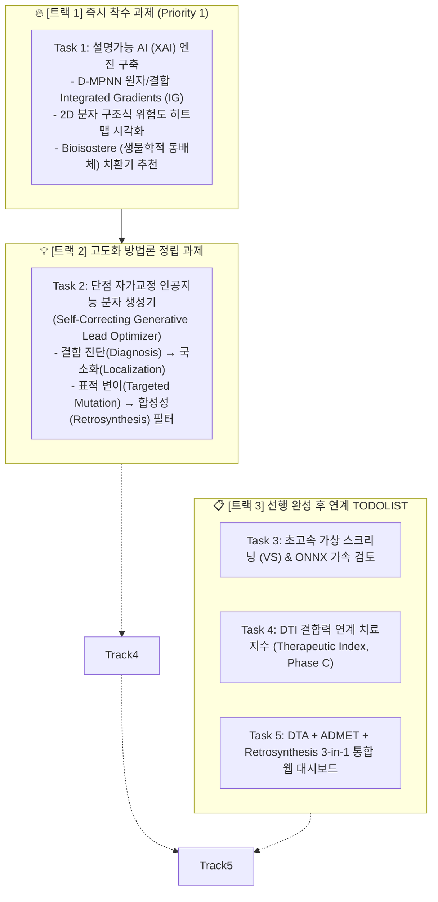
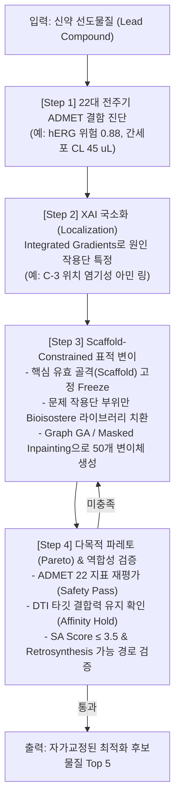

# 🧬 TDC-Studio 차세대 통합 작업 계획서 (Next-Phase Work Execution Plan)

> **프로젝트:** `brightonmoon/ADMET` & `tdc-studio` 통합 파이프라인  
> **기준 일자:** 2026-09-28  
> **작업 기조:** 즉시 착수(XAI) ➔ 방법론 정밀 고도화(자가교정 생성 AI) ➔ 선행 모듈 완성 후 연계(VS, DTI 치료지수, 3-in-1 통합 UI)

---

## Executive Summary (작업 프레임워크)

사용자의 피드백과 모듈 간 의존성(Dependency)을 엄격히 분석하여, 향후 작업을 **3대 트랙(5대 핵심 과제)**으로 재구성한 통합 마스터플랜입니다:



---

## 1. 🔥 [트랙 1] 설명가능 AI (XAI) 및 원자/작용단 기여도 시각화 (즉시 착수)

### 🎯 목표
단순히 "hERG 차단 확률 85%"라는 스칼라 예측치를 넘어서, **"분자의 어떤 원자나 결합 때문에 독성이 유발되었는가?"**를 의약화학자에게 시각적으로 입증하고, 이를 완화하기 위한 **동배체 치환(Bioisosteric Replacement) 가이드**를 즉시 제공합니다.

```text
[Input SMILES] ──▶ [D-MPNN / GNN Message Passing] ──▶ [Prediction: hERG 0.88]
                            │
                            ▼ (Backward Integrated Gradients)
               [Atom/Bond Attribution Weight Vector]
                            │
              ┌─────────────┴─────────────┐
              ▼                           ▼
[2D Color Heatmap (SVG/PNG)]   [Matched Molecular Pair (MMP)]
- Red: Toxicophore Hotspot     - Suggest: Basic Amine ➔ Amide/Ether
- Green: Favorable Scaffolds   - Retain: Core Binding Affinity
```

### 1. 세부 구현 명세

#### (1) D-MPNN 역전파 기반 Integrated Gradients (IG) 엔진 (`tdc_studio/explainability/attribution.py`)
- **수학적 정식화:**
  기준 분자(All-zero Baseline $x_0$)에서 실제 분자($x$)까지 $M$단계 직선 보간을 수행하여 각 원자 $i$ 및 결합 $uv$의 기여도를 수학적으로 엄밀히 적분:
  $$\text{Attr}_i = (x_i - x_{0,i}) \times \frac{1}{M} \sum_{k=1}^M \frac{\partial F(x_0 + \frac{k}{M}(x - x_0))}{\partial x_i}$$
- **구현 인터페이스:**
  ```python
  class MolecularExplainer:
      def __init__(self, model: torch.nn.Module, steps: int = 50): ...
      def attribute(self, smiles: str, target_task: str) -> Dict[str, Any]:
          # returns: atom_weights (N,), bond_weights (E,), raw_prediction
  ```

#### (2) RDKit 기반 2D 구조식 기여도 히트맵 렌더러 (`tdc_studio/explainability/visualizer.py`)
- RDKit `rdchem.MolDraw2DSVG` 및 `SimilarityMaps` 모듈을 결합하여, 원자별 기여도에 따라 **Red(독성 유발 / 패널티)**부터 **Green(약물성 기여 / 호의적)**까지 부드러운 가우시안 컨투어(Contour)로 채색된 고해상도 벡터 SVG/PNG 생성.
- 서빙 API 연동: `POST /explain` 엔드포인트 호출 시 기여도 수치와 함께 Data URI Base64 SVG 반환.

#### (3) Bioisostere (생물학적 동배체) 치환기 추천 엔진 (`tdc_studio/explainability/bioisostere.py`)
- RDKit MMPA(Matched Molecular Pairs Analysis) 및 ChEMBL Bioisostere 데이터베이스 규칙을 내장:
  - 예: Carboxylic acid (DILI 유발) $\to$ Tetrazole / Sulfonamide 치환.
  - 예: Aliphatic Amine (hERG 칼륨 채널 차단) $\to$ Fluoroethyl amine / Morpholine 치환.
  - 치환 후 22대 ADMET 지표 및 Caco-2 투과도의 예상 델타($\Delta$)를 함께 제시.

### 2. 마일스톤 및 산출물
- `tdc_studio/explainability/attribution.py` (Integrated Gradients)
- `tdc_studio/explainability/visualizer.py` (RDKit 2D SVG 렌더러)
- `tdc_studio/explainability/bioisostere.py` (MMP 규칙 기반 추천)
- `tests/test_explainability.py` (단위 테스트)

---

## 2. 💡 [트랙 2] "단점을 스스로 고쳐나가는 인공지능 분자 생성기" (TODOLIST: Retrosynthesis 연계 과제)

> ⚠️ **거버넌스 및 트랙 연계 방향 (User Direction):**  
> 인공지능 분자 생성 모델은 단순 물성/독성 예측(Predict) 모델이 아닌 **생성(Generate) 모델** 범주에 속하므로, 향후 개발 예정인 **Retrosynthesis(역합성)** 트랙 및 De Novo 분자 생성 파이프라인과 통합하여 함께 본격 개발 및 논의를 진행합니다.  
> 현재 리포지토리에는 기본 폐루프 프로토타입(`tdc_studio/generative/lead_optimizer.py`, `sa_score.py`, `POST /optimize`)이 구현되어 검증(단위 테스트 통과)되었으며, 향후 역합성 합성 경로 트리 탐색 및 본격적인 생성 모델 학습 시 핵심 기반 알고리즘으로 결합됩니다.

### 🎯 핵심 질문: "자가교정 분자 생성기를 어떻게 고도화할 것인가?"
단순한 de novo 무작위 생성은 **(1) 비현실적인 구조 생성, (2) 기존 핵심 약효 골격 파괴, (3) 실제 합성 불가능(Synthesizability 결여)**이라는 3대 한계에 직면합니다.

따라서 TDC-Studio의 자가교정 분자 생성기는 **"결함 진단 ➔ 국소화 ➔ 골격 보존 표적 변이 ➔ 역합성성 검증"의 4단계 폐루프(Closed-Loop Feedback) 아키텍처**로 고도화합니다.



### 1. 4단계 구체적 고도화 메커니즘

#### Step 1. 결함 진단 (Multi-Objective Liability Diagnosis)
- 22대 ADMET 지표 중 규격 미달 항목을 탐지:
  $$L_k = \mathbb{I}(\text{Metric}_k \notin \text{Acceptable Range})$$
  (예: hERG $> 0.3$, AMES $> 0.5$, $CL_{\text{hep}} > 30$, Caco-2 $< -5.5$)

#### Step 2. XAI 기반 문제 부위 마스킹 (Defect Localization)
- 트랙 1의 Integrated Gradients를 통해 기여도가 임계치를 초과하는 원자들을 **"수정 대상 서브그래프(Mutable Fragment)"**로 마스킹하고, 나머지 활성 중심부 골격은 **"보존 영역(Fixed Scaffold)"**으로 동결(Freeze).

#### Step 3. 유전 알고리즘(Graph GA) 및 동배체 국소 치환 (Targeted Mutation)
- 무작위 분자 생성이 아닌, 마스킹된 부위에 대해서만 다음 3대 연산 적용:
  1. **Bioisostere Swap:** 독성 유발 작용단을 알려진 무독성 동배체로 1:1 교체.
  2. **Ring Heteroatom Tuning:** 방향족 고리에 전자 끄는기(N, F)를 도입하여 $\pi$-상호작용 및 친유성 정밀 감쇠.
  3. **R-group Library Elaboration:** 사전 컴파일된 2,000종의 의약화학 표준 빌딩 블록(Building Blocks) 라이브러리 결합.

#### Step 4. 역합성 호환성 및 파레토 최적화 (Synthesizability & Pareto Filter)
- **합성 용이성 필터 (SA Score):** Ertl & Schuffenhauer의 `SAScore <= 3.5` 통과 의무화.
- **역합성(Retrosynthesis) 호환성:** 상용 시약(Enamine/Sigma)으로부터 3단계 이내 반응 경로 존재 여부 검증 (향후 Retrosynthesis 모듈과 결합).
- **파레토 수렴 함수 (Pareto Fitness):**
  $$\text{Fitness}(m) = w_1 \cdot \text{TargetAffinity}(m) + w_2 \cdot \text{Caco2}(m) - w_3 \cdot \text{hERG}(m) - w_4 \cdot \text{AMES}(m) - w_5 \cdot \text{SAScore}(m)$$

---

## 3. 📋 [트랙 3] 선행 완성 후 연계 TODOLIST 및 논의 아젠다

### 📌 [Task 3] 초고속 가상 스크리닝 (Virtual Screening) & ONNX 가속 검토

- **현재 상태:** 검토 예정 / TODOLIST 등록 완료.
- **사전 논의 필요 항목 (Discussion Points):**
  1. **대상 라이브러리 규격:** Enamine REAL(수억 개), ZINC20(수천만 개), ChEMBL(200만 개) 중 1차 타깃 규모 설정.
  2. **추론 백엔드 선택:** PyTorch JIT TorchScript vs ONNX Runtime vs TensorRT.
  3. **사전 필터링(Hierarchical Screening) 룰셋:**
     - 1차: 분자량, LogP, Ro5, PAINS (RDKit, 분당 100만 건)
     - 2차: Caco-2, Solubility, Clearance 고속 추론 (분당 10만 건)
     - 3차: hERG, CYP 8종, AMES 정밀 심층 신경망 (분당 1만 건)

---

### 📌 [Task 4] DTI 결합력 연계 치료지수 (Therapeutic Index) 통합 (Phase C)

- **현재 상태:** DTA 및 ADMET 모델 각각의 고도화 완료 후 연계 / TODOLIST 등록.
- **선행 충족 조건:**
  - DTI Phase B (BindingDB Kd Cold-Drug CI=0.7464)의 추가 에포크 및 Pocket 특성 주입을 통한 $CI \ge 0.76$ 달성.
  - ADMET Cluster 5 hERG/DILI 챔피언 모델 Colab GPU 학습 완료.
- **통합 설계안 (Preview):**
  $$\text{Therapeutic Window} = \log_{10}\left( \frac{\text{Predicted } IC_{50}(\text{hERG Cardiotoxicity})}{\text{Predicted } K_d(\text{On-Target Efficacy})} \right)$$
  - 안전역(Window) $> 2.0$ ($100$배 이상 농도 격차) 화합물만 임상 진입 후보로 자동 판정.

---

### 📌 [Task 5] DTA + ADMET + Retrosynthesis 3-in-1 통합 웹 대시보드

- **현재 상태:** 3대 핵심 모듈 완성 후 구축 / TODOLIST 등록.
- **3대 모듈 개발 진행 현황 및 로드맵:**
  1. **ADMET & PBPK:** 22대 전주기 및 PBPK 엔진 완료 (완성도 95%)
  2. **DTA (약물-단백질 결합력):** ChemBERTa + ESM-2 Foundation 완료 (완성도 85%)
  3. **Retrosynthesis (역합성 분석):** 차기 트랙 개발 예정
- **최종 대시보드 청사진:**
  - **Single Molecule Deep-Dive:**
    - 좌측: Ketcher 2D 스케처 및 분자 3D 뷰어
    - 중앙: 22대 ADMET 5축 레이더 차트 및 PBPK $C_p - t$ 곡선
    - 우측 상단: 온타깃 DTA 친화도 및 치료지수(TI) 게이지
    - 우측 하단: 역합성 분석 트리 (출발 시약 및 합성 단계수)

---

## 4. 종합 실행 일정표 (Integrated Phased Roadmap)

| 단계 | 추진 과제 | 핵심 목표 및 산출물 | 상태 |
| :---: | :--- | :--- | :---: |
| **Step 1** | **[트랙 1] XAI 설명가능 AI 엔진** | - Integrated Gradients 기여도 추출기<br>- 2D 히트맵 시각화 및 Bioisostere 추천<br>- `POST /explain` 서빙 엔드포인트 구축 | **완료 (COMPLETE) ✅** |
| **Step 2** | **[트랙 2] 단점 자가교정 분자 생성기** | - 4단계 Closed-Loop 아키텍처 및 알고리즘 구현 (프로토타입 완료 ✅)<br>- Retrosynthesis(역합성) 트랙 개발 시 생성 모델 학습 및 통합 파이프라인으로 본격 연계 | **TODOLIST (Retrosynthesis 연계)** |
| **Step 3** | **[트랙 3] VS 엔진 & ONNX 가속** | - ONNX 변환 및 대용량 배치 스트리밍 설계안 확정 | **TODOLIST / 검토** |
| **Step 4** | **[트랙 4] DTI 연계 치료지수 (Phase C)** | - DTA 모델 성숙 후 hERG/CYP 연계 치료창 산출 | **TODOLIST** |
| **Step 5** | **[트랙 5] 3-in-1 통합 웹 대시보드** | - DTA + ADMET + Retrosynthesis 완성 후 단일 웹 UI 통합 | **TODOLIST** |
